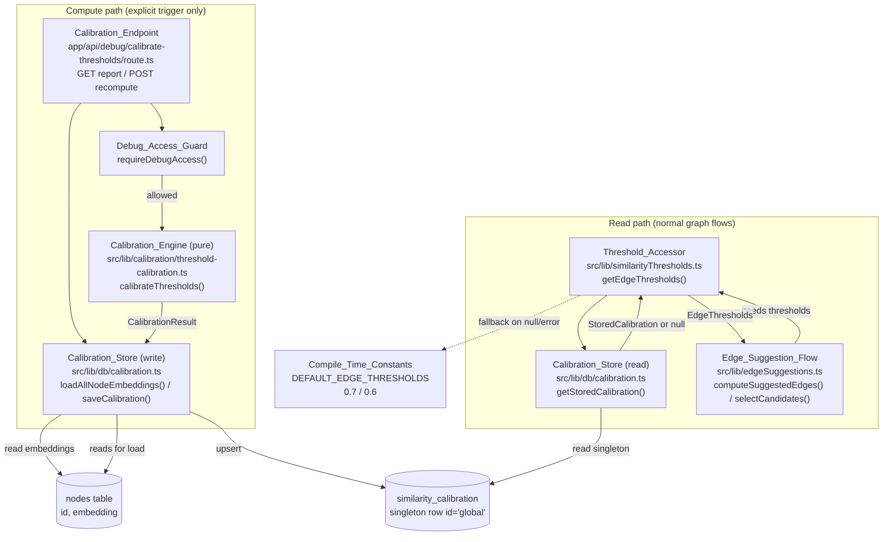
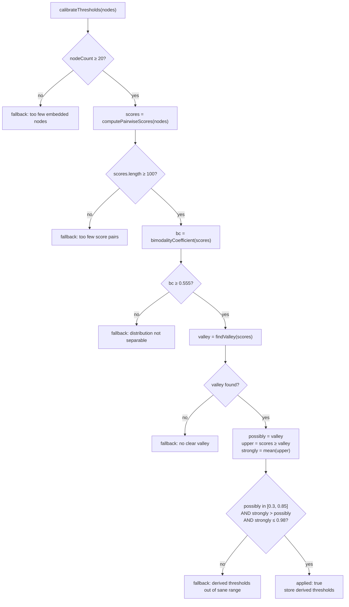

# Design Document: Adaptive Similarity Thresholds

## Overview

The knowledge graph decides whether two nodes are related by comparing the cosine similarity of their embeddings against two edge thresholds — a strongly-related threshold and a possibly-related threshold. Historically these were fixed compile-time constants (0.7 and 0.6) that ignored the actual shape of a dataset's embedding score distribution.

This feature adds the ability to **calibrate** those two thresholds from the geometry of existing node embeddings, so they reflect the real data distribution. Calibration is a deterministic, offline, statistics-only procedure derived purely from pairwise cosine similarities. It runs only when explicitly triggered through a debug-gated endpoint, produces a single global calibration record, and persists it.

The overriding guarantee is **revert-to-safe**: whenever the data does not clearly justify new thresholds — too little data, a non-separable distribution, or out-of-range/mis-ordered derived values — the system keeps the existing compile-time constants and behaves exactly as it does today.

This document describes the **as-built** architecture: the six modules that already implement the feature, the data models they exchange, the guard chain that drives the apply-or-revert decision, and the fail-safe read behavior. It also explicitly flags the requirements that the current code does not yet fully satisfy, so the tasks phase can close those gaps.

### Design tenets (as implemented)

- **Two separate paths.** The *compute path* (endpoint → engine → store) is expensive, O(n²), and runs only on explicit trigger. The *read path* (accessor → store) is cheap, runs on normal graph flows, and never triggers computation.
- **Pure engine.** `calibrateThresholds` is a pure function with no I/O — trivially unit- and property-testable.
- **Fail-safe reads.** The `Threshold_Accessor` never throws; any failure resolves to the compile-time constants.
- **Auditable persistence.** Every run (applied or reverted) is persisted as a single global row with provenance diagnostics.

## Architecture

The system separates the **compute path** (triggered, expensive) from the **read path** (hot, cheap). They meet only at the `similarity_calibration` singleton row in the database.



### Compute path (triggered)

1. A caller `POST`s to the `Calibration_Endpoint`.
2. `requireDebugAccess()` gates the request; unauthorized callers are rejected before the engine runs.
3. `loadAllNodeEmbeddings()` reads `id, embedding` from the `nodes` table (no user content).
4. `calibrateThresholds(nodes)` (pure) runs the guard chain and returns a `CalibrationResult`.
5. `saveCalibration(result)` upserts the singleton row — persisted whether applied or reverted.
6. The endpoint returns the status, effective thresholds, and diagnostics.

### Read path (hot)

1. The `Edge_Suggestion_Flow` (`computeSuggestedEdges`) needs the possibly-related threshold.
2. It calls `getEdgeThresholds()` on the `Threshold_Accessor`.
3. The accessor reads the singleton row via `getStoredCalibration()`.
4. If a row exists **and** `isApplied` is true, it returns the stored calibrated values (`calibrated: true`). Otherwise — no row, reverted row, or any error — it returns `DEFAULT_EDGE_THRESHOLDS` (`calibrated: false`).
5. The resolved threshold is passed into the pure `selectCandidates()` function.

The read path **never** computes pairwise scores and **never** triggers the engine.

## Components and Interfaces

The feature is implemented by six modules.

### 1. Compile_Time_Constants + Threshold_Accessor — `src/lib/similarityThresholds.ts`

Server-side accessor (lazily imports the server DB layer). Single entry point callers use to resolve thresholds in effect.

Key exports:

```typescript
export const STRONGLY_RELATED_THRESHOLD = 0.7;
export const POSSIBLY_RELATED_THRESHOLD = 0.6;

export type EdgeThresholds = {
  stronglyRelated: number;
  possiblyRelated: number;
  calibrated: boolean; // true = data-calibrated in effect; false = defaults
};

export const DEFAULT_EDGE_THRESHOLDS: EdgeThresholds = {
  stronglyRelated: STRONGLY_RELATED_THRESHOLD,
  possiblyRelated: POSSIBLY_RELATED_THRESHOLD,
  calibrated: false,
};

// Reads the global calibration row. Returns stored values only when
// stored.isApplied; otherwise DEFAULT_EDGE_THRESHOLDS. try/catch logs and
// falls back on ANY error — never throws.
export async function getEdgeThresholds(): Promise<EdgeThresholds>;
```

Responsibilities: resolve the effective `EdgeThresholds`; guarantee a non-throwing, fail-safe read; report calibration status via the `calibrated` flag.

### 2. Calibration_Engine — `src/lib/calibration/threshold-calibration.ts`

Pure, deterministic, offline. No I/O, no LLM, no user signal. Fully unit-testable.

Constants (meta-parameters, not the thresholds themselves):

```typescript
export const MIN_NODES_FOR_CALIBRATION = 20;
export const MIN_PAIRS_FOR_CALIBRATION = 100;
export const MIN_BIMODALITY_COEFFICIENT = 0.555;
export const HISTOGRAM_BINS = 40;
```

Key signatures:

```typescript
export type NodeEmbedding = { id: string; embedding: number[] | null };

export type CalibrationResult = {
  applied: boolean;
  stronglyRelated: number;
  possiblyRelated: number;
  nodeCount: number;
  samplePairCount: number;
  bimodalityCoefficient: number | null;
  valleyScore: number | null;
  reason: string;
};

// private: mean(xs), stdDev(xs, m)
export function bimodalityCoefficient(xs: number[]): number;        // Sarle's BC = (skew^2 + 1) / kurtosis
export function findValley(scores: number[], bins?: number): number | null; // histogram peak/valley detection
export function computePairwiseScores(nodes: NodeEmbedding[]): number[];     // O(n^2) cosine, skips embedding-less
export function calibrateThresholds(nodes: NodeEmbedding[]): CalibrationResult; // guard chain + fallback()
```

Responsibilities: compute pairwise cosine scores over embedded nodes only; measure separability (bimodality + valley); derive candidate thresholds; enforce the range/ordering clamp; and, on any guard failure, return `fallback()` with `applied: false` and the compile-time constants.

### 3. Calibration_Store — `src/lib/db/calibration.ts`

Server-only. Uses the service-role Supabase client. Holds the single global row.

```typescript
export type StoredCalibration = {
  stronglyRelated: number;
  possiblyRelated: number;
  isApplied: boolean;
  reason: string | null;
  computedAt: string;
};

// Reads id + embedding from the nodes table (no user content).
export async function loadAllNodeEmbeddings(): Promise<{ id: string; embedding: number[] | null }[]>;

// Reads the singleton via maybeSingle(); null when no row. Throws on query error.
export async function getStoredCalibration(): Promise<StoredCalibration | null>;

// Upserts the singleton (onConflict 'id'). Throws on write error.
export async function saveCalibration(result: CalibrationResult): Promise<void>;
```

Responsibilities: load calibration input (embeddings only); read/write the singleton; persist output + provenance only (never embeddings, user content, or per-pair scores).

### 4. Edge_Suggestion_Flow consumer — `src/lib/edgeSuggestions.ts`

Runtime consumer of the thresholds.

```typescript
// Pure + synchronous. Threshold is a parameter, defaulting to the compile-time
// constant so the function stays pure and testable.
export function selectCandidates(
  nodes: NodeForSuggestion[],
  possiblyRelatedThreshold?: number, // = POSSIBLY_RELATED_THRESHOLD
): Candidate[];

// Resolves { possiblyRelated } via getEdgeThresholds(), then runs selectCandidates.
export async function computeSuggestedEdges(nodes: NodeForSuggestion[]): Promise<SuggestedEdge[]>;
```

Responsibilities: resolve the effective threshold through the accessor (Req 2.4) and keep the selection logic pure by taking the threshold as a parameter.

### 5. Calibration_Endpoint — `app/api/debug/calibrate-thresholds/route.ts`

Next.js 16 route handler. Debug-gated via `requireDebugAccess()`.

```typescript
export async function GET(): Promise<NextResponse>;  // report stored calibration or "no-calibration" defaults
export async function POST(): Promise<NextResponse>; // load → calibrate → save → return; try/catch → 500 on error
```

Responsibilities:
- `GET`: report the effective thresholds and applied/reverted status without changing anything.
- `POST`: run the compute path and persist; on any thrown error, return 500 leaving the stored row unchanged.
- Both: reject unauthorized requests before any engine invocation.

### 6. Debug_Access_Guard — `requireDebugAccess()` (`src/lib/auth/debug`)

Shared access-control helper reused across debug endpoints. Returns a denial `NextResponse` when access is not granted (endpoint returns it immediately), or a falsy value when allowed.

## Data Models

### CalibrationResult (engine output, in-memory)

| Field | Type | Notes |
|---|---|---|
| `applied` | `boolean` | true = data justifies new thresholds; false = reverted to constants |
| `stronglyRelated` | `number` | derived when applied; else `STRONGLY_RELATED_THRESHOLD` (0.7) |
| `possiblyRelated` | `number` | derived when applied; else `POSSIBLY_RELATED_THRESHOLD` (0.6) |
| `nodeCount` | `number` | count of nodes with a usable embedding |
| `samplePairCount` | `number` | count of pairwise scores considered |
| `bimodalityCoefficient` | `number \| null` | Sarle's BC; null when not reached in the guard chain |
| `valleyScore` | `number \| null` | anti-mode score; null when no valley found |
| `reason` | `string` | human-readable provenance for the decision |

Applied results round `stronglyRelated`, `possiblyRelated`, `bimodalityCoefficient`, and `valleyScore` to 4 decimal places.

### StoredCalibration (read projection)

Projection returned by `getStoredCalibration()`: `stronglyRelated`, `possiblyRelated`, `isApplied`, `reason` (nullable), `computedAt`. Provenance columns exist in the table but are not all surfaced in this read model.

### EdgeThresholds (accessor output)

`{ stronglyRelated: number; possiblyRelated: number; calibrated: boolean }`. `DEFAULT_EDGE_THRESHOLDS` = `{ 0.7, 0.6, false }`.

### Database schema — `similarity_calibration` (singleton)

| Column | Type | Constraints |
|---|---|---|
| `id` | `TEXT` | PRIMARY KEY, DEFAULT `'global'` |
| `strongly_related` | `DOUBLE PRECISION` | NOT NULL |
| `possibly_related` | `DOUBLE PRECISION` | NOT NULL |
| `is_applied` | `BOOLEAN` | NOT NULL DEFAULT false |
| `sample_pair_count` | `INTEGER` | NOT NULL DEFAULT 0 |
| `node_count` | `INTEGER` | NOT NULL DEFAULT 0 |
| `bimodality_coefficient` | `DOUBLE PRECISION` | nullable |
| `valley_score` | `DOUBLE PRECISION` | nullable |
| `reason` | `TEXT` | nullable |
| `computed_at` | `TIMESTAMPTZ` | NOT NULL DEFAULT now() |
| `created_at` | `TIMESTAMPTZ` | NOT NULL DEFAULT now() |

Constraints:
- `chk_similarity_calibration_singleton`: `id = 'global'` — enforces at most one row (Req 9.2).
- `chk_similarity_calibration_range`: thresholds in `[0, 1]` **and** `strongly_related >= possibly_related` — the DB rejects mis-ordered rows (Req 9.6).

`saveCalibration` upserts on `id`, replacing in place so exactly one global row remains (Req 9.1). It persists only calibration output and provenance — never embeddings, user content, or per-pair scores (Req 9.7).

## Guard chain / decision flow (revert-to-safe)

`calibrateThresholds` evaluates a short-circuiting guard chain. Any failing guard returns `fallback(reason, extra)` — `applied: false` with the compile-time constants — capturing whatever diagnostics were computed so far.



Guard order: **node count → pair count → bimodality → valley → derive → range/ordering clamp**. Because the constants are `MIN_NODES_FOR_CALIBRATION = 20`, `MIN_PAIRS_FOR_CALIBRATION = 100`, and `MIN_BIMODALITY_COEFFICIENT = 0.555`, this maps directly to Requirements 6, 7, and 8.

Derivation when the chain passes:
- `possibly = valley` (Req 8.1).
- `upperScores = scores.filter(s >= valley)`; `strongly = mean(upperScores)` (Req 8.2). When `upperScores` is empty the code uses `valley + 0.1`, but the subsequent clamp still gates the final decision (see gap note on Req 8.7).
- Clamp: `possibly < 0.3 || possibly > 0.85 || strongly <= possibly || strongly > 0.98` → revert (Reqs 8.4, 8.5, 8.6).

The clamp guarantees an applied result is always sane and correctly ordered: `0.3 <= possibly <= 0.85 < strongly <= 0.98`.

## Error Handling

### Read path (fail-safe, never throws)

`getEdgeThresholds()` wraps the store read in `try/catch`. On any error it logs `[thresholds] Calibration read failed; using defaults` and returns `DEFAULT_EDGE_THRESHOLDS` (Reqs 2.1, 2.2, 2.3). Even though `getStoredCalibration()` throws on a query error, the accessor's catch converts that into a safe fallback, so the `Edge_Suggestion_Flow` never sees an error.

### Compute path (fail-closed on the stored row)

`POST` wraps load → calibrate → save in `try/catch`. On any thrown error it logs and returns HTTP 500. Because `saveCalibration` is the last step and throws before mutating on failure, a compute error leaves the previously stored row unchanged (Reqs 3.2, 4.4, 9.8).

### Access control

Both handlers call `requireDebugAccess()` first and return its denial response before touching the engine or store (Req 4.1).

### Requirements not yet fully met by current code

These gaps are called out so the tasks phase can address them:

- **Req 2.5 (500 ms read timeout):** `getEdgeThresholds()` does not bound the store read with a 500 ms timeout. A slow read currently blocks rather than abandoning and falling back.
- **Req 2.6 (validate stored values):** `getStoredCalibration()` trusts the DB row. There is no explicit check that stored values are present, well-formed, and within the valid `EdgeThresholds` range before use; malformed values would be returned as-is (the DB CHECK constraint guards writes, but the read path does no independent validation).
- **Req 4.3 / 4.5 (30 s recompute timeout):** The `POST` handler does not enforce a 30-second bound on the computation; a pathological dataset could exceed it without a timeout response.
- **Req 4.6 (unrecognized-operation rejection):** Only `GET` and `POST` are exported; other verbs receive a framework-default 405 rather than an explicit "invalid request" response. Worth confirming this satisfies the intent.
- **Req 1.6 / 10.3 (report read-failure path):** `getStoredCalibration()` throws on a read error. The `Threshold_Accessor` catches it (satisfying Req 1.6), but the **GET** endpoint does not currently catch a read failure, so a failed report read would surface as an unhandled 500 rather than reporting "defaults in effect" and logging the failure (Req 10.3).
- **Req 9.8 (persist-failure surfacing):** `saveCalibration` throwing and `POST` returning 500 satisfies surfacing; the "previous row unchanged" behavior should be confirmed with a test.

## Correctness Properties

*A property is a characteristic or behavior that should hold true across all valid executions of a system — essentially, a formal statement about what the system should do. Properties serve as the bridge between human-readable specifications and machine-verifiable correctness guarantees.*

The `Calibration_Engine` (`calibrateThresholds`) is a pure function over a set of node embeddings, and the `Threshold_Accessor` is a pure mapping over a store outcome — both are ideal for property-based testing. The properties below were derived from the prework analysis, which consolidated many individual acceptance criteria into a small set of universal invariants (e.g. the many revert-to-safe criteria in Requirements 6, 7, and 8 collapse into "when not applied, thresholds equal the constants" and "when applied, thresholds are sane and correctly ordered").

### Property 1: Determinism

*For any* set of node embeddings, running `calibrateThresholds` twice on that same set produces `CalibrationResult` values that are identical field-by-field (same `applied` decision, same threshold values, same provenance diagnostics).

**Validates: Requirements 5.2**

### Property 2: Order-independence (permutation invariance)

*For any* set of node embeddings and *any* permutation of that set, `calibrateThresholds` produces a `CalibrationResult` identical to the result for the original ordering.

**Validates: Requirements 5.3**

### Property 3: Embedding-less nodes are excluded

*For any* set of nodes, inserting additional nodes whose embedding is `null` or empty does not change the resulting `CalibrationResult`; equivalently, the number of pairwise scores considered is always `k·(k−1)/2` where `k` is the count of nodes with a usable (non-empty) embedding.

**Validates: Requirements 5.1, 5.4**

### Property 4: No mutation of inputs

*For any* set of node embeddings, the input nodes and their embedding arrays are unchanged (deep-equal to a snapshot taken before the call) after `calibrateThresholds` returns.

**Validates: Requirements 5.7**

### Property 5: Revert-to-safe never installs derived thresholds

*For any* set of node embeddings, whenever the returned `CalibrationResult` has `applied === false`, its `stronglyRelated` equals `STRONGLY_RELATED_THRESHOLD` (0.7) and its `possiblyRelated` equals `POSSIBLY_RELATED_THRESHOLD` (0.6). No calibrated value derived from an insufficient, non-separable, or out-of-range sample is ever left in effect.

**Validates: Requirements 6.1, 6.4, 7.2, 8.3**

### Property 6: Applied results are sane and correctly ordered

*For any* set of node embeddings, whenever the returned `CalibrationResult` has `applied === true`, the derived thresholds satisfy `0.3 <= possiblyRelated <= 0.85` and `possiblyRelated < stronglyRelated <= 0.98`.

**Validates: Requirements 8.4, 8.5, 8.6, 8.8**

### Property 7: The Threshold_Accessor never propagates an error

*For any* outcome of the `Calibration_Store` read — no row, an applied row, a reverted row, or a thrown error — `getEdgeThresholds()` resolves to a valid `EdgeThresholds` value (never rejects), and on the no-row / reverted / error outcomes that value is `DEFAULT_EDGE_THRESHOLDS` with `calibrated === false`.

**Validates: Requirements 1.6, 2.1, 2.3**

## Testing Strategy

The feature splits cleanly into a pure, deterministic engine (a strong PBT target) and thin I/O adapters (accessor, store, endpoint) that are best tested with example-based unit tests and integration tests. A dual approach applies.

### Property-based tests (engine + accessor)

Property-based testing **is** appropriate here because `calibrateThresholds` is a pure function with universal invariants over a large input space (arbitrary sets of embedding vectors), and `getEdgeThresholds` is a pure mapping over store outcomes.

- Use a property-based testing library for TypeScript (e.g. `fast-check`) with the existing Vitest runner. Do not hand-roll property testing.
- Run a **minimum of 100 iterations** per property.
- Tag each property test with a comment referencing the design property, format:
  `// Feature: adaptive-similarity-thresholds, Property {number}: {property_text}`
- Generators:
  - **Node sets**: arrays of `{ id, embedding }` where embeddings are fixed-dimension `number[]`, mixing in `null` and `[]` embeddings; include one- and two-cluster distributions (via seeded jitter around base directions) so both the applied and reverted branches are exercised.
  - **Store outcomes** (for Property 7): `null`, applied row, reverted row, and a throwing stub.
- Map to properties: P1 Determinism (5.2), P2 Order-independence (5.3), P3 Embedding-less exclusion (5.1, 5.4), P4 No mutation (5.7), P5 Revert-to-safe (6.1, 6.4, 7.2, 8.3), P6 Applied-implies-safe ordering (8.4–8.6, 8.8), P7 Accessor never throws (1.6, 2.1, 2.3).

The existing unit test file `src/lib/calibration/threshold-calibration.test.ts` already covers the spirit of several of these as example-based tests — notably the **determinism/order** intuition (seeded clusters), the **revert cases** (too few nodes; single unimodal blob; "never returns thresholds outside the fallback when reverting" ≈ Property 5), and the **applied case** (bimodal distribution yields sane, ordered thresholds ≈ Property 6). The tasks phase should promote these to true property-based tests with the generators above and add the accessor property (P7).

### Unit tests (examples, edge cases, mappings)

- **Accessor mapping** (Reqs 1.1–1.5): null store → defaults + `calibrated:false`; reverted row → defaults; applied row → stored values + `calibrated:true`; log emitted on read failure (Req 2.2).
- **Engine helpers**: `computePairwiseScores` count and cosine values; `bimodalityCoefficient` bimodal > unimodal; `findValley` finds a trough between separated peaks and returns null for a single blob (existing tests cover these).
- **Reason/provenance content** (Reqs 6.3, 7.4, 9.5): assert the `reason` string identifies which minimum/guard failed and that provenance fields are populated.
- **Derivation rules** (Reqs 8.1, 8.2): applied case — `possiblyRelated ≈ valleyScore`, `stronglyRelated ≈ mean(scores ≥ valley)`.
- **Edge cases** (Reqs 7.3, 8.3, 8.7): BC passes but no valley → revert; no valley → revert; valley found but no score at/above it → revert via the clamp.

### Integration tests (store + endpoint)

Not PBT targets — behavior does not vary meaningfully with input and involves external I/O:

- **Store singleton** (Reqs 9.1, 9.2): upsert then read yields exactly one row; second run replaces in place.
- **DB range/order constraint** (Req 9.6): inserting a row with `strongly_related < possibly_related` is rejected by `chk_similarity_calibration_range`.
- **Endpoint access** (Req 4.1): denied guard → rejection response, engine/store not invoked.
- **Endpoint report** (Reqs 4.2, 10.1, 10.2): GET with no row → `no-calibration` + defaults; GET with row → thresholds, status, reason, computedAt.
- **Endpoint recompute** (Reqs 3.1, 3.2, 4.4, 9.8): POST runs compute + persist; compute/persist error → 500 with the prior stored row unchanged.
- **Read path never computes** (Reqs 3.3, 3.5, 3.6): spy the engine functions and assert they are untouched during `getEdgeThresholds` / `selectCandidates`.

### Tests that must be added alongside the gap fixes

These follow the requirements the current code does not yet satisfy (see Error Handling → "Requirements not yet fully met"):

- 500 ms read timeout → fallback + timeout log (Req 2.5).
- Stored-value validation → invalid stored value → defaults + log (Req 2.6).
- 30 s recompute timeout → timeout error response, stored row unchanged (Reqs 4.3, 4.5).
- Unrecognized verb rejection at the endpoint (Req 4.6).
- GET report read-failure handling → report defaults + log (Reqs 1.6 at endpoint level, 10.3).

## Requirements Coverage Summary

| Requirement group | Primary coverage |
|---|---|
| 1 Safe defaults | Accessor mapping unit tests + Property 7 |
| 2 Fail-safe reads | Property 7 + unit tests; **2.5, 2.6 are gaps** |
| 3 Triggered-only | Endpoint + read-path spy unit/integration tests |
| 4 Access-gated endpoint | Endpoint integration tests; **4.3, 4.5 timeout gaps; 4.6 to confirm** |
| 5 Deterministic/offline | Properties 1–4 |
| 6 Minimum-data guard | Property 5 + reason unit tests |
| 7 Separability guard | Property 5 + helper/edge-case unit tests |
| 8 Derived thresholds/range | Property 5 (revert) + Property 6 (applied) + derivation unit tests |
| 9 Singleton persistence | Store/DB integration tests |
| 10 Reporting | Endpoint integration tests; **10.3 GET read-failure gap** |
