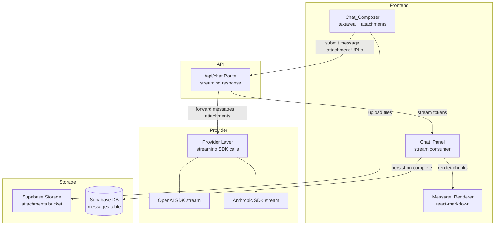

# Design Document: Chat UX Polish

## Overview

This design addresses five quality-of-life improvements to the ContextGraph chat interface, bringing it to parity with modern AI chat products. The changes span the full chat pipeline: composer input, API route, provider layer, streaming transport, message persistence, and frontend rendering.

**Current state (from codebase audit):**
- `maxTokens` defaults to 512 in `src/lib/ai/provider.ts` (both OpenAI and Anthropic paths)
- `ChatInput.tsx` renders a single-line `<input>` element
- `ChatMessage.tsx` uses `whitespace-pre-wrap` for all message content
- `/api/chat/route.ts` awaits full completion JSON before responding
- `ChatMessage` type has no attachment fields; no Supabase Storage integration exists

**Design goals:**
1. Raise default token limit to 4096 with caller override support
2. Replace `<input>` with auto-growing `<textarea>` (max 200px)
3. Render assistant Markdown via `react-markdown` with XSS sanitization
4. Stream tokens via ReadableStream with progressive rendering
5. Support file/image attachments via Supabase Storage + multimodal API

## Architecture



**Key architectural decisions:**

1. **Streaming via ReadableStream** (not Server-Sent Events): Next.js App Router natively supports returning `Response` objects with `ReadableStream` bodies. This avoids SSE polyfill complexity and works with the existing fetch-based frontend. Each chunk is a newline-delimited JSON object (`{type, content}` or `{type, error}`).

2. **react-markdown for rendering**: The project already uses React 19 and Tailwind. `react-markdown` is the standard choice — it integrates via a React component, supports plugins (remark-gfm for tables/strikethrough), and allows custom component overrides for code blocks and links. XSS is handled by `react-markdown`'s default behavior of not rendering raw HTML, reinforced by the `rehype-sanitize` plugin.

3. **Supabase Storage for attachments**: The project already uses Supabase for data persistence. Storage is the natural fit — uploads go to a `chat-attachments` bucket, and signed/public URLs are stored in the message metadata. The browser client (`createBrowserSupabaseClient`) handles uploads directly from the frontend, avoiding file transit through the API route.

4. **Schema extension over migration**: The `attachments` field is added as a JSONB column on the `messages` table (nullable, defaults to null for existing messages). This is backward-compatible — no data migration needed.

## Components and Interfaces

### 1. Provider Layer Changes (`src/lib/ai/provider.ts`)

```typescript
// New streaming types
export type StreamChunk = {
  type: "token" | "done" | "error";
  content?: string;
  stopReason?: string;
  error?: string;
};

export type StreamCompletionOptions = CompletionOptions & {
  onChunk: (chunk: StreamChunk) => void;
};

// New function signatures
export async function completeStream(options: StreamCompletionOptions): Promise<void>;
// Internal implementations
async function openaiCompleteStream(options: StreamCompletionOptions): Promise<void>;
async function anthropicCompleteStream(options: StreamCompletionOptions): Promise<void>;
```

The existing `complete()` function remains unchanged for non-chat uses (graph synthesis, node materialization). The new `completeStream()` is used only by the chat route.

**Default maxTokens change**: Both `openaiComplete` and `anthropicComplete` change their fallback from `512` to `4096`. The `completeStream` variants also use `4096` as default.

### 2. Chat Library (`src/lib/ai/chat.ts`)

```typescript
export async function generateChatResponse(
  messages: CompletionMessage[],
  options?: { temperature?: number; maxTokens?: number },
): Promise<string>;

// New streaming variant
export function streamChatResponse(
  messages: CompletionMessage[],
  options?: { temperature?: number; maxTokens?: number },
): ReadableStream<Uint8Array>;
```

`streamChatResponse` returns a `ReadableStream` that the API route can return directly as a `Response` body. It encodes each token chunk as a newline-delimited JSON line (`\n`-separated).

### 3. Chat API Route (`/api/chat/route.ts`)

The POST handler changes from returning `NextResponse.json({ content })` to returning a streaming `Response`:

```typescript
export async function POST(request: NextRequest): Promise<Response> {
  // Validate request (same as before)
  // Validate maxTokens if provided: integer in [1, 16384]
  // Return new Response(readableStream, { headers: { "Content-Type": "text/plain; charset=utf-8" } })
}
```

**Wire format** (newline-delimited JSON):
```
{"type":"token","content":"Hello"}
{"type":"token","content":" world"}
{"type":"done","stopReason":"end_turn"}
```

On error mid-stream:
```
{"type":"error","error":"Provider connection lost"}
```

### 4. Chat Composer (`src/components/chat/ChatInput.tsx`)

Complete rewrite from `<input>` to `<textarea>` with:
- `useRef` for textarea DOM access
- `useEffect` for auto-height calculation on value change
- `overflow-y: auto` when scrollHeight > 200px
- Keyboard handling: Enter = submit, Shift+Enter = newline
- Attachment state: `File[]` array with preview rendering
- File input element (hidden) triggered by attachment button
- Validation: type whitelist, 10MB size limit, 5 file max
- Upload to Supabase Storage on submit

```typescript
type ChatInputProps = {
  onSendMessage: (content: string, attachments?: AttachmentMeta[]) => void;
  disabled?: boolean;
};

type AttachmentMeta = {
  url: string;
  filename: string;
  mimeType: string;
  size: number;
};
```

### 5. Message Renderer (`src/components/chat/ChatMessage.tsx`)

For assistant messages, replace the `<p className="whitespace-pre-wrap">` with:

```tsx
import ReactMarkdown from "react-markdown";
import remarkGfm from "remark-gfm";
import rehypeSanitize from "rehype-sanitize";

// Inside render for assistant messages:
<ReactMarkdown
  remarkPlugins={[remarkGfm]}
  rehypePlugins={[rehypeSanitize]}
  components={{
    code: CodeBlock,     // Custom fenced code block with language label
    a: ExternalLink,     // target="_blank" for cross-origin
  }}
>
  {message.content}
</ReactMarkdown>
```

User messages continue to render as `<p className="whitespace-pre-wrap">`.

### 6. Stream Consumer (in `app/page.tsx` or extracted hook)

A new `useStreamChat` hook (or inline logic) that:
1. Calls `fetch("/api/chat", ...)` 
2. Reads the response body as a `ReadableStream`
3. Decodes chunks, parses JSON lines
4. Updates message state progressively
5. Handles timeout (30s no-token timer)
6. Handles mid-stream errors gracefully
7. Persists final message on stream completion

### 7. Attachment Upload Utility (`src/lib/attachments.ts`)

```typescript
export const ALLOWED_MIME_TYPES = [
  "image/jpeg", "image/png", "image/gif", "image/webp",
  "application/pdf", "text/plain",
];
export const MAX_FILE_SIZE = 10 * 1024 * 1024; // 10MB
export const MAX_ATTACHMENTS = 5;

export function validateFile(file: File): { valid: boolean; error?: string };
export async function uploadAttachment(file: File, conversationId: string): Promise<AttachmentMeta>;
```

Upload path: `chat-attachments/{conversationId}/{uuid}-{filename}`

### 8. Multimodal Message Formatting (`src/lib/ai/multimodal.ts`)

Transforms attachment metadata into provider-specific content parts:

```typescript
export function buildMultimodalContent(
  textContent: string,
  attachments: AttachmentMeta[],
  provider: "openai" | "anthropic",
): ContentPart[];
```

- Images → Anthropic `image` blocks (base64 or URL) / OpenAI `image_url` content parts
- PDF/text → Downloaded and included as text content parts

## Data Models

### ChatMessage Type (updated)

```typescript
export type AttachmentMeta = {
  url: string;
  filename: string;
  mimeType: string;
  size: number;
};

export type ChatMessage = {
  id: string;
  role: "user" | "assistant";
  content: string;
  attachments?: AttachmentMeta[] | null;
  // Branch fields — null for normal messages
  parentNodeId?: string | null;
  branchRootMessageId?: string | null;
};
```

### Supabase `messages` Table Migration

```sql
ALTER TABLE messages
ADD COLUMN attachments JSONB DEFAULT NULL;

COMMENT ON COLUMN messages.attachments IS 
  'Array of {url, filename, mimeType, size} for uploaded files. NULL for messages without attachments.';
```

### Supabase Storage Bucket

```sql
INSERT INTO storage.buckets (id, name, public)
VALUES ('chat-attachments', 'chat-attachments', true);

-- RLS policy: authenticated users can upload
CREATE POLICY "Allow uploads" ON storage.objects
  FOR INSERT TO authenticated
  WITH CHECK (bucket_id = 'chat-attachments');

-- Public read for serving attachments
CREATE POLICY "Allow public read" ON storage.objects
  FOR SELECT TO public
  USING (bucket_id = 'chat-attachments');
```

### Stream Wire Format

```typescript
type StreamLine =
  | { type: "token"; content: string }
  | { type: "done"; stopReason: string }
  | { type: "error"; error: string };
```

## Correctness Properties

*A property is a characteristic or behavior that should hold true across all valid executions of a system — essentially, a formal statement about what the system should do. Properties serve as the bridge between human-readable specifications and machine-verifiable correctness guarantees.*

### Property 1: maxTokens Validation

*For any* value provided as `maxTokens` in a chat request, the value is accepted if and only if it is an integer within the range [1, 16384]; all other values (non-integers, out of range, non-numbers) result in a 400 rejection.

**Validates: Requirements 1.4, 1.5**

### Property 2: Textarea Auto-Grow Height Clamping

*For any* multiline string content entered in the Chat_Composer, the computed height of the textarea shall be greater than or equal to the single-row initial height and less than or equal to 200 pixels.

**Validates: Requirements 2.3, 2.4**

### Property 3: Enter Submission Logic

*For any* string in the textarea and an Enter keypress without Shift held, message submission occurs if and only if the string contains at least one non-whitespace character.

**Validates: Requirements 2.5, 2.6**

### Property 4: Clear and Reset After Send

*For any* successfully submitted message, the textarea value shall be empty and the textarea height shall equal the single-row initial height immediately after submission.

**Validates: Requirements 2.8**

### Property 5: Markdown Rendering Completeness

*For any* assistant message containing Markdown syntax (valid or malformed), the rendered output shall contain all textual content from the source — no content is discarded — with valid Markdown portions rendered as formatted HTML.

**Validates: Requirements 3.1, 3.7**

### Property 6: Code Block Rendering

*For any* fenced code block with a language identifier, the rendered output shall include the code content in a monospace-styled container with the language identifier displayed as a label.

**Validates: Requirements 3.3**

### Property 7: External Link Security

*For any* Markdown link whose href has a different origin than the application, the rendered anchor element shall have `target="_blank"` and `rel="noopener noreferrer"` attributes.

**Validates: Requirements 3.4**

### Property 8: User Message Plain Text Preservation

*For any* user message containing Markdown syntax characters, the rendered output shall display the raw characters as plain text without Markdown interpretation.

**Validates: Requirements 3.5**

### Property 9: HTML Sanitization

*For any* assistant message containing raw HTML tags or `<script>` elements, the rendered output shall contain zero raw HTML elements — only HTML generated by the Markdown parser.

**Validates: Requirements 3.6**

### Property 10: Partial Markdown Streaming Stability

*For any* valid Markdown string sliced at an arbitrary byte position (simulating a partial stream), rendering the partial content shall not throw an error or produce uncaught exceptions.

**Validates: Requirements 4.3**

### Property 11: File Validation

*For any* set of files presented for attachment, a file is accepted if and only if its MIME type is in the allowed set (JPEG, PNG, GIF, WebP, PDF, text/plain), its size is ≤ 10MB, and the total attachment count does not exceed 5. Invalid files are rejected individually without affecting valid files.

**Validates: Requirements 5.3, 5.4**

### Property 12: Multimodal Format Transformation

*For any* array of attachment metadata, the transformation to provider-native format shall produce image content blocks for image MIME types and text content parts for PDF/text types, with all attachments represented in the output.

**Validates: Requirements 5.7**

### Property 13: Attachment Rendering by Type

*For any* message with attachments, image attachments shall render as inline previews (max width 400px maintaining aspect ratio) and non-image attachments shall render as downloadable links displaying filename and file size.

**Validates: Requirements 5.2, 5.9**

## Error Handling

| Scenario | Handling |
|----------|----------|
| Invalid `maxTokens` in request | Return 400 with descriptive error message |
| Provider API failure (non-streaming) | Return 500 with `"AI request failed: {message}"` |
| Stream mid-response error | Send `{"type":"error","error":"..."}` chunk, close stream |
| Stream timeout (30s no tokens) | Client-side: display partial + timeout indicator, re-enable input |
| Network disconnect during stream | Client-side: display partial content + error indicator |
| File exceeds 10MB | Inline error on that file, retain valid files |
| Unsupported file type | Inline error on that file, retain valid files |
| Supabase Storage upload failure | Inline error, retain message in composer, don't send |
| Attachment URL inaccessible at render time | Show broken-image fallback / filename with error state |
| Malformed Markdown in response | Graceful degradation — valid portions render, rest shown as text |
| `stop_reason: "max_tokens"` from model | Log warning server-side (conversation ID + token count) |

## Testing Strategy

### Property-Based Testing

This feature is well-suited for property-based testing due to the input validation logic, text transformation functions, and rendering rules that must hold universally.

**Library**: [fast-check](https://github.com/dubzzz/fast-check) (JavaScript/TypeScript PBT library)

**Configuration**: Minimum 100 iterations per property test.

**Tag format**: `Feature: chat-ux-polish, Property {N}: {title}`

Each correctness property (1–13) maps to a single property-based test. Key generators:
- Random integers and non-integers for maxTokens validation
- Random multiline strings for textarea behavior
- Random Markdown strings (valid and malformed) for rendering
- Random file metadata (MIME types, sizes) for attachment validation
- Random attachment arrays for multimodal transformation

### Unit Tests (Example-Based)

- Default maxTokens = 4096 when no override (Req 1.1, 1.2)
- Truncation warning logged when `stop_reason = "max_tokens"` (Req 1.3)
- Textarea renders instead of input (Req 2.1)
- Shift+Enter inserts newline (Req 2.7)
- Specific Markdown elements render correctly (Req 3.2)
- Stream completion triggers persistence (Req 4.4)
- Mid-stream error shows partial content (Req 4.5)
- Input disabled during streaming (Req 4.6, 4.7)
- File picker opens on attachment button click (Req 5.1)
- Upload failure retains composer state (Req 5.6)
- Loaded messages display persisted attachments (Req 5.10)

### Integration Tests

- End-to-end streaming: mock provider → API route → frontend consumer
- Supabase Storage upload/download round-trip
- Message persistence with attachments field

### Dependencies to Add

```json
{
  "dependencies": {
    "react-markdown": "^9.0.0",
    "remark-gfm": "^4.0.0",
    "rehype-sanitize": "^6.0.0"
  },
  "devDependencies": {
    "fast-check": "^3.0.0"
  }
}
```
