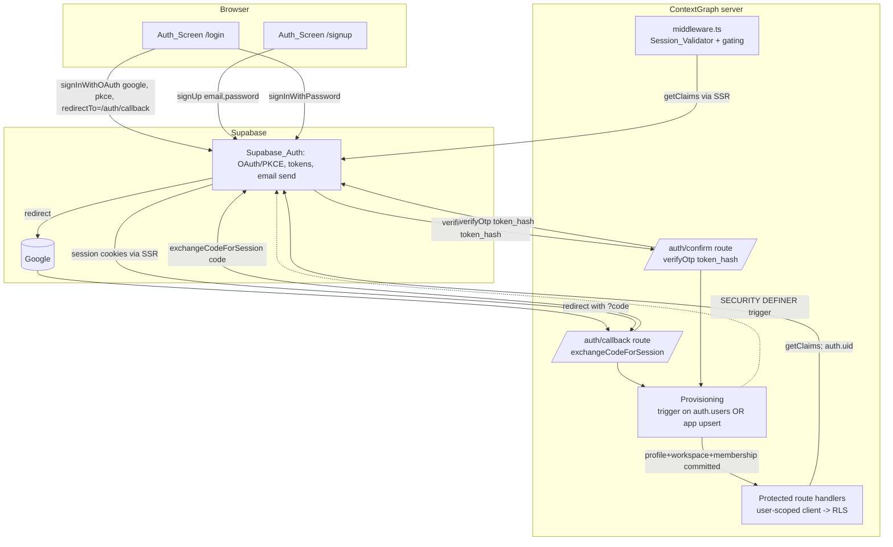
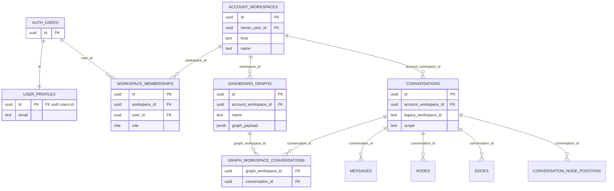

# Design Document

## Overview

This feature replaces ContextGraph's environment-variable owner/demo login (the HMAC `cg_session` cookie plus `TEMP_OWNER_*`/`TEMP_DEMO_*` credentials) with **Supabase Auth as the sole identity and session authority**. Users sign in with Google (OAuth + PKCE) or with email/password, both delegated entirely to Supabase. Every authenticated user is backed by a `User_Profile`, a personal `Account_Workspace`, and a `Workspace_Membership`, provisioned idempotently before any usable access. Authorization moves from static workspace strings to **membership-and-role driven access enforced by Row Level Security (RLS)**, with the canonical identity being the Supabase user UUID (`auth.users.id`).

The design intentionally hand-rolls nothing that Supabase already owns. It does not build a custom OAuth flow, verify Google ID tokens, mint application JWTs, store/hash/verify passwords, or sign session cookies. `@supabase/ssr` manages the auth cookies through its supported cookie-handler interface, and `getClaims()` validates sessions server-side.

Grounding against the current codebase surfaced three facts that shape the design:

1. **The existing auth is cookie-based and workspace-string based.** `src/lib/auth/session.ts` issues an HMAC `cg_session` cookie carrying `workspace: "owner" | "demo"`; `middleware.ts` gates on its presence; `src/lib/auth/authorization.ts` and `src/lib/auth/debug.ts` branch on `session.workspace`. All of this is replaced.
2. **Data is scoped by a `workspace_id TEXT` column constrained to `('owner','demo')`.** `conversations.workspace_id`, `graph_workspaces.workspace_id`, and the dependent tables keyed off conversation/graph IDs all assume this two-value model. The new model introduces real UUID workspaces and a one-time `UUID_Migration` to carry existing owner data forward.
3. **Nearly every API route currently uses the service-role client (`createServerSupabaseClient()` → `SUPABASE_SERVICE_ROLE_KEY`), which bypasses RLS.** A grep found service-role usage in ~20 route files (`app/api/attachments`, `app/api/conversations/*`, `app/api/v2/*`, `app/api/graph-*`, and all `app/api/debug/*`). Migrating ordinary request paths to a **user-scoped client so RLS applies** is the single largest and highest-risk part of this feature. It is called out explicitly in Architecture and scoped as its own concern.

> **Risk flag (restated up front):** The service-role → user-scoped RLS migration touches many files and changes the effective authorization boundary for ordinary data access. If a route is missed, it either keeps bypassing RLS (security gap) or breaks because the service-role-only tables (`graph_workspaces` et al.) have no user policies yet. This must be sequenced carefully: add RLS policies and provisioning **before** flipping any route to the user-scoped client, and migrate routes in reviewable batches.

### Requirements coverage map

| Area | Requirements |
| --- | --- |
| Google OAuth + PKCE, server code exchange | 1, 2 |
| Supabase-managed cookies & refresh (SSR) | 3 |
| Server-side validation via `getClaims()`, canonical UUID identity | 4 |
| No Redis / no raw PG pool | 5 |
| Idempotent provisioning before access | 6, 21 |
| Membership-based authorization replaces owner/demo | 7 |
| Middleware gating preservation | 8 |
| Debug-route gating via current membership role (no JWT role claim / no auth hook) | 9 |
| RLS as final boundary; service-role restricted | 7, 10 |
| Explicit `UUID_Migration` of owner data | 11 |
| Secret & credential handling | 12 |
| Email/password signup, verification, login | 13, 14, 15 |
| Forgot/reset/change password, recovery session | 16, 17, 18 |
| Logout via Supabase sign-out | 19 |
| Auth screens + server callback states | 20 |
| Unified identity across methods | 21 |
| Schema readiness for future shared workspaces | 22 |

## Architecture

### Runtime context

- **Platform:** Next.js 16 (App Router) on Vercel serverless, Node 22, Supabase/PostgreSQL. `@supabase/supabase-js` is already present; `@supabase/ssr` is added by this feature (the only new runtime dependency). No Redis, no raw PG pool (Req 5).
- **Three Supabase clients** replace the current two-client setup (`src/lib/supabase/client.ts` browser + `src/lib/supabase/server.ts` service-role):
  1. **Browser client** (`@supabase/ssr` `createBrowserClient`, anon key) — used by Auth_Screens to call `signInWithOAuth`, `signInWithPassword`, `signUp`, `resetPasswordForEmail`, `updateUser`, `signOut`.
  2. **Server client** (`createServerClient`, anon key, cookie handler bound to `next/headers` `cookies()`) — used in route handlers, server components, and callback routes. Runs **as the user**, so RLS applies (Req 10.1).
  3. **Middleware client** (`createServerClient`, anon key, cookie handler bound to the `NextRequest`/`NextResponse` cookie pair) — used only in `middleware.ts` to validate the session and refresh cookies on the response.
  4. **Service-role client** (existing, `SUPABASE_SERVICE_ROLE_KEY`) — retained but **demoted** to privileged non-request paths only: the `UUID_Migration` runner and genuinely offline/system jobs (background maintenance not tied to any user session) that legitimately need to bypass RLS. Normal account provisioning is **not** a service-role path — it runs through the `auth.users` SECURITY DEFINER trigger or a narrowly scoped `auth.uid()`-bound authenticated RPC (Req 10.3, 10.5).

### Vercel serverless + `@supabase/ssr` cookie handling

On Vercel, each route handler and middleware invocation is a fresh serverless execution. `@supabase/ssr` reads auth cookies on the way in and must be allowed to write refreshed cookies on the way out:

- **Middleware** is the only place guaranteed to run on every matched request, so it is where token refresh is wired: the middleware client reads cookies from `request.cookies` and writes any refreshed cookies to the `NextResponse` that is ultimately returned. This matches Supabase's documented SSR middleware pattern and satisfies Req 3.1/3.3 (refresh handled by the SSR integration, not hand-rolled).
- **Route handlers / server components** use the `cookies()`-bound server client. Server components cannot set cookies, so cookie **writes** are tolerated-but-ignored there (the middleware already refreshed them); cookie writes that matter (callback code exchange, sign-out) happen in route handlers / server actions where setting cookies is allowed.
- All cookie reads/writes go **exclusively** through the SSR cookie-handler interface — never `cookieStore.set`/`delete` on an auth cookie directly (Req 3.2, 3.4, 19.2, 19.4).

### End-to-end flows



**Reading the diagram against requirements:**

- **Google path (Req 1, 2):** `/login` calls `signInWithOAuth({ provider: 'google', options: { redirectTo: <callback>, queryParams/flowType pkce } })`. Supabase owns PKCE verifier/challenge/state (Req 1.2, 1.3). Google redirects to `/auth/callback?code=...`; the callback calls `exchangeCodeForSession(code)` through the SSR server client (Req 2.1). Tokens are issued and managed by Supabase (Req 2.2). The callback mints no JWT, verifies no Google ID token, and derives identity only from the exchanged code (Req 2.3). Exchange failure → auth error, no access (Req 2.4).
- **Email/password (Req 13, 15):** `signUp` on `/signup`, `signInWithPassword` on `/login`. Same SSR cookie establishment as Google (Req 15.2). Invalid credentials → generic error (Req 15.3).
- **Verification (Req 14):** signup triggers a Supabase-sent email carrying a `token_hash`; the `/auth/confirm` route calls `verifyOtp({ type, token_hash })` server-side (Req 14.1). Invalid/expired → error, no access (Req 14.4).
- **Recovery (Req 16, 17):** forgot-password calls `resetPasswordForEmail`; the recovery link lands on `/auth/confirm` (type `recovery`) which establishes a Recovery_Session, after which `/reset-password` calls `updateUser({ password })` (Req 17.1, 17.2).
- **Session validation (Req 4, 8):** both middleware and route handlers resolve identity via `getClaims()`; the Supabase_User_Id from verified claims is the canonical identity (Req 4.2); no valid session → unauthenticated (Req 4.4).
- **Provisioning (Req 6, 21):** performed before usable access, keyed by `auth.users.id`, idempotent across methods and repeat sign-ins.

### Component responsibilities (replacing the old auth module)

| Old (`src/lib/auth/*`) | New |
| --- | --- |
| `session.ts` `createSession`/`getSession`/`getSessionFromRequest`/`destroySession` (HMAC cookie) | **Removed.** Session lifecycle owned by Supabase/SSR. |
| `authorization.ts` `requireSession`/`requireConversationAccess` | **Replaced** by `requireUser()` (reads `getClaims()`) + RLS-scoped queries. Cross-workspace 404 behavior preserved. |
| `debug.ts` `requireDebugAccess` (owner workspace + flag) | **Replaced** by `requireDebugAccess()` using a **current** Workspace_Membership role check (live data, no JWT role claim, caller derived from `auth.uid()` — never a caller-supplied uid) + flag (Req 9). |
| `middleware.ts` (HMAC presence + owner gating) | **Rewritten** to use the SSR middleware client + `getClaims()`, preserving gating semantics (Req 8). |

## Components and Interfaces

### 1. Supabase client factories (`src/lib/supabase/`)

Three factories, each with a single responsibility. All user-facing clients use the **anon key** so RLS applies (Req 12.3); the service-role key is read server-side only (Req 12.1).

```ts
// src/lib/supabase/browser.ts  — client components only
import { createBrowserClient } from "@supabase/ssr";
export function createBrowserSupabaseClient() {
  return createBrowserClient(
    process.env.NEXT_PUBLIC_SUPABASE_URL!,
    process.env.NEXT_PUBLIC_SUPABASE_ANON_KEY!,
  );
}

// src/lib/supabase/server.ts  — route handlers / server components (USER-SCOPED, RLS applies)
import { createServerClient } from "@supabase/ssr";
import { cookies } from "next/headers";
export async function createUserScopedClient() {
  const cookieStore = await cookies();
  return createServerClient(
    process.env.NEXT_PUBLIC_SUPABASE_URL!,
    process.env.NEXT_PUBLIC_SUPABASE_ANON_KEY!,
    {
      cookies: {
        getAll: () => cookieStore.getAll(),
        setAll: (toSet) => {
          try { toSet.forEach(({ name, value, options }) => cookieStore.set(name, value, options)); }
          catch { /* called from a server component: middleware already refreshed */ }
        },
      },
    },
  );
}

// src/lib/supabase/service-role.ts  — PRIVILEGED NON-REQUEST PATHS ONLY (bypasses RLS)
import { createClient } from "@supabase/supabase-js";
export function createServiceRoleClient() {
  return createClient(
    process.env.NEXT_PUBLIC_SUPABASE_URL!,
    process.env.SUPABASE_SERVICE_ROLE_KEY!, // server-only, never NEXT_PUBLIC_
    { auth: { persistSession: false } },
  );
}
```

> **Migration note:** the current `src/lib/supabase/server.ts` exports a service-role client named `createServerSupabaseClient`. To avoid a silent security regression, `createServerSupabaseClient` is **renamed/moved** so that the obvious server import becomes the user-scoped client, and the service-role factory gets a deliberately conspicuous name (`createServiceRoleClient`) imported only from the privileged paths. A **hard-violation guard** (Req 10.5) is added: `createServiceRoleClient` throws if invoked from a module reachable by a request handler without an explicit allow-list marker (enforced in code review + a lint rule / runtime assertion checking an opt-in flag such as `allowServiceRole: true`), and never from middleware or page/route request paths. The service-role allowlist is reserved for **only** (1) the explicit `UUID_Migration` runner and (2) genuinely offline/system jobs; **normal account provisioning is not on the allowlist** — it runs through the `auth.users` SECURITY DEFINER trigger or an `auth.uid()`-bound authenticated RPC via the user-scoped client. The permitted importers are fixed by this explicit **service-role allowlist** and enforced by a **CI static check** (ESLint `no-restricted-imports` plus a custom script) that fails the build if any non-allowlisted request-path module imports the service-role factory. Both are specified in detail in **Service-Role Migration & Cutover Plan** below, which also inventories every current service-role usage route-by-route and defines the cutover feature flag that gates enabling production Supabase Auth.

### 2. Session validator (`src/lib/auth/session.ts`, rewritten)

```ts
// Used by middleware and route handlers. No DB query — claims only (Req 4, 5).
export type AuthClaims = { userId: string; email?: string };
export async function getAuthClaims(client): Promise<AuthClaims | null> {
  const { data, error } = await client.auth.getClaims();
  if (error || !data?.claims?.sub) return null;
  return { userId: data.claims.sub, email: data.claims.email };
}
```

- Canonical identity is `claims.sub` = Supabase_User_Id (Req 4.2). Never the Google subject (Req 4.3).
- No manual Google ID-token or self-JWT verification (Req 4.5).
- Resolves session/context through Supabase only — no cache, no PG pool (Req 5).

### 3. Middleware (`middleware.ts`, rewritten)

Preserves every gating branch of the current middleware, re-expressed over Supabase sessions (Req 8), and refreshes cookies via the SSR middleware client (Req 3).

```
1. Build middleware Supabase client bound to (request, response) cookies.
2. claims = getAuthClaims(mwClient)   // getClaims() through SSR — IDENTITY ONLY (Req 8.4, 4.1)
3. If path starts with /api/auth OR /auth OR == /login  -> allow (Req 8.3)
4. If path is a static/_next asset -> allow
5. If no claims:
     - /api/* (non-auth) -> 401 + Cache-Control: no-store (Req 8.1)
     - page route        -> redirect to /login            (Req 8.2)
6. Debug_Route (/api/debug/* or /debug/*)  -- ONLY debug paths incur a DB check:
     - flag disabled outside dev -> 404                                  (Req 9.1)
     - CURRENT server-side membership+role lookup (live data) lacks
       debug access -> 404                                               (Req 9.2)
     - else allow                                                        (Req 9.3)
7. Non-debug paths: NO membership/role DB query — identity claims only (lightweight, Req 5).
8. Return response with refreshed auth cookies; set Cache-Control: no-store on /api/*.
```

Two subtleties:

- **Debug role check in middleware (current membership, not a claim).** `getClaims()` is used **only to verify identity** — it establishes the Supabase_User_Id and nothing more (Req 4.1, 4.2). It is deliberately **not** used to carry an authorization/role signal: this design uses **no custom `app_role` JWT claim and no Supabase auth hook**. The reason is correctness, not convenience — a role baked into a JWT would be **stale** after a membership or role change (the token keeps asserting the old role until it is refreshed), and a single scalar claim **cannot represent workspace-specific roles** (a user may be `owner` in one workspace and `member` in another). Debug authorization must therefore read **current** membership state. For Debug_Routes **specifically**, the middleware performs a current server-side Workspace_Membership + role check against live data, resolved either through the **user-scoped Supabase client** (so RLS applies and `auth.uid()` is the session user) **or** through a narrowly scoped, audited `SECURITY DEFINER` database function that **derives the caller exclusively from `auth.uid()` and never accepts a caller-supplied user id** — e.g. `has_debug_access()` (no args) or `is_member_with_role(target_workspace uuid, required_role workspace_role)` (workspace/role only) — that checks the **caller's** live `workspace_memberships` row for that specific workspace and returns only a boolean. This lookup is confined to debug requests; ordinary (non-debug) middleware never touches the database and stays identity-claims only, keeping the common path aligned with Req 5. `requireDebugAccess()` performs the same current-state check again in the handler as defense-in-depth (Req 9).

  > **Why no uid parameter.** A `has_debug_access(uid)` / `is_member_with_role(uid, ...)` style signature is **forbidden**: because the function runs `SECURITY DEFINER` (it bypasses RLS to read `workspace_memberships`), a caller-supplied uid would let any authenticated caller probe or impersonate **other** users' memberships and roles. The helper therefore binds the subject to `auth.uid()` inside the function body, accepts only the target workspace/resource identifier when one is needed, verifies the **caller's own** current membership and required role for that **specific** workspace, and returns a boolean only — never another user's or workspace's rows or roles.

```sql
-- Debug authorization helper: caller is ALWAYS auth.uid(), never a parameter.
-- Fixed, safe search_path; SECURITY DEFINER + STABLE; returns only a boolean.
CREATE OR REPLACE FUNCTION public.is_member_with_role(
  target_workspace uuid,
  required_role    public.workspace_role
)
RETURNS boolean
LANGUAGE sql
SECURITY DEFINER
STABLE
SET search_path = ''                       -- no mutable search_path; fully-qualified names below
AS $$
  SELECT EXISTS (
    SELECT 1
    FROM public.workspace_memberships m
    WHERE m.workspace_id = target_workspace
      AND m.user_id      = auth.uid()       -- subject bound to the CALLER, not a parameter
      AND m.role         = required_role
  );
$$;

-- Convenience wrapper for "does the caller currently have debug access anywhere/
-- in their active workspace" — still no uid parameter.
CREATE OR REPLACE FUNCTION public.has_debug_access()
RETURNS boolean
LANGUAGE sql
SECURITY DEFINER
STABLE
SET search_path = ''
AS $$
  SELECT EXISTS (
    SELECT 1
    FROM public.workspace_memberships m
    WHERE m.user_id = auth.uid()            -- CALLER only
      AND m.role IN ('owner','admin')
  );
$$;
```
- **Allowed callback namespace.** The old middleware only bypassed `/api/auth` and `/login`. The new one additionally bypasses the `/auth/*` callback namespace (`/auth/callback`, `/auth/confirm`) since those must run without a prior session (Req 8.3, 20.4).

### 4. Auth routes and screens

**Server callback routes (route handlers, user-scoped SSR client):**

| Route | Method | Responsibility | Requirements |
| --- | --- | --- | --- |
| `app/auth/callback/route.ts` | GET | OAuth + code exchange: `exchangeCodeForSession(code)`; on success run provisioning gate, redirect to app; on failure redirect to `/login?error=` | 2.1–2.4, 20.4, 20.5 |
| `app/auth/confirm/route.ts` | GET | Email confirmation **and** recovery: `verifyOtp({ type, token_hash })`; `type=signup` → provisioning + app; `type=recovery` → establish Recovery_Session → redirect `/reset-password` | 14.1–14.4, 17.1, 17.4, 20.3–20.5 |

**Auth action handlers.** Email/password and OAuth initiation are issued from the browser client inside Server-Actions/client handlers; logout is a route handler/server action calling `signOut`:

| Action | Supabase call | Requirements |
| --- | --- | --- |
| Google sign-in | `signInWithOAuth({ provider:'google', options:{ redirectTo:'/auth/callback', flowType:'pkce' }})` | 1.1–1.4 |
| Signup | `signUp({ email, password, options:{ emailRedirectTo:'/auth/confirm' }})` | 13.1–13.5, 14.3 |
| Login | `signInWithPassword({ email, password })` | 15.1–15.5 |
| Forgot password | `resetPasswordForEmail(email, { redirectTo:'/auth/confirm?type=recovery' })` | 16.1–16.4 |
| Set/Change password | `updateUser({ password })` (requires active or recovery session) | 17.2, 18.1–18.4 |
| Logout | `signOut()` then confirm no valid session | 19.1–19.4 |

**Auth_Screens (Req 20.1–20.3):** `/login` (Google + email/password), `/signup`, `/forgot-password`, `/reset-password`, `/set-password` (a.k.a. change password; label switches to "Set Password" when the Google user has no password — Req 18.2), and an email-verification result screen. All UI uses Astryx components per workspace rules (TextInput, Button, Banner), replacing the current credential-only `/login` page.

### 5. Provisioning (`Provisioning`)

**Decision: a SECURITY DEFINER trigger on `auth.users` INSERT is the primary mechanism, with an app-side idempotent upsert as the gate/fallback.**

Tradeoff analysis:

| | DB trigger on `auth.users` | App-side transactional upsert |
| --- | --- | --- |
| Atomicity with user creation | Runs in the same transaction as the user insert — records exist the instant the user does | Separate round-trip after first authenticated request; a crash between can leave the user with no records |
| "Before any access" guarantee (Req 6.4) | Strong — committed before the session is ever used | Requires a gate on every entry path to re-check |
| Works for all methods (Google + email/pw) | Yes — fires on any `auth.users` insert (Req 6.1) | Yes, but each path must call it |
| Idempotency | `INSERT ... ON CONFLICT DO NOTHING` keyed by `auth.users.id` | Same, in app code |
| Partial-failure retry (Req 6.5) | Trigger is one transaction: all-or-nothing, so no partial state | App must wrap all three inserts in one transaction |
| Operational visibility / testing | Harder to unit test; lives in SQL | Easy to unit/integration test |

**Chosen design:** the trigger guarantees Req 6.1/6.4 at the strongest point (same transaction as user creation) and is inherently idempotent and all-or-nothing, directly satisfying Req 6.3 and 6.5. Because triggers are harder to observe, the app adds a thin **provisioning gate** (`ensureProvisioned()`) invoked at the end of each callback and as a safety net in `requireUser()`. **The gate never uses the service-role client** — normal provisioning must not run through a service-role request handler (Req 6, 10, 12). Instead the gate operates entirely under the **user-scoped client bound to `auth.uid()`**: it either (a) verifies — via the user-scoped client — that the trigger's three rows (`User_Profile`, personal `Account_Workspace`, `Workspace_Membership`) already exist for the caller, or (b) if the trigger is ever disabled or a record is missing, calls a narrowly scoped **authenticated `SECURITY DEFINER` RPC bound to `auth.uid()`** (`provision_self()`) via `.rpc()` through the user-scoped client. `provision_self()` provisions **only the caller's own** profile/workspace/membership using `auth.uid()` inside the function body — it accepts **no caller-supplied uid** and performs the same idempotent `ON CONFLICT DO NOTHING` upsert of the three records (Req 6.5 idempotent retry). The gate verifies all three exist before returning; access is denied until all three are confirmed committed (Req 6.4). If the trigger already created them, the gate is a read-only no-op.

```sql
-- App-side fallback: provisions ONLY the caller's own records (auth.uid()),
-- callable via .rpc('provision_self') through the USER-SCOPED client. No uid param,
-- no service-role. Idempotent and all-or-nothing like the trigger.
CREATE OR REPLACE FUNCTION public.provision_self()
RETURNS void
LANGUAGE plpgsql
SECURITY DEFINER
SET search_path = ''
AS $$
DECLARE
  uid    uuid := auth.uid();   -- subject is the CALLER, never a parameter
  ws_id  uuid;
  mail   text;
BEGIN
  IF uid IS NULL THEN
    RAISE EXCEPTION 'provision_self requires an authenticated caller';
  END IF;

  SELECT email INTO mail FROM auth.users WHERE id = uid;

  INSERT INTO public.user_profiles (id, email)
    VALUES (uid, mail)
    ON CONFLICT (id) DO NOTHING;

  INSERT INTO public.account_workspaces (owner_user_id, kind, name)
    VALUES (uid, 'personal', 'My Workspace')
    ON CONFLICT (owner_user_id) WHERE kind = 'personal' DO NOTHING
    RETURNING id INTO ws_id;

  IF ws_id IS NULL THEN
    SELECT id INTO ws_id FROM public.account_workspaces
      WHERE owner_user_id = uid AND kind = 'personal';
  END IF;

  INSERT INTO public.workspace_memberships (workspace_id, user_id, role)
    VALUES (ws_id, uid, 'owner')
    ON CONFLICT (workspace_id, user_id) DO NOTHING;
END; $$;
```

```sql
-- SECURITY DEFINER trigger: provisions profile + personal workspace + membership
CREATE OR REPLACE FUNCTION public.provision_user()
RETURNS TRIGGER
LANGUAGE plpgsql SECURITY DEFINER SET search_path = public AS $$
DECLARE ws_id UUID;
BEGIN
  INSERT INTO user_profiles (id, email)
    VALUES (NEW.id, NEW.email)
    ON CONFLICT (id) DO NOTHING;

  -- One personal workspace per user; idempotent on (owner_user_id, kind='personal')
  INSERT INTO account_workspaces (owner_user_id, kind, name)
    VALUES (NEW.id, 'personal', 'My Workspace')
    ON CONFLICT (owner_user_id) WHERE kind = 'personal' DO NOTHING
    RETURNING id INTO ws_id;

  IF ws_id IS NULL THEN
    SELECT id INTO ws_id FROM account_workspaces
      WHERE owner_user_id = NEW.id AND kind = 'personal';
  END IF;

  INSERT INTO workspace_memberships (workspace_id, user_id, role)
    VALUES (ws_id, NEW.id, 'owner')
    ON CONFLICT (workspace_id, user_id) DO NOTHING;
  RETURN NEW;
END; $$;

CREATE TRIGGER on_auth_user_created
  AFTER INSERT ON auth.users
  FOR EACH ROW EXECUTE FUNCTION public.provision_user();
```

**Identity unification (Req 21):** no custom merging. ContextGraph relies on Supabase-supported behavior that Google sign-in and email/password for the same email resolve to one `auth.users.id` (Supabase "link identities" / same-email identity linking). Because provisioning is keyed on `auth.users.id` and the trigger fires on the single user row, both methods converge on the **same** profile/workspace/membership (Req 21.1, 21.4). The design documents this as a Supabase configuration dependency (identity linking must be enabled in the project) rather than application logic (Req 21.3).

### 6. Authorization helpers (`src/lib/auth/authorization.ts`, rewritten)

```ts
export async function requireUser(): Promise<AuthClaims | AuthError>;      // 401 if no claims
export async function requireDebugAccess(): Promise<AuthError | null>;     // 404 unless CURRENT role+flag (Req 9)
```

- `requireUser()` reads `getClaims()` (identity only), then calls `ensureProvisioned()` (no-op fast path).
- `requireDebugAccess()` verifies the debug flag, then performs a **current** server-side Workspace_Membership + role lookup against live data — via the user-scoped client or the audited `SECURITY DEFINER` helper. The helper **derives the caller exclusively from `auth.uid()` and takes no uid parameter**: `has_debug_access()` (no args) or `is_member_with_role(target_workspace, required_role)` (workspace/role only), each checking the **caller's own** current membership for that specific workspace and returning only a boolean. It returns 404 unless the user **currently** holds the required role. It never reads a role from the JWT, so a membership/role change takes effect immediately rather than waiting for a token refresh (Req 9.2, 9.3). A uid-parameter variant is **forbidden**: since the helper runs `SECURITY DEFINER`, accepting a caller-supplied uid would let a caller probe or impersonate other users' memberships, so the subject is always `auth.uid()`.
- Ordinary data reads/writes drop `requireConversationAccess`'s manual `workspace_id` check in favor of **RLS** — the user-scoped client only ever sees rows in workspaces the user is a member of (Req 10.1, 7.4). The cross-workspace **404** behavior is preserved naturally: a non-member's query returns zero rows, which handlers translate to 404.

### 7. `UUID_Migration` runner (`src/lib/migration/uuid-migration.ts` + SQL function)

A one-time, idempotent reassociation of all Owner_Workspace_Data into the authenticated user's personal Account_Workspace, gated on the real Supabase_User_Id. Runs on a **privileged non-request path** using the service-role client (it rewrites ownership columns across tables and must be able to touch rows before RLS would admit them). Detailed in Data Models below.

## Data Models

### Entity-relationship diagram



> `DASHBOARD_GRAPHS` **is** the existing `graph_workspaces` table, re-parented from `workspace_id TEXT` ('owner'/'demo') to a real `account_workspace_id UUID`. Keeping the same table and `id` values is what lets the `UUID_Migration` preserve each graph as a separate child with its original identifier (Req 11.8). `conversations.account_workspace_id` is added alongside the retained `legacy_workspace_id` for migration bookkeeping.

### New tables

```sql
-- User_Profile (Req 6, keyed by Supabase_User_Id)
CREATE TABLE user_profiles (
  id         UUID PRIMARY KEY REFERENCES auth.users(id) ON DELETE CASCADE,
  email      TEXT,
  created_at TIMESTAMPTZ NOT NULL DEFAULT now()
);

-- Account_Workspace (personal workspace; future-ready for shared, Req 22)
CREATE TABLE account_workspaces (
  id            UUID PRIMARY KEY DEFAULT gen_random_uuid(),
  owner_user_id UUID NOT NULL REFERENCES auth.users(id) ON DELETE CASCADE,
  kind          TEXT NOT NULL DEFAULT 'personal' CHECK (kind IN ('personal','shared')),
  name          TEXT NOT NULL DEFAULT 'My Workspace',
  created_at    TIMESTAMPTZ NOT NULL DEFAULT now()
);
-- Exactly one personal workspace per user (idempotent provisioning target)
CREATE UNIQUE INDEX uq_personal_workspace
  ON account_workspaces (owner_user_id) WHERE kind = 'personal';

-- Membership role enum (Req 7.2, 9)
CREATE TYPE workspace_role AS ENUM ('owner','admin','member');

-- Workspace_Membership (Req 7, 22 — many memberships per workspace allowed)
CREATE TABLE workspace_memberships (
  id           UUID PRIMARY KEY DEFAULT gen_random_uuid(),
  workspace_id UUID NOT NULL REFERENCES account_workspaces(id) ON DELETE CASCADE,
  user_id      UUID NOT NULL REFERENCES auth.users(id) ON DELETE CASCADE,
  role         workspace_role NOT NULL DEFAULT 'owner',
  created_at   TIMESTAMPTZ NOT NULL DEFAULT now(),
  UNIQUE (workspace_id, user_id)
);
CREATE INDEX idx_membership_by_user ON workspace_memberships (user_id);
```

**Schema readiness (Req 22):** `workspace_memberships` has a composite uniqueness on `(workspace_id, user_id)` rather than a per-workspace single-member constraint, so a workspace can hold multiple memberships later (Req 22.1). This feature creates memberships **only** in the user's own personal workspace with role `owner` (Req 22.3) and ships **no** shared-workspace UI or multi-member flows (Req 22.2).

### Re-parenting existing tables

```sql
-- DASHBOARD_GRAPHS = graph_workspaces, re-parented to a real workspace UUID
ALTER TABLE graph_workspaces ADD COLUMN IF NOT EXISTS account_workspace_id UUID
  REFERENCES account_workspaces(id) ON DELETE CASCADE;
-- (legacy workspace_id TEXT retained during migration, dropped in a later cleanup)

-- CONVERSATIONS gain a real workspace parent; legacy column retained for bookkeeping
ALTER TABLE conversations ADD COLUMN IF NOT EXISTS account_workspace_id UUID
  REFERENCES account_workspaces(id) ON DELETE SET NULL;
ALTER TABLE conversations RENAME COLUMN workspace_id TO legacy_workspace_id; -- or keep both
```

`messages`, `nodes`, `edges`, and `conversation_node_positions` are **not** re-parented directly: they are keyed by `conversation_id` and inherit scoping transitively through the conversation. This is central to the migration (re-parent conversations and graphs; dependents follow) and to RLS (policies join through the conversation).

### RLS policies (Req 7, 10)

Default-deny: enable RLS on every user-data table and grant access only through membership. `auth.uid()` returns the Supabase_User_Id for the user-scoped client.

```sql
ALTER TABLE account_workspaces     ENABLE ROW LEVEL SECURITY;
ALTER TABLE workspace_memberships  ENABLE ROW LEVEL SECURITY;
ALTER TABLE graph_workspaces       ENABLE ROW LEVEL SECURITY;
ALTER TABLE conversations          ENABLE ROW LEVEL SECURITY;
ALTER TABLE messages               ENABLE ROW LEVEL SECURITY;
ALTER TABLE nodes                  ENABLE ROW LEVEL SECURITY;
ALTER TABLE edges                  ENABLE ROW LEVEL SECURITY;
ALTER TABLE conversation_node_positions ENABLE ROW LEVEL SECURITY;

-- Membership predicate helper
CREATE OR REPLACE FUNCTION public.is_member(ws UUID)
RETURNS BOOLEAN LANGUAGE sql SECURITY DEFINER STABLE AS $$
  SELECT EXISTS (
    SELECT 1 FROM workspace_memberships m
    WHERE m.workspace_id = ws AND m.user_id = auth.uid()
  );
$$;

-- A user sees their own memberships
CREATE POLICY mem_self ON workspace_memberships
  FOR SELECT USING (user_id = auth.uid());

-- Workspaces the user belongs to
CREATE POLICY ws_member ON account_workspaces
  FOR ALL USING (public.is_member(id)) WITH CHECK (public.is_member(id));

-- Graphs scoped through their workspace
CREATE POLICY graph_member ON graph_workspaces
  FOR ALL USING (public.is_member(account_workspace_id))
  WITH CHECK (public.is_member(account_workspace_id));

-- Conversations scoped through their workspace
CREATE POLICY conv_member ON conversations
  FOR ALL USING (public.is_member(account_workspace_id))
  WITH CHECK (public.is_member(account_workspace_id));

-- Dependents scoped transitively through the conversation
CREATE POLICY msg_member ON messages
  FOR ALL USING (EXISTS (
    SELECT 1 FROM conversations c
    WHERE c.id = messages.conversation_id AND public.is_member(c.account_workspace_id)));
-- nodes / edges / conversation_node_positions: identical pattern via conversation_id
```

- **Default-deny for no membership (Req 7.5):** with RLS enabled and only membership-gated policies, a user with zero memberships matches no `USING` clause and sees nothing.
- **User-scoped for requests (Req 10.1):** ordinary routes use `createUserScopedClient()`; `auth.uid()` is populated from the session, so policies apply.
- **Service-role restricted (Req 10.2, 10.3, 10.5):** only the `UUID_Migration` runner and genuinely offline/system jobs use the service-role client; the hard-violation guard blocks it from request-data paths. **Provisioning is not a service-role path** — it runs through the `auth.users` SECURITY DEFINER trigger or the `auth.uid()`-bound `provision_self()` RPC via the user-scoped client. Note the current `graph_workspaces` policies (migration `20260819004606`) enable RLS with **no** permissive policies (service-role-only); this feature **replaces** that with the membership policies above as part of flipping routes to the user-scoped client.

### `UUID_Migration` (Req 11)

Runs once per user, only after the real Supabase_User_Id is known (Req 11.2, 11.3), via a privileged (service-role) path exposed as an authenticated admin action or a parameterized SQL function `migrate_owner_data_to_user(target_user UUID)`.

**Pre-state:** legacy owner data has `legacy_workspace_id = 'owner'` on conversations and `workspace_id = 'owner'` on `graph_workspaces`. Demo data has `'demo'` and must never be read-for-modification, modified, reassociated, or deleted (Req 11.6, 11.7).

**Idempotency / skip-if-done detection:** a `migration_runs` bookkeeping table records completion.

```sql
CREATE TABLE migration_runs (
  user_id    UUID PRIMARY KEY REFERENCES auth.users(id) ON DELETE CASCADE,
  kind       TEXT NOT NULL DEFAULT 'owner_uuid_migration',
  completed_at TIMESTAMPTZ NOT NULL DEFAULT now()
);
```
If a row exists for `target_user`, the migration returns immediately (Req 11.4). The reassociation itself is also written idempotently (only rows still pointing at legacy `'owner'` are moved), so a crash-then-retry converges without duplication or double-reassociation.

**Ordering across dependent tables (parent-first, so referential integrity holds at every step — Req 11.5):**

1. Resolve target `account_workspace_id` = the personal workspace of `target_user` (must already be provisioned).
2. **Re-parent `graph_workspaces`** (Dashboard_Graphs): set `account_workspace_id = target`, **keeping each row's original `id`** (Req 11.8) and **not merging** any graphs (Req 11.9). Each graph stays a distinct child.
3. **Re-parent `conversations`** where `legacy_workspace_id = 'owner'`: set `account_workspace_id = target`.
4. **Dependents follow automatically** — `messages`, `nodes`, `edges`, `conversation_node_positions`, and `graph_workspace_conversations` reference `conversation_id`/`graph_workspace_id`, whose IDs are unchanged, so each Dashboard_Graph retains its conversation memberships, nodes, edges, positions, and provenance, still bound to the same graph (Req 11.10). No dependent row is rewritten; integrity is preserved by construction.
5. **Record completion** in `migration_runs`.

Because step order is parent→child and IDs are never changed, there is no window where a child points at a reassociated parent that does not yet exist. Demo rows (`'demo'`) are excluded from every `WHERE` clause, so they are never touched (Req 11.6, 11.7).

### Secret handling (Req 12)

- Anon key (`NEXT_PUBLIC_SUPABASE_ANON_KEY`) for browser and user-scoped clients so RLS applies (Req 12.3).
- Service-role key (`SUPABASE_SERVICE_ROLE_KEY`) read server-side only, never `NEXT_PUBLIC_` (Req 12.1).
- Keys, session tokens, and passwords are excluded from response bodies, URLs, logs, and client-readable storage (Req 12.2, 12.5). Auth action handlers never log credentials; errors are generic. Passwords are submitted only to Supabase Auth methods and never stored/hashed/validated by ContextGraph (Req 12.4, 13.2, 15.4, 18.3).

## Service-Role Migration & Cutover Plan

The service-role → user-scoped RLS migration is the single highest-risk part of this feature (restated from Architecture): it changes the effective authorization boundary for ordinary data access across many files. This section makes the migration concrete: a route-by-route inventory produced from the current codebase, a disabled cutover feature flag that gates enabling production Supabase Auth until every protected path enforces membership, and an explicit service-role allowlist enforced at runtime (Req 10.5) and in CI.

### Route-by-route inventory of current service-role usage

Service-role usage was enumerated by inspecting the codebase for `createServerSupabaseClient` (the current `SUPABASE_SERVICE_ROLE_KEY` factory in `src/lib/supabase/server.ts`). It appears **directly** in 23 route files and **transitively** through `src/lib/db/*` and `src/lib/intelligence*/**` helpers that most other routes call. The table below is grouped by migration disposition:

- **(a) convert to user-scoped** — ordinary request paths that read/write workspace data; these MUST move to `createUserScopedClient()` so RLS applies (Req 10.1) **before** production Supabase Auth is enabled.
- **(b) RPC / function paths** — request paths that call Postgres functions via `.rpc(...)`; converted to the user-scoped client so the RPC runs under `auth.uid()` (SECURITY DEFINER helpers remain narrowly scoped and audited).
- **(c) storage operations** — Supabase Storage reads/writes; converted to the user-scoped client (storage RLS / signed URLs apply) unless a specific object is a legitimately-privileged system asset.
- **(d) legitimately-privileged non-request operations** — the `UUID_Migration` runner and genuinely offline/system/background jobs (not tied to any user session) that must bypass RLS; these **remain** service-role and go on the allowlist. **Provisioning is excluded** — it runs through the `auth.users` SECURITY DEFINER trigger or the `auth.uid()`-bound `provision_self()` RPC via the user-scoped client, never service-role.

For each entry the **negative cross-workspace test** is the same shape: a user who is **not** a member of the target workspace must receive **404 / empty** (never another workspace's rows) once the route is user-scoped.

#### Group (a): convert to user-scoped client

| Route / module | HTTP method(s) | Current service-role use | Planned replacement | Required membership check | Negative cross-workspace test (must pass) |
| --- | --- | --- | --- | --- | --- |
| `app/api/attachments/route.ts` | POST, GET | Direct: insert attachment rows + read conversation | User-scoped client (RLS via conversation→workspace) | Member of the conversation's workspace | Non-member POST/GET for another workspace's conversation → 404/empty |
| `app/api/conversations/route.ts` | GET, POST | Transitive via `src/lib/db/conversations.ts` | User-scoped client; drop `workspace_id` string filter in favor of RLS | Member of the target workspace | Non-member listing/creating in another workspace → empty/404 |
| `app/api/conversations/generate-title/route.ts` | POST | Direct + `requireConversationAccess` | User-scoped client (RLS replaces manual check) | Member of the conversation's workspace | Non-member title gen on another workspace's conversation → 404 |
| `app/api/conversation/route.ts` | GET/POST | Transitive via `src/lib/db/conversations.ts` | User-scoped client | Member of the conversation's workspace | Non-member load → 404/empty |
| `app/api/conversation-node-positions/route.ts` | GET, POST | Transitive via `src/lib/db/graph-workspaces.ts` | User-scoped client (RLS via conversation) | Member of the conversation's workspace | Non-member read/write of positions → 404/empty |
| `app/api/messages/route.ts` | GET, POST | Transitive via `src/lib/db/messages.ts` | User-scoped client (RLS via conversation) | Member of the conversation's workspace | Non-member message read/append → 404/empty |
| `app/api/messages/edit/route.ts` | POST/PATCH | Direct + `requireConversationAccess` | User-scoped client | Member of the conversation's workspace | Non-member edit → 404 |
| `app/api/nodes/route.ts` | GET, POST | Transitive via `src/lib/db/nodes.ts` | User-scoped client (RLS via conversation) | Member of the conversation's workspace | Non-member node read/write → 404/empty |
| `app/api/draft-node/route.ts` | POST | Transitive via `src/lib/db/*` | User-scoped client | Member of the conversation's workspace | Non-member draft → 404 |
| `app/api/structure-conversation/route.ts` | POST | Direct + `src/lib/db/*` | User-scoped client | Member of the conversation's workspace | Non-member structure call → 404 |
| `app/api/evolve-graph/route.ts` | POST | Direct + `src/lib/db/nodes.ts`,`edges.ts` | User-scoped client | Member of the conversation's workspace | Non-member evolve → 404/empty |
| `app/api/evolve-apply/route.ts` | POST | Direct insert of node_messages | User-scoped client | Member of the conversation's workspace | Non-member apply → 404 |
| `app/api/graph-dashboard/route.ts` | GET, POST | Direct read/write of dashboard graph payload | User-scoped client (RLS on `graph_workspaces`) | Member of the graph's `account_workspace_id` | Non-member dashboard read/write → 404/empty |
| `app/api/graph-summary/route.ts` | GET | Transitive via `src/lib/db/*` | User-scoped client | Member of the target workspace | Non-member summary → empty |
| `app/api/graph-workspaces/route.ts` | GET, POST | Transitive via `src/lib/db/graph-workspaces.ts` | User-scoped client (RLS on `graph_workspaces`) | Member of the `account_workspace_id` | Non-member list/create in another workspace → empty/404 |
| `app/api/graph-workspaces/[id]/load/route.ts` | GET | Transitive via `src/lib/db/graph-workspaces.ts` | User-scoped client | Member of that graph's workspace | Non-member load of another workspace's graph → 404 |
| `app/api/graph-workspaces/[id]/save/route.ts` | POST/PUT | Transitive via `src/lib/db/graph-workspaces.ts` | User-scoped client | Member of that graph's workspace | Non-member save → 404 |
| `app/api/graph-workspaces/conversations/route.ts` | GET, POST | Transitive via `src/lib/db/graph-workspaces.ts` | User-scoped client | Member of that graph's workspace | Non-member membership read/write → 404/empty |
| `app/api/v2/graph-snapshot/route.ts` | GET, POST | Direct read/write of `v2_graph_snapshots` (+ `.rpc`, see group b) | User-scoped client | Member of the conversation's workspace | Non-member snapshot read/write → 404/empty |
| `app/api/v2/manual-node/route.ts` | POST | Direct + `requireConversationAccess` | User-scoped client | Member of the conversation's workspace | Non-member manual node → 404 |
| `app/api/v2/paste-nodes/route.ts` | POST | Direct snapshot read/write | User-scoped client | Member of the conversation's workspace | Non-member paste → 404 |
| `app/api/chat/route.ts` | POST | Transitive via `src/lib/db/*`, `src/lib/intelligence*/**` | User-scoped client | Member of the conversation's workspace | Non-member chat against another workspace's conversation → 404/empty |

#### Group (b): RPC / function paths

| Route / module | HTTP method(s) | Current service-role use | Planned replacement | Required membership check | Negative cross-workspace test (must pass) |
| --- | --- | --- | --- | --- | --- |
| `app/api/v2/graph-snapshot/route.ts` (`.rpc`) | POST | Service-role `.rpc(...)` for snapshot bookkeeping | User-scoped client calling the same RPC under `auth.uid()`; RPC bodies keep membership checks | Member of the conversation's workspace | Non-member RPC invocation → no cross-workspace effect (404/empty) |
| `src/lib/intelligence-v2/incremental/update-runner.ts` (`.rpc`) | (request-triggered) | Service-role `.rpc` for incremental update + `triggerRecoveryOnce` | User-scoped client when request-triggered; recovery/background trigger path stays on allowlist (group d) | Member of the conversation's workspace | Non-member-triggered update → no write to another workspace |
| `src/lib/intelligence-v2/sie/commit-manager.ts` (`.rpc`) | (request-triggered) | Service-role `.rpc` commit | User-scoped client on request paths | Member of the conversation's workspace | Non-member commit → rejected/empty |
| `src/lib/intelligence-v2/sie/reservation-orchestrator.ts` (`.rpc`) | (request-triggered) | Service-role `.rpc` reservation | User-scoped client on request paths | Member of the conversation's workspace | Non-member reservation → rejected/empty |
| `src/lib/intelligence-v2/sie/identity-context-loader.ts` (`.rpc`) | (request-triggered) | Service-role `.rpc` identity-context load | User-scoped client on request paths | Member of the conversation's workspace | Non-member load → empty |

#### Group (c): storage operations

| Route / module | HTTP method(s) | Current service-role use | Planned replacement | Required membership check | Negative cross-workspace test (must pass) |
| --- | --- | --- | --- | --- | --- |
| `app/api/attachments/route.ts` (`db.storage`) | POST, GET | Service-role Storage upload + signed/download access | User-scoped client (Storage RLS / per-object policies); privileged system assets, if any, stay on allowlist | Member of the owning conversation's workspace | Non-member upload/download of another workspace's object → 404/denied |
| `src/lib/attachments.ts` / `src/lib/db/conversations.ts` (`.storage` cleanup) | (request-triggered delete) | Service-role Storage delete during conversation delete | User-scoped client on request-triggered deletes; bulk/system cleanup jobs stay on allowlist (group d) | Member of the conversation's workspace | Non-member delete → 404/denied |

#### Group (d): legitimately-privileged non-request operations (remain service-role, allowlisted)

| Module | Trigger | Why it stays service-role | Allowlist marker |
| --- | --- | --- | --- |
| `UUID_Migration` runner (`src/lib/migration/uuid-migration.ts`) | One-time admin/background action | Rewrites ownership columns across tables before RLS would admit the rows (Req 11); privileged by design | `allowServiceRole: true` |
| Background/system jobs: recovery trigger (`triggerRecoveryOnce`), bulk storage/system cleanup, calibration/maintenance (`src/lib/db/calibration.ts`) | Scheduled / non-request (genuinely offline, no user session) | Not tied to a user session; no `auth.uid()` to scope by | `allowServiceRole: true` |

> **Provisioning is deliberately absent from this allowlist.** Normal account provisioning MUST NOT run through a service-role request handler (Req 6, 10, 12). It is handled by the `provision_user` trigger (`auth.users` INSERT, SECURITY DEFINER — runs in the DB, not a request path; already privileged, needs no allowlist entry) and, as a fallback, by the `auth.uid()`-bound `provision_self()` RPC called via `.rpc()` through the **user-scoped** client. Neither uses the service-role client nor a caller-supplied uid, so the service-role allowlist contains **only** the `UUID_Migration` runner and offline/system jobs.

> **Debug routes note.** `app/api/debug/*` (benchmark, candidate-timeline, candidates, engine-state, message-order, migrate-engine-state, obj-trace, pipeline, pipeline-health, reembed-nodes, v2-incremental, v2-trace, plus the `src/lib/db`-backed calibrate-thresholds, edge-candidates, neighborhoods, node-pairs, persist-edges, suggestions, topic-shifts) are gated by `requireDebugAccess()` (current-membership role check, Decision 1). During the migration they move to the user-scoped client like group (a); any genuinely cross-workspace diagnostic that must bypass RLS is explicitly allowlisted as a group (d) privileged operation rather than left as an implicit service-role request path.

### Cutover gate (disabled feature flag)

The entire auth cutover — enabling production **Supabase Auth** and real multi-user sessions — stays behind a **disabled feature flag** until every protected route, RPC, storage operation, and dependent-record access enforces membership correctly.

- **Flag:** `AUTH_SUPABASE_CUTOVER_ENABLED` (server-side env, default `false`).
- **Semantics / what it gates:** while `false`, the app continues to run on the legacy owner/demo session and the service-role client, and real Supabase sign-in sessions are **not** accepted for ordinary access. The flag's flip to `true` is what switches session validation, middleware gating, and all converted routes to the user-scoped (RLS-enforced) path. The additive scaffolding (tables, enum, RLS policies, provisioning trigger, the three client factories, the allowlist, and the CI static check) ships and runs **before** the flag is enabled, without changing existing behavior.
- **Hard ordering invariant:** ordinary request paths MUST be converted to the user-scoped client **before** production Supabase Auth is enabled. There MUST be **no deployment window** in which real multi-user sessions coexist with ordinary routes that still bypass RLS. Concretely, the flag cannot be enabled while any group (a)/(b)/(c) route still imports `createServiceRoleClient` on its request path (the CI static check below makes this mechanically true).

### Migration apply order (pre-cutover set vs. deferred cleanup)

`supabase db push` applies **every** file in `supabase/migrations/` in timestamp
order. The initial production migration set is therefore deliberately scoped to
**only additive / behavior-neutral** steps and **stops at the preflight-report
RPC** — it must NOT include any destructive drop:

**Pre-cutover set (auto-applied by `supabase db push`, in order):**

1. `20260824000000_create_identity_workspace_tables.sql` — identity/workspace tables + role enum
2. `20260824000100_reparent_graphs_conversations.sql` — additive re-parent columns, ADD `legacy_workspace_id`, BACKFILL, and the **bidirectional sync trigger** (RETAINS `workspace_id`; does **not** drop/rename it)
3. `20260824000200_provisioning_trigger.sql` — `provision_user()` trigger on `auth.users`
4. `20260824000300_provision_self_rpc.sql` — `provision_self()` RPC (authenticated)
5. `20260824000400_debug_authz_helpers.sql` — `has_debug_access()` / `is_member_with_role()` (authenticated)
6. `20260824000500_enable_rls_membership_policies.sql` — RLS + membership policies
7. `20260824000600_uuid_migration_and_preflight.sql` — `assert_owner_migration_preflight()` + `migrate_owner_data_to_user()` (**EXECUTE granted to `service_role` only**)
8. `20260824000700_preflight_report_rpc.sql` — `assert_owner_migration_preflight_report()` RPC (**EXECUTE granted to `service_role` only**)

**Deferred, post-cutover cleanup (NOT in `supabase/migrations/`, applied MANUALLY):**

- `supabase/migrations-deferred/post-cutover/20260824000800_drop_conversations_workspace_id.sql` — **DESTRUCTIVE**: drops the sync trigger + function and `DROP COLUMN conversations.workspace_id`.

This file is kept **out of** `supabase/migrations/` on purpose so `db push` never
applies it alongside the additive set (doing so would destroy backward
compatibility — dropping `workspace_id` before the new code deploys). It is
applied **manually**, by copying it into `supabase/migrations/` as a **new,
normally-sequenced** migration (a later timestamp, body unchanged), **only after
all four preconditions hold**: (1) new code fully deployed, (2) cutover enabled,
(3) legacy code removed, and (4) both `workspace_id` and `legacy_workspace_id`
verified in sync. See the README in that directory for the exact procedure.

The two migration-run RPCs (`migrate_owner_data_to_user()` and
`assert_owner_migration_preflight_report()`, plus `assert_owner_migration_preflight()`)
grant EXECUTE to **`service_role` only** — the role the offline UUID_Migration
runner uses — and explicitly revoke it from `anon` / `authenticated` / `PUBLIC`.
(The debug helpers in `000400` remain callable by `authenticated`, since they are
invoked by authenticated users on request paths.)

**Enable criteria / checklist (all must hold before `AUTH_SUPABASE_CUTOVER_ENABLED = true`):**

1. New tables, `workspace_role` enum, RLS policies, and the `provision_user` trigger are deployed and verified in the target environment via the **pre-cutover set (000000–000700)** above. The destructive `conversations.workspace_id` drop (`000800`) is **not** part of this set — it stays in the deferred/post-cutover location until its four preconditions are met.
2. Provisioning has been run for existing/real users, and the `UUID_Migration` has completed for the owner dataset (demo untouched).
3. Every group (a) route is converted to `createUserScopedClient()` and its negative cross-workspace test passes (non-member → 404/empty).
4. Every group (b) RPC path runs under the user-scoped client (or is explicitly allowlisted as group (d)), with membership enforced inside each SECURITY DEFINER function.
5. Every group (c) storage operation is user-scoped (or explicitly allowlisted), with per-object/workspace storage policies verified.
6. The service-role allowlist contains **only** the `UUID_Migration` runner and offline/system jobs (provisioning is **not** listed — it runs via the trigger or the `auth.uid()`-bound `provision_self()` RPC through the user-scoped client), and the CI static check passes (no non-allowlisted request-path importer of the service-role factory).
7. The hard-violation guard (Req 10.5) is active at runtime and unit-tested.
8. `requireDebugAccess()` enforces the current-membership role check (Decision 1) on all `/api/debug/*` and `/debug/*` routes.

This checklist is a **release gate**: the flag flip is the last step, performed only after items 1–8 are green.

### Service-role allowlist and CI static check

**Allowlist representation.** The set of modules permitted to import/construct the service-role client is an explicit, reviewed list — a single source of truth such as `src/lib/supabase/service-role-allowlist.ts` (an array of allowed module paths) referenced by both the runtime guard and the static check. Allowed modules additionally pass the opt-in marker (`allowServiceRole: true`) when calling `createServiceRoleClient`, so the privilege is visible at the call site. The allowlist contains only group (d) entries: the `UUID_Migration` runner and genuinely offline/system/background jobs. **Provisioning is not on the allowlist** — it is served by the `auth.users` SECURITY DEFINER trigger (DB-side, not a request path) or the `auth.uid()`-bound `provision_self()` RPC invoked through the user-scoped client, so it never touches the service-role factory.

**Runtime enforcement (Req 10.5).** `createServiceRoleClient` throws a hard error unless called with the opt-in marker from an allowlisted module, and never from middleware or page/route request paths. This is the last-line hard-violation guard. Because provisioning has been removed from the allowlist, both the hard-violation guard and the CI static check now protect an allowlist that contains **only** the `UUID_Migration` runner and offline/system jobs — a provisioning module attempting to construct the service-role client would be blocked at runtime and rejected by CI, which is the intended outcome now that provisioning runs through the trigger / `auth.uid()`-bound RPC.

**CI / static enforcement (fails the build).** To stop a *new* ordinary request-path module from importing the service-role factory before it ever runs:

- An **ESLint `no-restricted-imports`** rule forbids importing `@/src/lib/supabase/service-role` (the `createServiceRoleClient` factory) everywhere by default, with an **override** that permits it only for the allowlisted paths (ESLint `overrides` keyed to the same allowlist). Any new importer outside the allowlist is an ESLint error.
- A **custom check script** (e.g. `scripts/check-service-role-usage.mjs`, run as an npm script) statically scans `app/**` and `src/**` for imports/usages of the service-role factory and **fails** if any importer is not in `service-role-allowlist.ts`. It distinguishes allowed vs. disallowed importers purely by membership in the allowlist — adding a new privileged job requires an explicit, reviewed allowlist edit, which is the intended checkpoint.
- Both run in **CI** (added to the GitHub Actions `build` job in `.github/workflows/ci.yml`). Unlike the existing non-blocking lint step, the service-role static check is **blocking**: a violation fails the build, preventing merge.

How the static check distinguishes allowed vs. disallowed importers: the allowlist is the authoritative set of module paths; an importer is **allowed** iff its path is listed, **disallowed** otherwise. There is no heuristic — the only way to legitimately add a privileged importer is to edit the allowlist (and, by extension, the ESLint override), which forces review and keeps the cutover ordering invariant mechanically enforceable.

## Correctness Properties

*A property is a characteristic or behavior that should hold true across all valid executions of a system — essentially, a formal statement about what the system should do. Properties serve as the bridge between human-readable specifications and machine-verifiable correctness guarantees.*

Most of this feature delegates to Supabase (OAuth/PKCE, token issuance, cookie and refresh management, password storage, email send, verification/recovery tokens, and same-email identity linking). Those criteria are verified by example/integration tests and manual checks against a real Supabase project, not by property-based tests — see Testing Strategy. The properties below capture the parts that are **ContextGraph's own input-varying logic**: the claims-to-identity mapping, provisioning idempotency, the membership/RLS predicate, the request-gating decision, and the `UUID_Migration` invariants. Each is testable against a pure in-memory model (claims object, provisioning store, membership set, routing-decision function, or an in-memory relational dataset) without live Supabase.

### Property 1: Claims resolve to the canonical Supabase user id or unauthenticated

*For any* `getClaims()` result, the Session_Validator resolves the authenticated identity to `claims.sub` (the Supabase_User_Id) when a valid `sub` is present, resolves to unauthenticated when no valid session/claims exist, and never returns a Google-provider subject as the identity.

**Validates: Requirements 4.1, 4.2, 4.4**

### Property 2: Provisioning is idempotent and gates access on all three records

*For any* Supabase_User_Id, any pre-existing subset of its provisioning records, and any number of repeated provisioning invocations, provisioning results in exactly one User_Profile, one personal Account_Workspace, and one Workspace_Membership (no duplicates), reuses any already-committed records rather than creating a second set, and reports "access granted" if and only if all three records are durably present.

**Validates: Requirements 6.1, 6.2, 6.3, 6.4, 6.5, 6.6, 21.4**

### Property 3: Workspace data access is membership-scoped with default-deny

*For any* user and any set of Workspace_Membership records, a request may access a workspace-scoped row if and only if the user holds a membership linking them to that row's workspace; a user with no membership can access no workspace data.

**Validates: Requirements 7.4, 7.5, 10.4**

### Property 4: The request-gating decision follows the gating table and depends on current membership

*For any* request path, authentication state, and **current** membership/role set, the gating decision is: auth routes, the `/auth/*` callbacks, and `/login` are always allowed without a session; an unauthenticated API request (non-auth) yields 401 with a `no-store` directive; an unauthenticated page request redirects to `/login`; and a Debug_Route is allowed only when it is a debug path AND the debug flag is enabled (or dev) AND the user **currently** holds the required membership role, otherwise 404 — with the debug allowance applying only to debug paths. Because the role input to the decision is the user's **current** membership state (never a cached/JWT role claim), revoking the role and re-evaluating the same request flips the decision to 404 without any token refresh.

**Validates: Requirements 8.1, 8.2, 8.3, 9.1, 9.2, 9.3**

### Property 5: The UUID_Migration is idempotent

*For any* owner/demo dataset and target Supabase_User_Id, running the UUID_Migration once and then running it again with the same target produces a dataset identical to the state after the first run (no further reassociation, no duplication).

**Validates: Requirements 11.3, 11.4**

### Property 6: The UUID_Migration reassociates all owner data with referential integrity preserved

*For any* owner dataset, after the UUID_Migration every Owner_Workspace_Data record (owner conversations, graphs, and their dependent messages, nodes, edges, node positions, provenance, and conversation memberships) is associated with the target user's personal Account_Workspace, and every reference between reassociated records remains valid, with each dependent record still bound to the same Dashboard_Graph and conversation it belonged to before.

**Validates: Requirements 11.1, 11.2, 11.5, 11.10**

### Property 7: The UUID_Migration preserves each Dashboard_Graph as a distinct child

*For any* owner dataset, after the UUID_Migration the number of Dashboard_Graphs is unchanged, each Dashboard_Graph retains its original graph identifier, and no two Dashboard_Graphs are merged or flattened into one.

**Validates: Requirements 11.8, 11.9**

### Property 8: The UUID_Migration never touches demo data

*For any* owner/demo dataset, after the UUID_Migration every Demo_Workspace_Data record is byte-for-byte unchanged (not reassociated, modified, or deleted) relative to its pre-migration state.

**Validates: Requirements 11.6, 11.7**

## Error Handling

| Failure | Handling | Requirements |
| --- | --- | --- |
| OAuth code exchange fails in `/auth/callback` | Do not establish a session or grant access; redirect to `/login?error=auth` with a generic message; log without secrets | 2.4, 12.2 |
| Email-confirmation token invalid/expired at `/auth/confirm` | Reject verification; render the verification-result screen with a generic error; no access granted | 14.3, 14.4, 20.3 |
| Verification email send fails after `signUp` success | Detect the failed send and either surface a "couldn't send verification email — resend" state to the user or trigger a retry of the send; never grant access while unverified | 14.6 |
| Login credentials rejected | Return a generic authentication error that does not reveal whether email or password was wrong; no access | 15.3, 15.5 |
| Forgot-password for unknown vs known email | Return an identical, non-enumerating response in both cases | 16.2, 16.3 |
| Recovery token invalid/expired/used | Do not establish a Recovery_Session; reject with a generic error | 17.4 |
| `updateUser` (reset / change / set password) fails | Report an error; leave credential state unchanged | 17.x, 18.4 |
| Provisioning partially committed then fails | Deny access with an error; leave committed records for an idempotent retry (via the trigger or the `auth.uid()`-bound `provision_self()` RPC through the user-scoped client — never service-role) to complete the rest; never grant access on partial state | 6.5 |
| Logout: `signOut` succeeds but server-held session state not confirmed invalidated | Report logout as failed/incomplete until invalidation is confirmed, so a later request presenting the cleared session is treated as unauthenticated | 19.3 |
| Service-role client invoked from a request-data path | Hard violation: block the operation (guard throws) | 10.5 |
| New non-allowlisted module imports the service-role factory | CI static check (ESLint `no-restricted-imports` + custom script) **fails the build**; cannot merge | 10.3, 10.5 |
| Cutover enabled while a request path still bypasses RLS | Prevented by the enable checklist + the blocking CI static check; `AUTH_SUPABASE_CUTOVER_ENABLED` cannot be flipped until no group (a)/(b)/(c) route imports the service-role factory | 10.1, 10.2, 10.3 |
| `UUID_Migration` crash mid-run | Safe to re-run; idempotent reassociation + `migration_runs` bookkeeping converge without duplication; parent-first ordering means no dangling child references | 11.4, 11.5 |

Cookie reads/writes for every error path still go exclusively through the SSR cookie handler (Req 3.2, 19.4); no auth cookie is set or cleared manually.

## Testing Strategy

**Dual approach.** Property-based tests cover the input-varying logic (the eight properties above). Example-based unit, integration, and smoke tests cover the Supabase-delegated flows and structural guarantees. A set of items can only be verified manually against a live Supabase project.

### Property-based tests (Vitest + fast-check)

- Library: `fast-check` (already a devDependency) under Vitest (`vitest run`, Node 22). No PBT framework is hand-rolled.
- Each property test runs **minimum 100 iterations** and is tagged:
  `// Feature: google-oauth-authentication, Property N: <property text>`.
- Each property maps to exactly one property-based test, written against a **pure in-memory model** so no live Supabase is needed:
  - **P1** — generate claims objects (with/without `sub`, with extra `provider`/Google-subject fields); assert the validator returns `sub` or `null` and never a provider subject.
  - **P2** — model the provisioning upsert over an in-memory store; generate arbitrary pre-existing subsets and repeat counts; assert exactly-one-of-each, no duplicates, reuse, and access-granted iff all three present.
  - **P3** — model `is_member` over generated users/workspaces/membership sets and target rows; assert access iff a linking membership exists; empty memberships ⇒ deny all.
  - **P4** — model the gating decision as a pure function of `(path, hasSession, flagEnabled, currentMembershipRole)`; generate inputs; assert the decision matches the gating table (including `no-store` on API 401 and debug-only allowance). Include a case that **revokes the role and re-evaluates**: the decision must flip to 404 purely from the changed current-membership input, proving the gate reads live membership and not a cached/JWT role claim (Req 9.2).
  - **P5–P8** — model the `UUID_Migration` as a pure transform over an in-memory relational dataset (owner + demo graphs/conversations/dependents); generate arbitrary datasets and assert idempotency (P5), reparenting completeness + referential integrity + dependent-association preservation (P6), graph-count + id retention + no-flatten (P7), and demo-untouched (P8).

### Example / integration tests (Vitest, mocked Supabase client)

- **Callback routes:** `/auth/callback` success and `exchangeCodeForSession` failure (Req 2); `/auth/confirm` for `signup` and `recovery` with valid / invalid / expired / used tokens (Req 14, 17).
- **Auth action handlers:** call-shape assertions for `signInWithOAuth` (provider=google, pkce, redirectTo), `signUp`, `signInWithPassword` (generic error on rejection), `resetPasswordForEmail` (non-enumerating identical response), `updateUser` (change vs set-password branch and failure), `signOut` (success + invalidation-confirmation branch) (Req 1, 13, 15, 16, 18, 19).
- **Hard-violation guard:** service-role factory throws when invoked from a request-marked / non-allowlisted context, and succeeds only from an allowlisted module with the opt-in marker (Req 10.5).
- **Negative cross-workspace tests (per converted route):** for every group (a)/(b)/(c) route in the Service-Role Migration & Cutover Plan, a route-level test asserts that a **non-member** of the target workspace receives **404 / empty** (never another workspace's rows) once the route is user-scoped (Req 10.1, 7.4). These are the per-route tests referenced by enable-checklist items 3–5.
- **Debug gate reads current membership:** `requireDebugAccess()` returns 404 after a role is revoked, with no token refresh — asserted with a mocked current-membership lookup, complementing property P4 (Req 9.2, Decision 1).
- **Redaction:** error/response payloads and logs contain no token or password fields; `grep` guard that the service-role key is never `NEXT_PUBLIC_` (Req 12).

### CI static checks (blocking)

- **Service-role allowlist static check:** the custom script (`scripts/check-service-role-usage.mjs`) and the ESLint `no-restricted-imports` rule run in CI and **fail the build** if any non-allowlisted request-path module imports `createServiceRoleClient` (Req 10.3, 10.5). A fixture test verifies the script flags a disallowed importer and passes an allowlisted one.
- These checks are part of the **cutover release gate**: enable-checklist item 6 (allowlist contains only group (d); static check green) must pass before `AUTH_SUPABASE_CUTOVER_ENABLED` is flipped to `true`.

### Smoke / schema tests

- Dependency check: no Redis and no raw PG pool introduced (Req 5).
- Route-presence for all Auth_Screens and callbacks (Req 20).
- Schema assertion that `workspace_memberships` is unique on `(workspace_id, user_id)` so a workspace can hold multiple memberships, and that no shared-workspace UI/flow ships (Req 22).

### Must be verified manually against a real Supabase project

Property and mocked tests cannot stand in for the managed service. The following require a live project and are explicitly out of automated scope:

- End-to-end Google OAuth + PKCE redirect and real `exchangeCodeForSession` (Req 1, 2).
- Supabase-managed cookie lifecycle and access-token refresh on Vercel serverless via the SSR middleware client (Req 3).
- Real verification / password-reset email send, token validity, and single-use expiry (Req 14, 16, 17).
- **Same-email identity linking** across Google and email/password resolving to one `auth.users.id` (Req 21.1, 21.2) — a Supabase project configuration dependency, not application logic.
- The `provision_user` trigger firing in the same transaction as `auth.users` insert, and live RLS enforcement end-to-end through the user-scoped client (Req 6.1, 10.1).

### Rollout risk and sequencing (service-role → user-scoped RLS)

The full route-by-route inventory, the disabled cutover feature flag (`AUTH_SUPABASE_CUTOVER_ENABLED`), its enable criteria/checklist, and the service-role allowlist with its blocking CI static check are specified in **Service-Role Migration & Cutover Plan** above. In summary, additive scaffolding (tables, enum, RLS policies, provisioning trigger, client factories, allowlist, CI check) ships first; provisioning and the `UUID_Migration` run next; group (a)/(b)/(c) routes convert to the user-scoped client in reviewable batches each gated by a negative cross-workspace test; the service-role factory is confined to the group (d) allowlist behind the runtime guard and CI check; and only after the entire enable checklist is green is the cutover flag flipped — the release gate — with no window where real multi-user sessions coexist with RLS-bypassing request routes. The `/api/debug/*` routes additionally re-express their owner-only gate as a **current** membership-role check (Req 9, Decision 1) during this migration. The initial `supabase db push` applies only the **additive pre-cutover set (000000–000700)**; the destructive `conversations.workspace_id` drop lives in `supabase/migrations-deferred/post-cutover/` and is applied **manually** as a new, normally-sequenced migration only after the four preconditions (new code deployed, cutover enabled, legacy code removed, both columns in sync) — see **Migration apply order** above.
