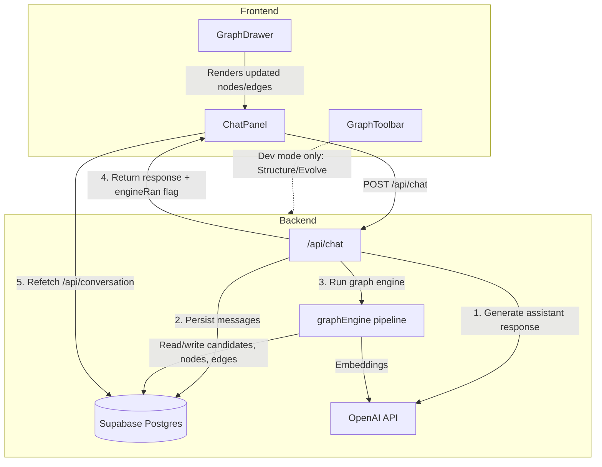
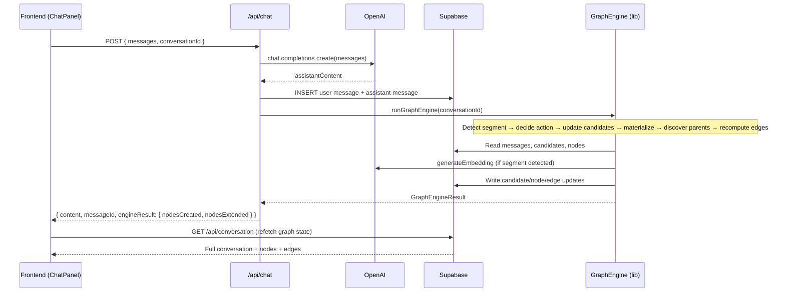
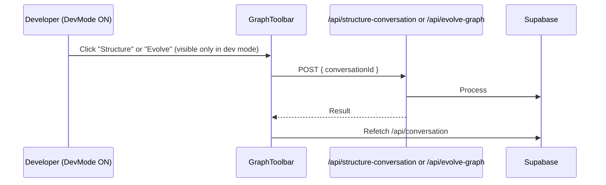

# Design Document: Graph Engine v2

## Overview

Graph Engine v2 is a set of three architectural revisions to the existing Evidence Accumulation Graph Engine. The revisions move graph evolution from a frontend-triggered fire-and-forget call into an atomic backend pipeline integrated with `/api/chat`, replace the simple evidence-counting confidence formula with a weighted "idea worth remembering" score incorporating semantic coherence, distinctiveness, recurrence, and evidence quality, and gate the Structure/Evolve debug buttons behind a developer-mode toggle so the automatic engine is the only user-facing path.

The core trust guarantees are preserved: no automatic deletions, merges, or splits. Spatial stability, node workspace/branch behavior, and manual node creation remain unchanged. TopicCandidate persistence continues as-is — only the scoring logic and invocation path change.

## Architecture



## Sequence Diagrams

### Primary Flow: Chat → Graph Engine (Atomic Pipeline)



### Developer Mode: Manual Structure/Evolve



## Components and Interfaces

### Component 1: Revised `/api/chat` Route

**Purpose**: Single entry point for chat that atomically generates a response, persists messages, and runs the graph engine pipeline.

**Interface**:
```typescript
// Request (unchanged externally)
interface ChatRequest {
  messages: Array<{ role: "user" | "assistant"; content: string }>;
  conversationId: string;
  branchContext?: BranchContext;
}

// Response (extended)
interface ChatResponse {
  content: string;
  messageId: string;
  engineResult?: GraphEngineResult;
}

interface GraphEngineResult {
  nodesCreated: number;
  nodesExtended: number;
  parentsCreated: number;
  candidatesUpdated: number;
}
```

**Responsibilities**:
- Validate request
- Call OpenAI for assistant response
- Persist user and assistant messages to DB within a single flow
- Invoke `runGraphEngine()` inline (non-blocking failure — engine errors don't fail the chat)
- Return response with optional engine metadata

### Component 2: `runGraphEngine()` Library Function

**Purpose**: Extracted pipeline logic (currently in `app/api/graph-engine/route.ts`) as a callable library function so it can be invoked from `/api/chat` without an HTTP round-trip.

**Interface**:
```typescript
// src/lib/graphEngine.ts (new export)
export async function runGraphEngine(
  conversationId: string,
): Promise<GraphEngineResult>;
```

**Responsibilities**:
- Load messages from DB
- Detect segment completion
- Decide action (extend / accumulate / new candidate)
- Compute confidence with the new weighted formula
- Materialize candidates that cross threshold
- Discover parent nodes
- Recompute edges on topology change
- Return summary of actions taken

### Component 3: Confidence Scoring (v2 — "Idea Worth Remembering")

**Purpose**: Replace evidence-counting with a multi-factor weighted score that answers "Is this an idea worth remembering?"

**Interface**:
```typescript
export interface ConfidenceFactors {
  semanticCoherence: number;   // [0, 1] — internal consistency of segments
  distinctiveness: number;     // [0, 1] — novelty vs existing nodes
  recurrence: number;          // [0, 1] — topic has come up multiple times
  evidenceQuality: number;     // [0, 1] — substantiveness of messages
}

export function computeConfidenceV2(
  candidate: TopicCandidate,
  existingNodeEmbeddings: NodeEmbedding[],
): { score: number; factors: ConfidenceFactors };
```

### Component 4: Developer Mode Toggle

**Purpose**: Gate Structure/Evolve debug tools behind a developer mode switch.

**Interface**:
```typescript
// Environment variable
// NEXT_PUBLIC_DEV_MODE=true  (in .env.local)

// React hook
export function useDevMode(): boolean;

// Keyboard shortcut (alternative toggle)
// Ctrl+Shift+D (or Cmd+Shift+D on Mac)
```

**Responsibilities**:
- Read `NEXT_PUBLIC_DEV_MODE` env var at build time
- Provide runtime toggle via keyboard shortcut (persisted in localStorage)
- Expose boolean to components that conditionally render debug UI

### Component 5: GraphToolbar (Dev Mode Variant)

**Purpose**: Show Structure/Evolve buttons only when dev mode is active.

**Interface**:
```typescript
type GraphToolbarProps = {
  isMaximized: boolean;
  hasNodes: boolean;
  isSummarizing: boolean;
  onSummarize: () => void;
  onStructure: () => void;   // dev mode only
  onEvolve: () => void;      // dev mode only
  onToggleMaximize: () => void;
  onClose: () => void;
};
```

## Data Models

### TopicCandidate (Unchanged Schema)

```typescript
interface TopicCandidate {
  id: string;
  conversationId: string;
  status: CandidateStatus;          // "accumulating" | "materialized" | "discarded"
  segments: MessageSegment[];
  embedding: number[] | null;       // running centroid
  confidence: number;               // now computed via v2 formula
  materializedNodeId: string | null;
  lastUpdatedAt: string;
  createdAt: string;
}

interface MessageSegment {
  messageIds: string[];
  embedding: number[];
  completedAt: string;
}
```

**Validation Rules**:
- `confidence` is always clamped to [0, 1]
- `segments` array is append-only (never remove segments)
- `status` transitions: accumulating → materialized | discarded (one-way)

### GraphEngineConfig (Updated Constants)

```typescript
// src/lib/graphEngineConfig.ts

// ─── Segment detection (unchanged) ─────────────────────────────────────────
export const SEGMENT_WINDOW_SIZE = 3;
export const SEGMENT_BOUNDARY_THRESHOLD = 0.72;

// ─── Extend vs accumulate (unchanged) ──────────────────────────────────────
export const EXTEND_THRESHOLD = 0.70;
export const CANDIDATE_MATCH_THRESHOLD = 0.60;

// ─── Confidence scoring v2 ─────────────────────────────────────────────────
export const CONFIDENCE_WEIGHTS_V2 = {
  semanticCoherence: 0.30,    // Was semanticConsistency: 0.25
  distinctiveness: 0.30,      // Was uniqueness: 0.20 — elevated importance
  recurrence: 0.20,           // Was 0.25
  evidenceQuality: 0.20,      // NEW — replaces evidenceVolume (0.30)
};

export const MATERIALIZE_THRESHOLD = 0.72;   // Slightly lowered from 0.75
export const MIN_EVIDENCE_MESSAGES = 4;       // Unchanged
export const MIN_EVIDENCE_SEGMENTS = 2;       // Raised from 1 → require recurrence

// ─── Evidence quality thresholds ────────────────────────────────────────────
export const TRIVIAL_MESSAGE_MAX_CHARS = 20;         // Messages ≤20 chars are trivial
export const SUBSTANTIVE_MESSAGE_MIN_CHARS = 80;     // Messages ≥80 chars are substantive
export const GREETING_PATTERNS = [
  /^(hi|hello|hey|thanks|ok|sure|yes|no|bye|cool|nice|great|lol|haha)\b/i,
];

// ─── Parent discovery (unchanged) ──────────────────────────────────────────
export const PARENT_MIN_SIBLINGS = 3;
export const PARENT_SIMILARITY_THRESHOLD = 0.60;

// ─── Candidate lifecycle (unchanged) ───────────────────────────────────────
export const CANDIDATE_STALE_THRESHOLD = 20;
```

## Algorithmic Pseudocode

### Algorithm 1: Backend-Integrated Chat Pipeline

```typescript
async function POST(request: NextRequest): Promise<NextResponse<ChatResponse>> {
  const { messages, conversationId, branchContext } = parseRequest(request);

  // Step 1: Generate assistant response
  const assistantContent = await callOpenAI(messages, branchContext);

  // Step 2: Persist messages atomically
  const userMsg = messages[messages.length - 1];
  const [userMsgId, assistantMsgId] = await persistMessages(
    conversationId,
    userMsg,
    assistantContent,
  );

  // Step 3: Run graph engine (fire-and-forget semantics — errors logged, not thrown)
  let engineResult: GraphEngineResult | undefined;
  try {
    engineResult = await runGraphEngine(conversationId);
  } catch (err) {
    console.error("[chat] Graph engine failed (non-fatal):", err);
  }

  // Step 4: Return response
  return NextResponse.json({
    content: assistantContent,
    messageId: assistantMsgId,
    engineResult,
  });
}
```

**Preconditions:**
- `conversationId` is a valid UUID referencing an existing conversation
- `messages` array is non-empty with last element having role "user"
- OpenAI API key is configured

**Postconditions:**
- User message and assistant message are persisted in DB
- Graph engine has been invoked (failure is non-fatal)
- Response contains assistant content regardless of engine outcome

### Algorithm 2: Confidence Scoring v2 — "Idea Worth Remembering"

```typescript
export function computeConfidenceV2(
  candidate: TopicCandidate,
  existingNodeEmbeddings: NodeEmbedding[],
): { score: number; factors: ConfidenceFactors } {
  const segments = candidate.segments;

  // ─── Factor 1: Semantic Coherence ────────────────────────────────────
  // How internally consistent are the accumulated segments?
  // High pairwise similarity = strong coherent topic
  let semanticCoherence = 1.0;
  if (segments.length >= 2) {
    let totalSim = 0;
    let pairs = 0;
    for (let i = 0; i < segments.length; i++) {
      for (let j = i + 1; j < segments.length; j++) {
        if (segments[i].embedding.length > 0 && segments[j].embedding.length > 0) {
          totalSim += cosineSimilarity(segments[i].embedding, segments[j].embedding);
          pairs++;
        }
      }
    }
    semanticCoherence = pairs > 0 ? totalSim / pairs : 0.5;
  }

  // ─── Factor 2: Distinctiveness ───────────────────────────────────────
  // How different is this candidate from ALL existing nodes?
  // If it overlaps heavily → not worth a new node
  let bestNodeMatchScore = 0;
  const centroid = candidate.embedding;
  if (centroid && centroid.length > 0) {
    for (const node of existingNodeEmbeddings) {
      if (node.embedding.length > 0) {
        const sim = cosineSimilarity(centroid, node.embedding);
        if (sim > bestNodeMatchScore) bestNodeMatchScore = sim;
      }
    }
  }
  // Distinctiveness = inverse of best match. Score of 0.9 match → 0.1 distinctiveness
  const distinctiveness = 1.0 - bestNodeMatchScore;

  // ─── Factor 3: Recurrence ────────────────────────────────────────────
  // Has this topic come up in multiple separate segments?
  // 1 segment = 0.0 (single mention, not yet recurring)
  // 2 segments = 0.5 (mentioned twice)
  // 3+ segments = 1.0 (clearly recurring)
  const recurrence = Math.min(1.0, Math.max(0, (segments.length - 1) / 2));

  // ─── Factor 4: Evidence Quality ──────────────────────────────────────
  // Are the segments substantive or trivial?
  let qualityScore = 0;
  let totalMsgs = 0;
  for (const seg of segments) {
    // We score based on message characteristics stored during segment creation
    // For now, use message count * average length heuristic
    const msgCount = seg.messageIds.length;
    totalMsgs += msgCount;
    // Each segment with 3+ messages that survived boundary detection is substantive
    if (msgCount >= SEGMENT_WINDOW_SIZE) {
      qualityScore += 1.0;
    } else {
      qualityScore += 0.5;
    }
  }
  const evidenceQuality = Math.min(1.0, qualityScore / Math.max(segments.length, 1));

  // ─── Weighted sum ────────────────────────────────────────────────────
  const factors: ConfidenceFactors = {
    semanticCoherence,
    distinctiveness,
    recurrence,
    evidenceQuality,
  };

  const score = Math.max(0, Math.min(1,
    semanticCoherence * CONFIDENCE_WEIGHTS_V2.semanticCoherence +
    distinctiveness * CONFIDENCE_WEIGHTS_V2.distinctiveness +
    recurrence * CONFIDENCE_WEIGHTS_V2.recurrence +
    evidenceQuality * CONFIDENCE_WEIGHTS_V2.evidenceQuality
  ));

  return { score, factors };
}
```

**Preconditions:**
- `candidate.segments` is a non-empty array
- Each segment has a valid embedding (or is skipped in computation)
- `existingNodeEmbeddings` contains current graph nodes (may be empty for first node)

**Postconditions:**
- `score` is clamped to [0, 1]
- All four factors are individually in [0, 1]
- Weights sum to 1.0

**Loop Invariants:**
- Pairwise similarity loop: all previously computed pairs are valid cosine similarities in [-1, 1]
- Node comparison loop: `bestNodeMatchScore` is the maximum similarity seen so far

### Algorithm 3: Evidence Quality Scoring (Message-Level)

```typescript
export function scoreMessageQuality(content: string, role: "user" | "assistant"): number {
  const trimmed = content.trim();
  const charCount = trimmed.length;

  // Trivial messages: greetings, single words, very short
  if (charCount <= TRIVIAL_MESSAGE_MAX_CHARS) return 0.1;
  if (GREETING_PATTERNS.some(p => p.test(trimmed))) return 0.1;

  // Short but meaningful (21-79 chars)
  if (charCount < SUBSTANTIVE_MESSAGE_MIN_CHARS) return 0.5;

  // Substantive messages (80+ chars)
  // Bonus for very detailed messages (200+ chars)
  if (charCount >= 200) return 1.0;
  return 0.8;
}

export function computeSegmentQuality(messageContents: Array<{ content: string; role: "user" | "assistant" }>): number {
  if (messageContents.length === 0) return 0;

  const scores = messageContents.map(m => scoreMessageQuality(m.content, m.role));
  const avg = scores.reduce((sum, s) => sum + s, 0) / scores.length;

  // Boost if mix of user and assistant (indicates real dialogue, not monologue)
  const hasUser = messageContents.some(m => m.role === "user");
  const hasAssistant = messageContents.some(m => m.role === "assistant");
  const dialogueBoost = (hasUser && hasAssistant) ? 0.1 : 0;

  return Math.min(1.0, avg + dialogueBoost);
}
```

**Preconditions:**
- `content` is a non-null string
- `role` is either "user" or "assistant"

**Postconditions:**
- Return value is always in [0, 1]
- Trivial messages (greetings, single words) score ≤ 0.1
- Substantive messages (80+ chars) score ≥ 0.8

## Key Functions with Formal Specifications

### Function: `runGraphEngine(conversationId: string)`

```typescript
export async function runGraphEngine(conversationId: string): Promise<GraphEngineResult>
```

**Preconditions:**
- `conversationId` references an existing conversation with at least 1 message
- Database connection is available
- OpenAI API key is configured for embedding generation

**Postconditions:**
- Returns a `GraphEngineResult` summarizing all actions taken
- All database mutations are committed (no partial state)
- If fewer than 6 messages exist, returns immediately with zero counts
- Existing nodes are never deleted, merged, or split
- Node positions are never modified

### Function: `computeConfidenceV2(candidate, existingNodeEmbeddings)`

```typescript
export function computeConfidenceV2(
  candidate: TopicCandidate,
  existingNodeEmbeddings: NodeEmbedding[],
): { score: number; factors: ConfidenceFactors }
```

**Preconditions:**
- `candidate.segments.length >= 1`
- Embeddings are 1536-dimensional vectors (OpenAI text-embedding-3-small)

**Postconditions:**
- `score` ∈ [0, 1]
- Each factor ∈ [0, 1]
- `semanticCoherence * 0.30 + distinctiveness * 0.30 + recurrence * 0.20 + evidenceQuality * 0.20 === score` (within floating point tolerance)

### Function: `shouldMaterialize(candidate: TopicCandidate)`

```typescript
export function shouldMaterialize(candidate: TopicCandidate): boolean
```

**Preconditions:**
- `candidate.confidence` has been computed via `computeConfidenceV2`

**Postconditions:**
- Returns `true` if and only if ALL of:
  - `candidate.confidence >= MATERIALIZE_THRESHOLD` (0.72)
  - Total messages across segments >= `MIN_EVIDENCE_MESSAGES` (4)
  - `candidate.segments.length >= MIN_EVIDENCE_SEGMENTS` (2)
- A candidate with only 1 segment can never materialize (requires recurrence)

### Function: `useDevMode(): boolean`

```typescript
export function useDevMode(): boolean
```

**Preconditions:**
- Called within a React component tree
- `window` is available (client-side only)

**Postconditions:**
- Returns `true` if `NEXT_PUBLIC_DEV_MODE === "true"` OR localStorage `devMode` flag is set
- Keyboard shortcut Ctrl+Shift+D toggles the localStorage flag and triggers re-render

## Example Usage

### Chat Flow (Frontend)

```typescript
// In ChatPanel — sending a message
async function handleSend(userMessage: string) {
  // Single POST — chat + graph engine happen atomically on backend
  const res = await fetch("/api/chat", {
    method: "POST",
    body: JSON.stringify({
      messages: [...history, { role: "user", content: userMessage }],
      conversationId,
    }),
  });

  const { content, messageId, engineResult } = await res.json();

  // Append assistant message to local state
  appendMessage({ role: "assistant", content, id: messageId });

  // Refetch full conversation state (picks up any new nodes/edges)
  await refetchConversation();

  // Optionally show subtle indicator if nodes were created
  if (engineResult?.nodesCreated > 0) {
    showGraphActivityIndicator();
  }
}
```

### Dev Mode Hook Usage

```typescript
// In GraphToolbar
import { useDevMode } from "@/src/hooks/useDevMode";

export default function GraphToolbar(props: GraphToolbarProps) {
  const devMode = useDevMode();

  return (
    <div className="flex h-16 items-center justify-between ...">
      <h2>Context Graph</h2>
      <div className="flex items-center gap-2">
        {props.hasNodes && <SummarizeButton ... />}

        {/* Dev-only debug tools */}
        {devMode && (
          <>
            <button onClick={props.onStructure}>⚙ Structure</button>
            <button onClick={props.onEvolve}>⚡ Evolve</button>
          </>
        )}

        <MaximizeButton ... />
        <CloseButton ... />
      </div>
    </div>
  );
}
```

### Confidence Scoring Example

```typescript
// A candidate with 3 coherent segments about "React server components"
// that doesn't match any existing node:
const factors = {
  semanticCoherence: 0.85,   // segments are highly similar to each other
  distinctiveness: 0.90,     // no existing node covers this topic
  recurrence: 1.0,           // 3 segments → (3-1)/2 = 1.0
  evidenceQuality: 0.8,      // substantive messages
};

const score = 0.85 * 0.30 + 0.90 * 0.30 + 1.0 * 0.20 + 0.8 * 0.20;
// = 0.255 + 0.270 + 0.200 + 0.160 = 0.885
// 0.885 > 0.72 threshold → MATERIALIZE ✓

// A candidate with 1 short greeting segment that matches an existing node:
const weakFactors = {
  semanticCoherence: 1.0,    // only 1 segment, defaults to 1.0
  distinctiveness: 0.15,     // 0.85 similarity to existing node → only 0.15 distinct
  recurrence: 0.0,           // only 1 segment → (1-1)/2 = 0.0
  evidenceQuality: 0.1,      // trivial greeting messages
};

const weakScore = 1.0 * 0.30 + 0.15 * 0.30 + 0.0 * 0.20 + 0.1 * 0.20;
// = 0.300 + 0.045 + 0.000 + 0.020 = 0.365
// 0.365 < 0.72 threshold → DO NOT MATERIALIZE ✗
```

## Correctness Properties

### Property 1: Chat Atomicity

A chat response is never returned without the user and assistant messages being persisted. Graph engine failure does not prevent chat response delivery.

### Property 2: Trust Guarantees (Additive-Only Invariant)

- `∀ node ∈ graph: node is never deleted by the engine`
- `∀ node ∈ graph: node is never merged with another node by the engine`
- `∀ node ∈ graph: node.position is never modified by the engine`
- Engine only performs additive operations: extend, create, add parent, add edge

### Property 3: Confidence Bounds

`∀ candidate: 0 ≤ candidate.confidence ≤ 1` — the score is always clamped after weighted sum computation.

### Property 4: Weight Invariant

Sum of `CONFIDENCE_WEIGHTS_V2` values === 1.0 (0.30 + 0.30 + 0.20 + 0.20 = 1.0).

### Property 5: Materialization Gate

A candidate materializes only when ALL of: `confidence >= 0.72 AND segments.length >= 2 AND totalMessages >= 4`.

### Property 6: Distinctiveness Filter

A candidate with `distinctiveness < 0.3` (i.e., best node match > 0.7) will have its score heavily penalized, preventing duplicate nodes from being created.

### Property 7: Recurrence Requirement

A candidate with only 1 segment always has `recurrence = 0.0`, making materialization very unlikely without sustained multi-segment evidence.

### Property 8: Dev Mode Isolation

When `devMode === false`, Structure/Evolve endpoints are never called from the UI. The toolbar renders no debug buttons.

### Property 9: Single Round-Trip

Frontend makes exactly 1 fetch (`/api/chat`) per user message. Graph state changes are observed via the subsequent `/api/conversation` refetch — not a second engine call.

### Property 10: Spatial Stability

No engine action modifies `node.position_x` or `node.position_y`. Node positions are user-controlled or layout-controlled, never engine-controlled.

## Error Handling

### Error Scenario 1: Graph Engine Failure During Chat

**Condition**: `runGraphEngine()` throws during the `/api/chat` pipeline
**Response**: Error is caught and logged. Chat response is returned normally with `engineResult: undefined`.
**Recovery**: Graph engine will run again on the next message. No data corruption since engine uses upserts.

### Error Scenario 2: OpenAI Embedding API Failure

**Condition**: Embedding generation fails during segment detection or candidate scoring
**Response**: `detectSegmentCompletion()` returns null (no segment detected). Pipeline short-circuits with no_action.
**Recovery**: Next message triggers a new detection attempt. Conversation data remains intact.

### Error Scenario 3: Database Write Failure During Materialization

**Condition**: `persistNode()` or `materializeCandidate()` throws
**Response**: The candidate remains in "accumulating" state. No partial node is visible.
**Recovery**: On next engine run, the candidate will be re-evaluated. If it still meets threshold, materialization is retried.

### Error Scenario 4: Concurrent Engine Runs

**Condition**: Two rapid messages trigger overlapping engine executions
**Response**: Database upserts are idempotent (`ON CONFLICT ... DO NOTHING`). Worst case: a segment is processed twice, creating a duplicate candidate that will naturally merge on next evidence.
**Recovery**: Idempotent operations ensure no corruption. Stale candidate pruning handles duplicates over time.

## Testing Strategy

### Unit Testing Approach

- `computeConfidenceV2`: Test with various segment configurations to verify factor calculations
- `scoreMessageQuality`: Test trivial, short, and substantive messages
- `shouldMaterialize`: Test threshold boundaries (exactly at threshold, just below, just above)
- `useDevMode`: Test env var detection and localStorage toggle

### Property-Based Testing Approach

**Property Test Library**: fast-check

- **Confidence bounds**: For any random candidate with random embeddings, score is always in [0, 1]
- **Weight sum invariant**: Confidence weights always sum to 1.0
- **Monotonic recurrence**: Adding segments never decreases the recurrence factor
- **Distinctiveness inverse**: If bestNodeMatch increases, distinctiveness decreases proportionally
- **Quality ordering**: A message with more characters (above trivial threshold) scores ≥ a shorter one

### Integration Testing Approach

- Full pipeline test: Send message → verify engine runs → verify candidate created
- Materialization test: Accumulate evidence across multiple messages → verify node appears
- Dev mode test: Verify toolbar buttons appear/disappear based on toggle
- Refetch test: After chat response, verify `/api/conversation` returns updated graph state

## Performance Considerations

- **Embedding calls**: The engine may call OpenAI embeddings 1-3 times per message (segment detection + segment embedding + centroid comparison). This adds ~200-600ms to the chat response. Acceptable since the alternative was a separate frontend call.
- **Pairwise similarity**: For candidates with many segments, O(n²) pairwise computation. Capped by typical candidate lifetime (3-5 segments before materialization or discard). Not a concern.
- **Parent discovery**: O(n²) over all nodes. For typical graphs (10-50 nodes), this is negligible. Consider optimization if graphs grow beyond 200 nodes.
- **Mitigation**: If latency becomes an issue, the engine call can be wrapped in a `Promise` that doesn't block the response (fire-and-forget within the same request, returning the response before engine completes). For v2, we keep it synchronous for simplicity and atomicity guarantees.

## Security Considerations

- `/api/graph-engine` route is preserved for backward compatibility but should be gated behind dev-mode or removed in a future version. It accepts a `conversationId` without auth — acceptable for single-user local-first app but should be noted.
- Dev mode keyboard shortcut (Ctrl+Shift+D) has no security implications — it only shows debug UI, all data is already accessible via the conversation.
- No new attack surface introduced. The engine runs server-side with the same Supabase service key.

## Dependencies

- **OpenAI API** (`openai` npm package): Embeddings (text-embedding-3-small) and chat completions (gpt-4o-mini)
- **Supabase** (`@supabase/supabase-js`): Postgres database for messages, nodes, edges, candidates
- **React Flow** (`@xyflow/react`): Graph visualization (unchanged)
- **Next.js 16**: App router, API routes
- **No new dependencies** — all changes use existing packages
