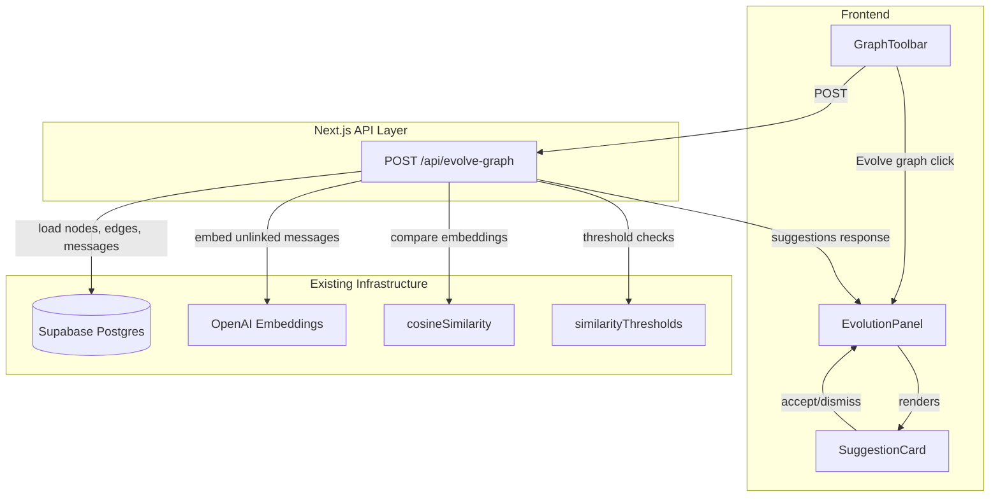
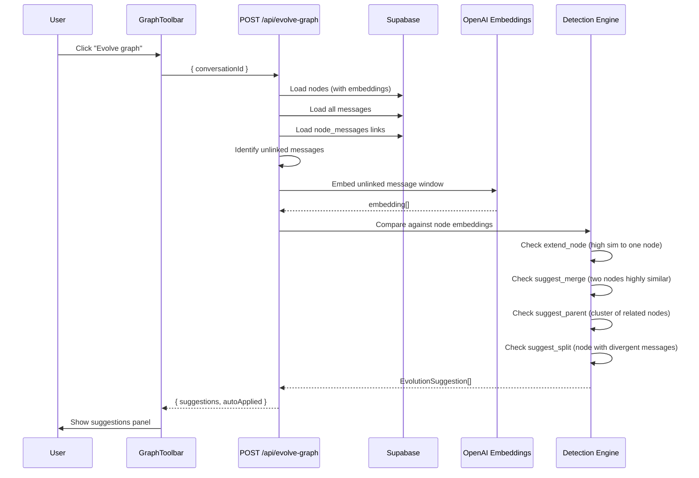
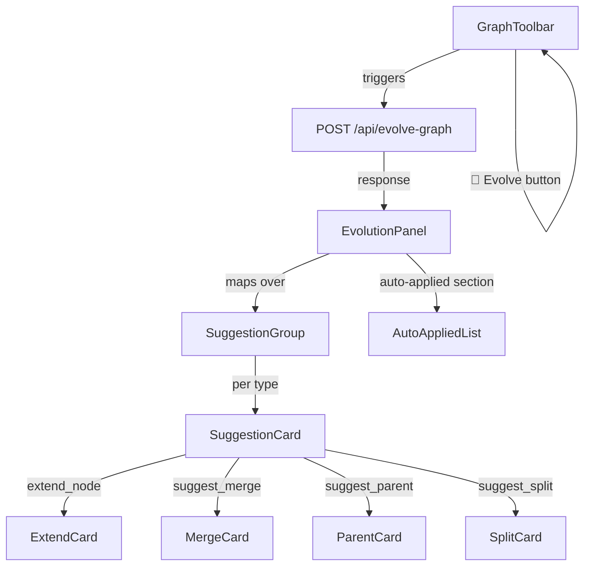

# Design Document: Node Evolution Engine

## Overview

The Node Evolution Engine makes ContextGraph's node structure dynamic by detecting when the conversation has evolved beyond the current graph structure and surfacing typed suggestions to the user. Rather than auto-mutating the graph, it follows a "detect + suggest" model: the system identifies structural evolution opportunities (extend, merge, parent, split) and presents them with confidence scores and human-readable reasons. Only `extend_node` with very high confidence can auto-apply; all other mutations require explicit user approval.

This preserves the stability principle — the graph never silently rearranges — while allowing it to grow organically as conversations deepen. The engine operates as a POST `/api/evolve-graph` route that loads current graph state, identifies unlinked messages, compares embeddings, and produces a typed list of evolution suggestions rendered in a dedicated suggestions panel.

## Architecture



## Data Flow: Evolution Detection



## Components and Interfaces

### Component 1: Evolution API Route

**Purpose**: Orchestrates the evolution detection pipeline — loads state, runs heuristics, returns typed suggestions.

**Interface**:
```typescript
// POST /api/evolve-graph
interface EvolveGraphRequest {
  conversationId: string;
}

interface EvolveGraphResponse {
  suggestions: EvolutionSuggestion[];
  autoApplied: AutoAppliedAction[];
  meta: {
    unlinkedMessageCount: number;
    nodesAnalyzed: number;
    processingTimeMs: number;
  };
}
```

**Responsibilities**:
- Load current graph state from Supabase
- Identify messages not linked to any node
- Embed unlinked message windows
- Run detection heuristics against existing node embeddings
- Auto-apply high-confidence extend_node actions
- Return all other suggestions for user review

### Component 2: Detection Engine (Heuristics)

**Purpose**: Pure functions that compare embeddings and produce typed suggestions based on configurable thresholds.

**Interface**:
```typescript
interface DetectionEngine {
  detectExtendNode(
    unlinkedWindow: EmbeddedWindow,
    nodes: NodeWithEmbedding[]
  ): ExtendNodeSuggestion[];

  detectMergeCandidates(
    nodes: NodeWithEmbedding[]
  ): MergeSuggestion[];

  detectParentCandidates(
    nodes: NodeWithEmbedding[],
    edges: SemanticEdge[]
  ): ParentSuggestion[];

  detectSplitCandidates(
    nodes: NodeWithEmbedding[],
    nodeMessages: Map<string, ChatMessage[]>
  ): SplitSuggestion[];
}
```

**Responsibilities**:
- Compare embedding similarity against configured thresholds
- Produce confidence scores for each suggestion
- Generate human-readable reasons
- Remain pure (no side effects, no DB access)

### Component 3: EvolutionPanel (Frontend)

**Purpose**: Renders evolution suggestions in a slide-out panel with accept/dismiss controls per suggestion.

**Interface**:
```typescript
interface EvolutionPanelProps {
  suggestions: EvolutionSuggestion[];
  autoApplied: AutoAppliedAction[];
  isLoading: boolean;
  onAccept: (suggestion: EvolutionSuggestion) => void;
  onDismiss: (suggestion: EvolutionSuggestion) => void;
  onClose: () => void;
}
```

**Responsibilities**:
- Group suggestions by type (extend, merge, parent, split)
- Show confidence as visual indicator (bar/badge)
- Display auto-applied actions as confirmations
- Allow user to accept or dismiss each suggestion

## Data Models

### Core Suggestion Types

```typescript
type EvolutionAction =
  | "extend_node"
  | "suggest_merge"
  | "suggest_parent"
  | "suggest_split";

interface EvolutionSuggestionBase {
  id: string;
  action: EvolutionAction;
  confidence: number; // 0.0 – 1.0
  reason: string;     // Human-readable explanation
  createdAt: string;  // ISO timestamp
}

interface ExtendNodeSuggestion extends EvolutionSuggestionBase {
  action: "extend_node";
  targetNodeId: string;
  messageIds: string[];         // Messages to link
  similarityScore: number;      // Raw cosine score
}

interface MergeSuggestion extends EvolutionSuggestionBase {
  action: "suggest_merge";
  nodeAId: string;
  nodeBId: string;
  similarityScore: number;
  proposedTitle: string | null;  // LLM-generated merged title (optional)
}

interface ParentSuggestion extends EvolutionSuggestionBase {
  action: "suggest_parent";
  childNodeIds: string[];       // 2+ nodes that would become children
  proposedTitle: string;        // Suggested parent topic
  avgSimilarity: number;        // Average pairwise similarity of children
}

interface SplitSuggestion extends EvolutionSuggestionBase {
  action: "suggest_split";
  targetNodeId: string;
  proposedSplits: {
    messageIds: string[];
    suggestedTitle: string;
  }[];
  divergenceScore: number;      // How different the sub-clusters are
}

type EvolutionSuggestion =
  | ExtendNodeSuggestion
  | MergeSuggestion
  | ParentSuggestion
  | SplitSuggestion;

interface AutoAppliedAction {
  action: "extend_node";
  targetNodeId: string;
  messageIds: string[];
  confidence: number;
  reason: string;
}
```

### Internal Types

```typescript
interface EmbeddedWindow {
  messageIds: string[];
  embedding: number[];
  text: string;        // Combined message text used for embedding
}

interface NodeWithEmbedding {
  id: string;
  title: string;
  summary: string;
  evidenceSummary: string | null;
  embedding: number[];
  messageIds: string[];
}
```

**Validation Rules**:
- `confidence` must be in range [0.0, 1.0]
- `messageIds` must reference existing messages in the conversation
- `targetNodeId`, `nodeAId`, `nodeBId` must reference existing nodes
- `childNodeIds` must contain at least 2 node IDs
- `proposedSplits` must contain at least 2 splits

## Detection Heuristics & Thresholds

### extend_node Detection

```typescript
// Thresholds for extend_node
const EXTEND_HIGH_CONFIDENCE = 0.78;   // Auto-apply threshold
const EXTEND_SUGGEST_THRESHOLD = 0.65; // Show as suggestion
const EXTEND_WINDOW_SIZE = 4;          // Messages per unlinked window

/**
 * Algorithm:
 * 1. Group unlinked messages into sliding windows of EXTEND_WINDOW_SIZE
 * 2. Embed each window
 * 3. Compare window embedding against ALL node embeddings
 * 4. If best match >= EXTEND_HIGH_CONFIDENCE → auto-apply
 * 5. If best match >= EXTEND_SUGGEST_THRESHOLD → suggest
 * 6. If best match < EXTEND_SUGGEST_THRESHOLD → no action (new topic)
 */
```

### suggest_merge Detection

```typescript
// Thresholds for merge detection
const MERGE_THRESHOLD = 0.80;          // Very high — nodes must be near-duplicates
const MERGE_MIN_CONFIDENCE = 0.70;     // Below this, don't suggest

/**
 * Algorithm:
 * 1. Compute all pairwise node similarities (reuse existing infrastructure)
 * 2. Filter pairs where similarity >= MERGE_THRESHOLD
 * 3. Exclude pairs that already have a strong semantic edge (already connected)
 * 4. For each qualifying pair, generate a merged title via LLM (optional)
 * 5. Confidence = normalized similarity score
 */
```

### suggest_parent Detection

```typescript
// Thresholds for parent detection
const PARENT_MIN_CLUSTER_SIZE = 3;       // Need at least 3 related nodes
const PARENT_INTRA_SIMILARITY = 0.60;    // Minimum pairwise similarity within cluster
const PARENT_MIN_CONFIDENCE = 0.65;

/**
 * Algorithm:
 * 1. Find connected components in the semantic edge graph
 * 2. For components with >= PARENT_MIN_CLUSTER_SIZE nodes:
 *    a. Compute average pairwise similarity
 *    b. If avg >= PARENT_INTRA_SIMILARITY, these are sibling candidates
 * 3. Check that no existing node already serves as parent
 *    (embedding of proposed parent topic vs existing nodes)
 * 4. Generate proposed parent title from child titles/summaries
 * 5. Confidence = (avgSimilarity - PARENT_INTRA_SIMILARITY) / (1 - PARENT_INTRA_SIMILARITY)
 */
```

### suggest_split Detection

```typescript
// Thresholds for split detection
const SPLIT_MIN_MESSAGES = 8;             // Node must have enough messages to split
const SPLIT_DIVERGENCE_THRESHOLD = 0.45;  // Internal dissimilarity threshold
const SPLIT_MIN_CONFIDENCE = 0.60;

/**
 * Algorithm:
 * 1. For each node with >= SPLIT_MIN_MESSAGES linked messages:
 *    a. Embed each message individually (or use cached embeddings)
 *    b. Compute intra-node pairwise similarities
 *    c. If min pairwise similarity < SPLIT_DIVERGENCE_THRESHOLD:
 *       → Messages are divergent enough to warrant a split
 * 2. Use simple k-means (k=2) on message embeddings to find split boundary
 * 3. Generate suggested titles for each sub-cluster
 * 4. Confidence based on inter-cluster distance
 */
```

## Key Functions with Formal Specifications

### Function: detectEvolution()

```typescript
async function detectEvolution(
  conversationId: string
): Promise<{ suggestions: EvolutionSuggestion[]; autoApplied: AutoAppliedAction[] }>
```

**Preconditions:**
- `conversationId` references an existing conversation in the database
- At least one node exists for this conversation
- OpenAI API key is configured and valid

**Postconditions:**
- Returns a (possibly empty) list of suggestions, each with unique `id`
- `autoApplied` contains only `extend_node` actions with `confidence >= EXTEND_HIGH_CONFIDENCE`
- For auto-applied actions: node_messages links have been inserted in DB
- No node has been deleted, merged, split, or created (suggestions only)
- Existing graph structure is unchanged except for extend_node auto-applications

**Loop Invariants:**
- For each unlinked message window processed: all previously processed windows remain unchanged
- For each node pair compared: similarity computation is symmetric (sim(A,B) = sim(B,A))

### Function: buildUnlinkedWindows()

```typescript
function buildUnlinkedWindows(
  messages: ChatMessage[],
  linkedMessageIds: Set<string>,
  windowSize: number
): ChatMessage[][]
```

**Preconditions:**
- `messages` is sorted chronologically (ascending)
- `windowSize` > 0
- `linkedMessageIds` contains IDs of messages already assigned to nodes

**Postconditions:**
- Returns contiguous windows of unlinked messages, each of length `windowSize`
- Messages within a window are consecutive in the original chronological order
- No window overlaps with another
- Messages already in `linkedMessageIds` are excluded

### Function: applyExtendNode()

```typescript
async function applyExtendNode(
  conversationId: string,
  targetNodeId: string,
  messageIds: string[]
): Promise<void>
```

**Preconditions:**
- `targetNodeId` references an existing node in this conversation
- All `messageIds` are valid message IDs in this conversation
- None of the `messageIds` are already linked to `targetNodeId`

**Postconditions:**
- All specified messages are now linked to the target node (node_messages rows inserted)
- The node's embedding is NOT re-computed (deferred to next explicit structure action)
- No other nodes are affected
- Operation is idempotent — re-calling with same args produces no additional rows

## Algorithmic Pseudocode

### Main Evolution Detection Algorithm

```typescript
async function evolveGraph(conversationId: string): Promise<EvolveGraphResponse> {
  const startTime = Date.now();

  // Step 1: Load all state
  const nodes = await loadNodesWithEmbeddings(conversationId);
  const messages = await loadMessages(conversationId);
  const nodeMessageLinks = await loadNodeMessageLinks(conversationId);
  const edges = await loadSemanticEdges(conversationId);

  // Step 2: Identify unlinked messages
  const linkedMessageIds = new Set(
    nodeMessageLinks.flatMap(link => link.messageIds)
  );
  const unlinkedMessages = messages.filter(m => !linkedMessageIds.has(m.id));

  // Step 3: Build and embed unlinked windows
  const windows = buildUnlinkedWindows(unlinkedMessages, linkedMessageIds, EXTEND_WINDOW_SIZE);
  const embeddedWindows: EmbeddedWindow[] = [];

  for (const window of windows) {
    const text = window.map(m => `${m.role}: ${m.content}`).join("\n");
    const embedding = await generateEmbedding(text);
    embeddedWindows.push({ messageIds: window.map(m => m.id), embedding, text });
  }

  // Step 4: Run detection heuristics
  const extendSuggestions = detectExtendNode(embeddedWindows, nodes);
  const mergeSuggestions = detectMergeCandidates(nodes);
  const parentSuggestions = detectParentCandidates(nodes, edges);
  const splitSuggestions = await detectSplitCandidates(nodes, nodeMessageLinks, messages);

  // Step 5: Separate auto-apply from suggestions
  const autoApplied: AutoAppliedAction[] = [];
  const suggestions: EvolutionSuggestion[] = [];

  for (const ext of extendSuggestions) {
    if (ext.confidence >= EXTEND_HIGH_CONFIDENCE) {
      await applyExtendNode(conversationId, ext.targetNodeId, ext.messageIds);
      autoApplied.push({
        action: "extend_node",
        targetNodeId: ext.targetNodeId,
        messageIds: ext.messageIds,
        confidence: ext.confidence,
        reason: ext.reason,
      });
    } else {
      suggestions.push(ext);
    }
  }

  suggestions.push(...mergeSuggestions, ...parentSuggestions, ...splitSuggestions);

  return {
    suggestions: suggestions.sort((a, b) => b.confidence - a.confidence),
    autoApplied,
    meta: {
      unlinkedMessageCount: unlinkedMessages.length,
      nodesAnalyzed: nodes.length,
      processingTimeMs: Date.now() - startTime,
    },
  };
}
```

### Extend Node Detection

```typescript
function detectExtendNode(
  windows: EmbeddedWindow[],
  nodes: NodeWithEmbedding[]
): ExtendNodeSuggestion[] {
  const suggestions: ExtendNodeSuggestion[] = [];

  for (const window of windows) {
    let bestScore = 0;
    let bestNode: NodeWithEmbedding | null = null;

    // Find the most similar existing node
    for (const node of nodes) {
      if (!node.embedding || node.embedding.length === 0) continue;
      const score = cosineSimilarity(window.embedding, node.embedding);
      if (score > bestScore) {
        bestScore = score;
        bestNode = node;
      }
    }

    // Only suggest if above the suggestion threshold
    if (bestNode && bestScore >= EXTEND_SUGGEST_THRESHOLD) {
      suggestions.push({
        id: crypto.randomUUID(),
        action: "extend_node",
        targetNodeId: bestNode.id,
        messageIds: window.messageIds,
        similarityScore: bestScore,
        confidence: normalizeConfidence(bestScore, EXTEND_SUGGEST_THRESHOLD, 1.0),
        reason: `Recent messages are highly related to "${bestNode.title}" (similarity: ${(bestScore * 100).toFixed(0)}%)`,
        createdAt: new Date().toISOString(),
      });
    }
  }

  return suggestions;
}
```

### Merge Candidate Detection

```typescript
function detectMergeCandidates(
  nodes: NodeWithEmbedding[]
): MergeSuggestion[] {
  const suggestions: MergeSuggestion[] = [];
  const nodesWithEmbeddings = nodes.filter(n => n.embedding.length > 0);

  for (let i = 0; i < nodesWithEmbeddings.length; i++) {
    for (let j = i + 1; j < nodesWithEmbeddings.length; j++) {
      const nodeA = nodesWithEmbeddings[i];
      const nodeB = nodesWithEmbeddings[j];
      const similarity = cosineSimilarity(nodeA.embedding, nodeB.embedding);

      if (similarity >= MERGE_THRESHOLD) {
        suggestions.push({
          id: crypto.randomUUID(),
          action: "suggest_merge",
          nodeAId: nodeA.id,
          nodeBId: nodeB.id,
          similarityScore: similarity,
          confidence: normalizeConfidence(similarity, MERGE_THRESHOLD, 1.0),
          reason: `"${nodeA.title}" and "${nodeB.title}" cover very similar topics (${(similarity * 100).toFixed(0)}% overlap)`,
          proposedTitle: null, // Deferred — LLM call only if user considers it
          createdAt: new Date().toISOString(),
        });
      }
    }
  }

  return suggestions;
}
```

## Example Usage

```typescript
// Example 1: Triggering evolution from the frontend
async function handleEvolveGraph() {
  setIsEvolving(true);
  try {
    const response = await fetch("/api/evolve-graph", {
      method: "POST",
      headers: { "Content-Type": "application/json" },
      body: JSON.stringify({ conversationId }),
    });
    const data: EvolveGraphResponse = await response.json();

    setEvolutionSuggestions(data.suggestions);
    setAutoAppliedActions(data.autoApplied);

    // If anything was auto-applied, refresh node state
    if (data.autoApplied.length > 0) {
      await refreshConversation();
    }
  } finally {
    setIsEvolving(false);
  }
}

// Example 2: Accepting a merge suggestion
async function handleAcceptSuggestion(suggestion: EvolutionSuggestion) {
  if (suggestion.action === "suggest_merge") {
    // Future: POST /api/apply-evolution with the suggestion
    // For v1: just mark as accepted in local state
    setEvolutionSuggestions(prev =>
      prev.filter(s => s.id !== suggestion.id)
    );
  }
}

// Example 3: Auto-applied extend_node notification
// After evolution runs, the panel shows:
// "✓ 3 messages auto-linked to 'React State Management' (92% confidence)"
```

## Correctness Properties

The following properties must hold for the evolution engine:

1. **Stability invariant**: After `evolveGraph()` returns, the set of nodes is unchanged. No node is created, deleted, or has its title/summary modified. Only `node_messages` links may be added (via auto-apply).

2. **Idempotency**: Calling `evolveGraph()` twice in succession with no intervening message additions produces the same suggestions (modulo generated UUIDs and timestamps).

3. **Confidence bounds**: For all suggestions `s`: `0.0 <= s.confidence <= 1.0`.

4. **Auto-apply safety**: An action is auto-applied if and only if `action === "extend_node"` AND `confidence >= EXTEND_HIGH_CONFIDENCE`. All other action types are never auto-applied.

5. **No orphaned references**: Every `targetNodeId`, `nodeAId`, `nodeBId`, and entry in `childNodeIds` references a node that exists in the current conversation's graph.

6. **Message disjointness for extend**: An `extend_node` suggestion never proposes linking messages that are already linked to the target node.

7. **Merge symmetry**: If a merge suggestion exists for (A, B), no separate suggestion exists for (B, A).

## Error Handling

### Error Scenario 1: OpenAI Embedding Failure

**Condition**: Embedding generation fails for unlinked message windows (rate limit, API down)
**Response**: Skip extend_node detection entirely. Still run merge/parent/split detection using cached node embeddings.
**Recovery**: Return partial results with a warning flag in the response meta.

### Error Scenario 2: No Unlinked Messages

**Condition**: All messages in the conversation are already linked to nodes
**Response**: Skip extend_node detection. Still run merge/parent/split detection.
**Recovery**: Return suggestions from other heuristics (or empty array).

### Error Scenario 3: Insufficient Nodes

**Condition**: Fewer than 2 nodes exist (merge/parent impossible)
**Response**: Only run extend_node detection. Skip merge/parent/split.
**Recovery**: Return whatever extend suggestions are found.

### Error Scenario 4: Database Load Failure

**Condition**: Supabase query fails when loading state
**Response**: Return 500 error with descriptive message
**Recovery**: Frontend shows error toast, user can retry.

## Testing Strategy

### Unit Testing Approach

- Test each detection function in isolation with mock embeddings
- Verify threshold boundary behavior (just above, just below)
- Test `buildUnlinkedWindows` with various message/link configurations
- Test `normalizeConfidence` produces values in [0, 1]
- Test symmetry properties of merge detection

### Property-Based Testing Approach

**Property Test Library**: fast-check

Key properties to test:
- `detectExtendNode` never produces suggestions with confidence > 1.0 or < 0.0
- `detectMergeCandidates` never suggests merging a node with itself
- `buildUnlinkedWindows` output windows are non-overlapping and cover all unlinked messages
- For any input, the total set of nodes remains unchanged after `evolveGraph()`

### Integration Testing Approach

- End-to-end test of `/api/evolve-graph` with a seeded Supabase database
- Verify auto-apply actually inserts `node_messages` rows
- Verify that running evolution twice produces consistent results
- Test with edge cases: empty conversation, single node, all messages linked

## Frontend Component Structure



**Component hierarchy**:
- `GraphToolbar` — adds "Evolve graph" button (alongside existing Structure/Summarize)
- `EvolutionPanel` — slide-out panel (similar to existing NodeDetailPanel pattern)
  - `AutoAppliedList` — shows what was auto-extended with confidence
  - `SuggestionGroup` — groups suggestions by action type
    - `SuggestionCard` — renders one suggestion with accept/dismiss buttons
      - Shows: action type icon, confidence bar, reason text, affected nodes
      - Actions: Accept, Dismiss

## What Auto-Applies vs What Requires Approval

| Action | Auto-Apply Condition | User Approval Required |
|--------|---------------------|----------------------|
| `extend_node` | confidence >= 0.78 | confidence in [0.65, 0.78) |
| `suggest_merge` | Never | Always |
| `suggest_parent` | Never | Always |
| `suggest_split` | Never | Always |

**Rationale**: Extending a node (adding messages to an existing topic) is low-risk and reversible. Merging, splitting, or creating parent nodes fundamentally changes the graph topology and should always have user oversight.

## Performance Considerations

- **Embedding calls**: The main cost driver. Batch unlinked message windows to minimize API calls. For v1, cap at 5 windows per invocation.
- **Pairwise comparisons**: O(n²) for n nodes. Acceptable for v1 (expected < 50 nodes per conversation). If scale increases, add early termination or pre-filtering.
- **No background polling**: Evolution runs only when the user clicks "Evolve graph". This keeps costs predictable and avoids background load.
- **Cached embeddings**: Node embeddings are already stored in the database. Only unlinked messages need fresh embedding generation.

## Security Considerations

- No new authentication surface — uses existing Supabase session from conversation routes
- Rate-limit the evolve-graph endpoint (same pattern as structure-conversation)
- LLM calls (for reason generation or proposed titles) use gpt-4o-mini with constrained max_tokens
- No user data leaves the system beyond what already goes to OpenAI for embeddings

## Dependencies

- **Existing**: `@/src/lib/cosineSimilarity`, `@/src/lib/embeddings`, `@/src/lib/similarityThresholds`, `@/src/lib/db/nodes`, Supabase client
- **New**: None for v1. All detection logic is implementable with existing embedding + similarity infrastructure.
- **Optional future**: If split detection needs k-means, consider calling the Python ML service. For v1, a simple 2-way partition based on embedding distances is sufficient in TypeScript.
