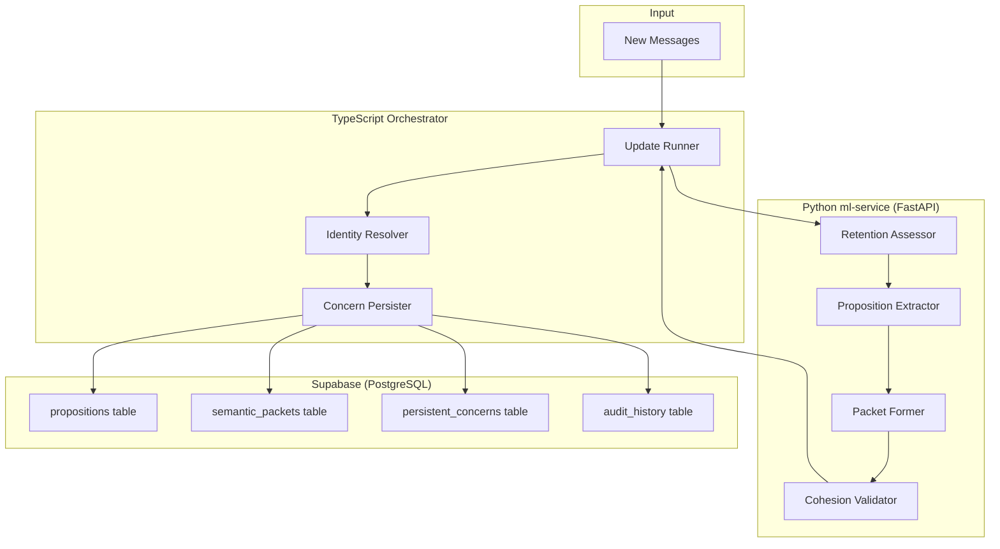
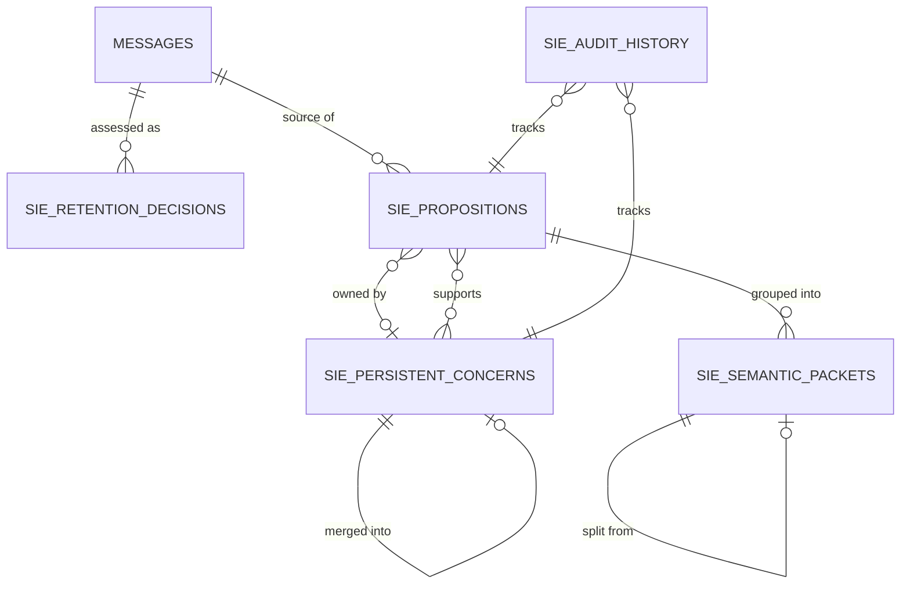

# Design Document: SIE Data Model

## Overview

This design defines the foundational data model for the Semantic Intelligence Engine (SIE) — the semantic processing layer that replaces the current V2 intelligence pipeline's ad-hoc object formation with a principled, retention-aware, concern-centric semantic model.

The SIE data model introduces five key concepts that don't exist in the current V2 system:

1. **Retention-Level Assessment** — A 6-level classification that determines how conversational material participates in the knowledge graph, replacing the current binary "include or discard" approach.
2. **Propositions** — Smallest semantic units with full provenance, extending the current `Proposition` type in `schemas.ts` with richer lifecycle, ownership, and state tracking.
3. **Semantic Packets** — Concern-cohesive processing bundles that replace the current "thread → object" pipeline with validated, split-aware packet formation.
4. **Persistent Concerns** — Durable semantic identities that replace the current `ConversationalObject` with stable, independently returnable concerns.
5. **Cross-Cutting Invariants** — Mandatory rules enforced across all operations ensuring provenance immutability, ownership clarity, and uncertainty-as-state.

### Relationship to Existing System

The existing V2 pipeline (`src/lib/intelligence-v2/`) follows: Utterance → Proposition → Thread → Object → Relationship → Hierarchy. The SIE data model refines the middle stages:

- **Utterance** remains unchanged (immutable ground truth)
- **Proposition** gains retention classification, richer provenance, and concern-ownership tracking
- **Thread** is superseded by **Semantic Packet** (concern-cohesive, validated)
- **Object** is superseded by **Persistent Concern** (stable identity, lifecycle states)
- **Relationship/Hierarchy** remain downstream consumers of the new model

### Execution Boundary

| Layer | Runtime | Technology |
|-------|---------|-----------|
| Retention assessment + proposition extraction | Python ml-service | FastAPI, Pydantic, sentence-transformers |
| Packet formation + cohesion validation | Python ml-service | Pydantic validation, LLM calls |
| Persistence + orchestration | TypeScript Next.js | Supabase client, Zod schemas |
| Storage | Supabase | PostgreSQL + pgvector |

## Architecture



### Data Flow

1. **Ingestion**: The TypeScript update runner (`update-runner.ts`) receives new messages via `enqueueV2Update`.
2. **Semantic Processing**: Messages are sent to the Python ml-service for retention assessment, proposition extraction, packet formation, and cohesion validation.
3. **Identity Resolution**: The orchestrator receives validated packets and resolves them against existing Persistent Concerns (match, extend, or create new).
4. **Persistence**: Results are atomically committed to Supabase via the existing `v2_commit_update` RPC pattern.

### Key Design Decisions

- **Python for semantic processing**: The ml-service already handles embedding and segmentation. Retention assessment and proposition extraction use the same sentence-transformer models.
- **TypeScript for orchestration**: Identity resolution requires full graph state access (already loaded in the update runner). Keeps the atomic commit pattern intact.
- **Graduated outcomes everywhere**: No binary yes/no. Every classification supports UNRESOLVED/DEFER states as first-class outcomes.
- **Immutable provenance, mutable semantics**: Where something came from never changes. What it means can evolve.

## Components and Interfaces

### Python ml-service Components

#### RetentionAssessor

Classifies incoming conversational material into retention levels.

```python
# ml-service/app/retention.py

from pydantic import BaseModel, Field
from enum import Enum
from typing import Optional


class RetentionLevel(str, Enum):
    DISCARD = "DISCARD"
    CONTEXT_ONLY = "CONTEXT_ONLY"
    SUPPORTING_EVIDENCE = "SUPPORTING_EVIDENCE"
    DURABLE_PROPOSITION = "DURABLE_PROPOSITION"
    EMERGENCE_EVIDENCE = "EMERGENCE_EVIDENCE"
    INDEPENDENT_CONCERN_CANDIDATE = "INDEPENDENT_CONCERN_CANDIDATE"


class BehavioralConfidenceBand(str, Enum):
    HIGH = "HIGH"
    MEDIUM = "MEDIUM"
    LOW = "LOW"


class PipelineOutcome(str, Enum):
    YES = "YES"
    NO = "NO"
    UNRESOLVED = "UNRESOLVED"
    DEFER = "DEFER"
    RETRIEVAL_INCONCLUSIVE = "RETRIEVAL_INCONCLUSIVE"
    REQUIRES_VALIDATION = "REQUIRES_VALIDATION"


class RetentionDecision(BaseModel):
    """Result of retention assessment for a single piece of material."""
    primary_level: RetentionLevel
    secondary_roles: list[RetentionLevel] = Field(default_factory=list)
    confidence: BehavioralConfidenceBand
    outcome: PipelineOutcome
    source_message_ids: list[str]
    speaker_role: str  # "USER" or "ASSISTANT"
    sequence_position: int
    extraction_version: str
    rationale: Optional[str] = None


class RetentionRequest(BaseModel):
    """Input to the retention assessor."""
    conversation_id: str
    messages: list["SIEMessage"]
    context_window: list["SIEMessage"] = Field(default_factory=list)


class SIEMessage(BaseModel):
    """A message as seen by the SIE pipeline."""
    message_id: str
    role: str  # "user" or "assistant"
    content: str
    sequence_position: int
    created_at: str
```

#### PropositionExtractor

Extracts propositions from material that passes retention assessment.

```python
# ml-service/app/proposition_extractor.py

from pydantic import BaseModel, Field
from enum import Enum
from typing import Optional
import uuid


class PropositionType(str, Enum):
    QUESTION = "QUESTION"
    CLAIM = "CLAIM"
    PREFERENCE = "PREFERENCE"
    GOAL = "GOAL"
    INTENT = "INTENT"
    DECISION = "DECISION"
    CONSTRAINT = "CONSTRAINT"
    PLAN = "PLAN"
    CORRECTION = "CORRECTION"
    REJECTION = "REJECTION"
    UPDATE = "UPDATE"
    REQUEST = "REQUEST"
    EMOTIONAL_STATE = "EMOTIONAL_STATE"
    EXAMPLE = "EXAMPLE"


class PropositionProvenance(str, Enum):
    DIRECT = "DIRECT"
    PARAPHRASE = "PARAPHRASE"
    INTERPRETATION = "INTERPRETATION"
    INFERENCE = "INFERENCE"


class SemanticState(str, Enum):
    ACTIVE = "ACTIVE"
    SUPERSEDED = "SUPERSEDED"
    RETRACTED = "RETRACTED"
    INVALIDATED = "INVALIDATED"


class Proposition(BaseModel):
    """The smallest meaningful semantic unit with full provenance."""
    proposition_id: str = Field(default_factory=lambda: f"prop-{uuid.uuid4().hex[:12]}")
    conversation_id: str
    source_message_ids: list[str]
    speaker_role: str  # "USER" or "ASSISTANT"
    canonical_meaning: str
    proposition_type: PropositionType
    message_seq_range: tuple[int, int]  # (start_seq, end_seq)
    provenance: PropositionProvenance
    semantic_state: SemanticState = SemanticState.ACTIVE
    retention_level: "RetentionLevel"
    primary_concern_id: Optional[str] = None  # null until identity resolution
    supporting_concern_ids: list[str] = Field(default_factory=list)
    created_at: str
    extraction_version: str
    supersedes_proposition_id: Optional[str] = None


class PropositionExtractionResult(BaseModel):
    """Output of proposition extraction for a batch of messages."""
    propositions: list[Proposition]
    extraction_version: str
    source_message_ids: list[str]
```

#### PacketFormer & CohesionValidator

Forms and validates concern-cohesive Semantic Packets.

```python
# ml-service/app/packet.py

from pydantic import BaseModel, Field
from enum import Enum
from typing import Optional
import uuid


class CohesionStatus(str, Enum):
    COHESIVE = "COHESIVE"
    MIXED = "MIXED"
    UNRESOLVED_COHESION = "UNRESOLVED_COHESION"


class SemanticPacket(BaseModel):
    """A concern-cohesive processing unit for identity resolution."""
    packet_id: str = Field(default_factory=lambda: f"pkt-{uuid.uuid4().hex[:12]}")
    conversation_id: str
    proposition_ids: list[str]
    source_message_ids: list[str]
    message_seq_range: tuple[int, int]
    user_grounded_meaning: str
    assistant_context: Optional[str] = None
    continuation_origin: Optional[str] = None  # previous packet/concern this continues
    provenance: str  # description of how packet was formed
    packet_formation_version: str
    cohesion_status: CohesionStatus
    split_from_packet_id: Optional[str] = None
    split_into_packet_ids: list[str] = Field(default_factory=list)


class PacketSplitRecord(BaseModel):
    """Records a packet split for diagnostics."""
    original_packet_id: str
    resulting_packet_ids: list[str]
    split_reason: str
    shared_source_message_ids: list[str]


class PacketFormationResult(BaseModel):
    """Output of packet formation."""
    packets: list[SemanticPacket]
    splits: list[PacketSplitRecord] = Field(default_factory=list)
    formation_version: str
```

### TypeScript Orchestrator Interfaces

```typescript
// src/lib/intelligence-v2/sie/types.ts

/** Retention levels - 6-level model */
export type RetentionLevel =
  | "DISCARD"
  | "CONTEXT_ONLY"
  | "SUPPORTING_EVIDENCE"
  | "DURABLE_PROPOSITION"
  | "EMERGENCE_EVIDENCE"
  | "INDEPENDENT_CONCERN_CANDIDATE";

/** Behavioral confidence - no arbitrary numeric cutoffs */
export type BehavioralConfidenceBand = "HIGH" | "MEDIUM" | "LOW";

/** Graduated pipeline outcomes */
export type PipelineOutcome =
  | "YES"
  | "NO"
  | "UNRESOLVED"
  | "DEFER"
  | "RETRIEVAL_INCONCLUSIVE"
  | "REQUIRES_VALIDATION";

/** Proposition types */
export type SIEPropositionType =
  | "QUESTION" | "CLAIM" | "PREFERENCE" | "GOAL"
  | "INTENT" | "DECISION" | "CONSTRAINT" | "PLAN"
  | "CORRECTION" | "REJECTION" | "UPDATE" | "REQUEST"
  | "EMOTIONAL_STATE" | "EXAMPLE";

/** Proposition provenance */
export type SIEPropositionProvenance = "DIRECT" | "PARAPHRASE" | "INTERPRETATION" | "INFERENCE";

/** Proposition semantic state */
export type SIESemanticState = "ACTIVE" | "SUPERSEDED" | "RETRACTED" | "INVALIDATED";

/** Cohesion assessment outcomes */
export type CohesionStatus = "COHESIVE" | "MIXED" | "UNRESOLVED_COHESION";

/** Concern lifecycle status */
export type ConcernStatus = "ACTIVE" | "DORMANT" | "RETIRED" | "MERGED";

/** Parent resolution state */
export type ParentResolutionState = "ROOT_CONFIRMED" | "PARENT_DEFERRED" | "PARENT_ASSIGNED";

/** ----- Core Interfaces ----- */

export interface SIEProposition {
  propositionId: string;
  conversationId: string;
  sourceMessageIds: string[];
  speakerRole: "USER" | "ASSISTANT";
  canonicalMeaning: string;
  propositionType: SIEPropositionType;
  messageSeqRange: [number, number];
  provenance: SIEPropositionProvenance;
  semanticState: SIESemanticState;
  retentionLevel: RetentionLevel;
  primaryConcernId: string | null;
  supportingConcernIds: string[];
  createdAt: string;
  extractionVersion: string;
  supersedesPropositionId: string | null;
}

export interface SemanticPacket {
  packetId: string;
  conversationId: string;
  propositionIds: string[];
  sourceMessageIds: string[];
  messageSeqRange: [number, number];
  userGroundedMeaning: string;
  assistantContext: string | null;
  continuationOrigin: string | null;
  provenance: string;
  packetFormationVersion: string;
  cohesionStatus: CohesionStatus;
  splitFromPacketId: string | null;
  splitIntoPacketIds: string[];
}

export interface PersistentConcern {
  concernId: string;
  conversationId: string;
  identitySummary: string;
  displayTitle: string;
  currentSummary: string;
  status: ConcernStatus;
  createdAt: string;
  lastActiveAt: string;
  canonicalParentId: string | null;
  parentResolutionState: ParentResolutionState;
  aliases: string[];
  ownedPropositionIds: string[];
  supportingEvidenceIds: string[];
  metadata: Record<string, unknown>;
  semanticVersion: number;
  mergedIntoConcernId: string | null;
}

export interface RetentionDecision {
  primaryLevel: RetentionLevel;
  secondaryRoles: RetentionLevel[];
  confidence: BehavioralConfidenceBand;
  outcome: PipelineOutcome;
  sourceMessageIds: string[];
  speakerRole: "USER" | "ASSISTANT";
  sequencePosition: number;
  extractionVersion: string;
  rationale: string | null;
}
```

### API Contract (ml-service ↔ TypeScript)

```python
# ml-service/app/routes/sie.py — FastAPI endpoints

@router.post("/sie/assess-retention")
async def assess_retention(request: RetentionRequest) -> list[RetentionDecision]:
    """Classify messages by retention level."""
    ...

@router.post("/sie/extract-propositions")
async def extract_propositions(request: PropositionExtractionRequest) -> PropositionExtractionResult:
    """Extract propositions from retained material."""
    ...

@router.post("/sie/form-packets")
async def form_packets(request: PacketFormationRequest) -> PacketFormationResult:
    """Form concern-cohesive packets and validate cohesion."""
    ...
```

## Data Models

### Supabase Schema

```sql
-- Retention decisions (audit trail)
CREATE TABLE sie_retention_decisions (
    id UUID PRIMARY KEY DEFAULT gen_random_uuid(),
    conversation_id UUID NOT NULL REFERENCES conversations(id),
    source_message_ids TEXT[] NOT NULL,
    primary_level TEXT NOT NULL CHECK (primary_level IN (
        'DISCARD', 'CONTEXT_ONLY', 'SUPPORTING_EVIDENCE',
        'DURABLE_PROPOSITION', 'EMERGENCE_EVIDENCE', 'INDEPENDENT_CONCERN_CANDIDATE'
    )),
    secondary_roles TEXT[] DEFAULT '{}',
    confidence TEXT NOT NULL CHECK (confidence IN ('HIGH', 'MEDIUM', 'LOW')),
    outcome TEXT NOT NULL CHECK (outcome IN (
        'YES', 'NO', 'UNRESOLVED', 'DEFER', 'RETRIEVAL_INCONCLUSIVE', 'REQUIRES_VALIDATION'
    )),
    speaker_role TEXT NOT NULL CHECK (speaker_role IN ('USER', 'ASSISTANT')),
    sequence_position INTEGER NOT NULL,
    extraction_version TEXT NOT NULL,
    rationale TEXT,
    created_at TIMESTAMPTZ NOT NULL DEFAULT NOW()
);

CREATE INDEX idx_retention_conversation ON sie_retention_decisions(conversation_id);
CREATE INDEX idx_retention_level ON sie_retention_decisions(primary_level);

-- Propositions
CREATE TABLE sie_propositions (
    proposition_id TEXT PRIMARY KEY,
    conversation_id UUID NOT NULL REFERENCES conversations(id),
    source_message_ids TEXT[] NOT NULL,
    speaker_role TEXT NOT NULL CHECK (speaker_role IN ('USER', 'ASSISTANT')),
    canonical_meaning TEXT NOT NULL,
    proposition_type TEXT NOT NULL CHECK (proposition_type IN (
        'QUESTION', 'CLAIM', 'PREFERENCE', 'GOAL', 'INTENT', 'DECISION',
        'CONSTRAINT', 'PLAN', 'CORRECTION', 'REJECTION', 'UPDATE',
        'REQUEST', 'EMOTIONAL_STATE', 'EXAMPLE'
    )),
    message_seq_start INTEGER NOT NULL,
    message_seq_end INTEGER NOT NULL,
    provenance TEXT NOT NULL CHECK (provenance IN ('DIRECT', 'PARAPHRASE', 'INTERPRETATION', 'INFERENCE')),
    semantic_state TEXT NOT NULL DEFAULT 'ACTIVE' CHECK (semantic_state IN ('ACTIVE', 'SUPERSEDED', 'RETRACTED', 'INVALIDATED')),
    retention_level TEXT NOT NULL,
    primary_concern_id TEXT REFERENCES sie_persistent_concerns(concern_id),
    supporting_concern_ids TEXT[] DEFAULT '{}',
    created_at TIMESTAMPTZ NOT NULL DEFAULT NOW(),
    extraction_version TEXT NOT NULL,
    supersedes_proposition_id TEXT REFERENCES sie_propositions(proposition_id)
);

CREATE INDEX idx_propositions_conversation ON sie_propositions(conversation_id);
CREATE INDEX idx_propositions_concern ON sie_propositions(primary_concern_id);
CREATE INDEX idx_propositions_state ON sie_propositions(semantic_state);

-- Semantic Packets
CREATE TABLE sie_semantic_packets (
    packet_id TEXT PRIMARY KEY,
    conversation_id UUID NOT NULL REFERENCES conversations(id),
    proposition_ids TEXT[] NOT NULL,
    source_message_ids TEXT[] NOT NULL,
    message_seq_start INTEGER NOT NULL,
    message_seq_end INTEGER NOT NULL,
    user_grounded_meaning TEXT NOT NULL,
    assistant_context TEXT,
    continuation_origin TEXT,
    provenance TEXT NOT NULL,
    packet_formation_version TEXT NOT NULL,
    cohesion_status TEXT NOT NULL CHECK (cohesion_status IN ('COHESIVE', 'MIXED', 'UNRESOLVED_COHESION')),
    split_from_packet_id TEXT REFERENCES sie_semantic_packets(packet_id),
    split_into_packet_ids TEXT[] DEFAULT '{}',
    created_at TIMESTAMPTZ NOT NULL DEFAULT NOW()
);

CREATE INDEX idx_packets_conversation ON sie_semantic_packets(conversation_id);
CREATE INDEX idx_packets_cohesion ON sie_semantic_packets(cohesion_status);

-- Persistent Concerns
CREATE TABLE sie_persistent_concerns (
    concern_id TEXT PRIMARY KEY,
    conversation_id UUID NOT NULL REFERENCES conversations(id),
    identity_summary TEXT NOT NULL,
    display_title TEXT NOT NULL,
    current_summary TEXT NOT NULL,
    status TEXT NOT NULL DEFAULT 'ACTIVE' CHECK (status IN ('ACTIVE', 'DORMANT', 'RETIRED', 'MERGED')),
    created_at TIMESTAMPTZ NOT NULL DEFAULT NOW(),
    last_active_at TIMESTAMPTZ NOT NULL DEFAULT NOW(),
    canonical_parent_id TEXT REFERENCES sie_persistent_concerns(concern_id),
    parent_resolution_state TEXT NOT NULL DEFAULT 'PARENT_DEFERRED' CHECK (parent_resolution_state IN ('ROOT_CONFIRMED', 'PARENT_DEFERRED', 'PARENT_ASSIGNED')),
    aliases TEXT[] DEFAULT '{}',
    owned_proposition_ids TEXT[] DEFAULT '{}',
    supporting_evidence_ids TEXT[] DEFAULT '{}',
    metadata JSONB DEFAULT '{}',
    semantic_version INTEGER NOT NULL DEFAULT 1,
    merged_into_concern_id TEXT REFERENCES sie_persistent_concerns(concern_id)
);

CREATE INDEX idx_concerns_conversation ON sie_persistent_concerns(conversation_id);
CREATE INDEX idx_concerns_status ON sie_persistent_concerns(status);
CREATE INDEX idx_concerns_parent ON sie_persistent_concerns(canonical_parent_id);

-- Audit History (state transitions)
CREATE TABLE sie_audit_history (
    id UUID PRIMARY KEY DEFAULT gen_random_uuid(),
    entity_type TEXT NOT NULL CHECK (entity_type IN ('proposition', 'packet', 'concern')),
    entity_id TEXT NOT NULL,
    conversation_id UUID NOT NULL REFERENCES conversations(id),
    field_changed TEXT NOT NULL,
    previous_value JSONB,
    new_value JSONB NOT NULL,
    change_reason TEXT NOT NULL,
    changed_at TIMESTAMPTZ NOT NULL DEFAULT NOW(),
    change_version INTEGER NOT NULL
);

CREATE INDEX idx_audit_entity ON sie_audit_history(entity_type, entity_id);
CREATE INDEX idx_audit_conversation ON sie_audit_history(conversation_id);
```

### Data Model Relationships



### Mapping from Existing V2 Types

| Current V2 Type (schemas.ts) | SIE Equivalent | Migration Notes |
|------------------------------|---------------|-----------------|
| `Proposition` | `SIEProposition` | Adds retention_level, concern ownership, richer provenance |
| `PropositionType` | `SIEPropositionType` | Extends with GOAL, CONSTRAINT, PLAN, CORRECTION, REJECTION, UPDATE |
| `PropositionProvenance` | `SIEPropositionProvenance` | Same values, uppercased |
| `PropositionStatus` | `SIESemanticState` | Same values, uppercased |
| `Thread` | `SemanticPacket` | Replaces subject-coherent sequence with concern-cohesive packet |
| `ConversationalObject` | `PersistentConcern` | Replaces maturity-based objects with identity-stable concerns |
| `ObjectType` | N/A | Concerns are typed by their propositions, not by fixed categories |
| `ObjectMaturity` | `semanticVersion` | Version number replaces nascent/developing/stable |


## Correctness Properties

*A property is a characteristic or behavior that should hold true across all valid executions of a system — essentially, a formal statement about what the system should do. Properties serve as the bridge between human-readable specifications and machine-verifiable correctness guarantees.*

### Property 1: Retention classification produces valid levels

*For any* conversational material input to the Retention Assessor, the output SHALL be a valid `RetentionLevel` enum value (one of DISCARD, CONTEXT_ONLY, SUPPORTING_EVIDENCE, DURABLE_PROPOSITION, EMERGENCE_EVIDENCE, INDEPENDENT_CONCERN_CANDIDATE) with a valid `BehavioralConfidenceBand` and `PipelineOutcome`.

**Validates: Requirements 1.1**

### Property 2: Retention levels determine downstream participation

*For any* material classified as DISCARD, it SHALL NOT appear in any downstream proposition, packet, or concern. *For any* material classified as CONTEXT_ONLY, it SHALL NOT become a primary concern owner. *For any* material classified as SUPPORTING_EVIDENCE, it SHALL appear only in supporting evidence associations, never as sole primary ownership defining a concern.

**Validates: Requirements 1.2, 1.3, 1.4**

### Property 3: Multiple retention roles are preserved through serialization

*For any* retention decision with a primary_level and one or more secondary_roles, serializing to JSON/database and deserializing back SHALL produce an equivalent object with both primary_level and all secondary_roles intact.

**Validates: Requirements 1.8**

### Property 4: Low confidence prevents permanent classification

*For any* retention decision where confidence is LOW, the outcome SHALL NOT be YES or NO — it must be one of UNRESOLVED, DEFER, REQUIRES_VALIDATION, or RETRIEVAL_INCONCLUSIVE.

**Validates: Requirements 1.9**

### Property 5: Assistant content never automatically becomes user state

*For any* proposition with speakerRole=ASSISTANT, it SHALL NOT be treated as durable user belief, preference, decision, or state. Specifically: it SHALL NOT be assigned as a primary owned proposition of a user-state concern without explicit user confirmation evidence in the provenance chain.

**Validates: Requirements 1.11, 2.10, 5.5**

### Property 6: Failed concern justification does not force discard

*For any* material that fails to justify a new Persistent Concern during identity resolution, its retention level SHALL remain unchanged from its original assessment — it SHALL NOT be automatically downgraded to DISCARD.

**Validates: Requirements 1.12**

### Property 7: Entity schema completeness

*For any* valid SIEProposition, SemanticPacket, or PersistentConcern, all required fields as specified in the data model SHALL be present and non-null. Specifically: propositions require propositionId, conversationId, sourceMessageIds (non-empty), speakerRole, canonicalMeaning, propositionType, messageSeqRange, provenance, semanticState, createdAt, and extractionVersion. Packets require packetId, conversationId, propositionIds (non-empty), sourceMessageIds (non-empty), messageSeqRange, userGroundedMeaning, provenance, packetFormationVersion, and cohesionStatus. Concerns require concernId, identitySummary, displayTitle, currentSummary, status, createdAt, lastActiveAt, and semanticVersion.

**Validates: Requirements 2.2, 3.1, 4.1, 1.10, 2.4**

### Property 8: Provenance is immutable through all operations

*For any* proposition and any valid operation applied to it (state transition, concern reassignment, semantic repair, ownership change, or version increment), the sourceMessageIds and provenance fields SHALL remain unchanged. The historical fact of where a proposition came from SHALL NOT be rewritten.

**Validates: Requirements 2.5, 5.1, 5.7**

### Property 9: State transitions produce audit records

*For any* state transition on a proposition (semanticState change) or concern (status change, parent change, merge), an audit history record SHALL be created containing the entity_id, field_changed, previous_value, new_value, and change_reason. The previous state SHALL remain queryable.

**Validates: Requirements 2.7**

### Property 10: Stable IDs survive all semantic evolution

*For any* entity (proposition, packet, or concern) and any valid lifecycle operation (extension, state change, dormancy, reactivation, title change, summary change, vocabulary drift, repair, merge redirect, reparenting, evidence reassociation), the entity's primary identifier (propositionId, packetId, or concernId) SHALL remain unchanged.

**Validates: Requirements 2.1, 4.2, 4.10, 5.6**

### Property 11: Unresolved states are first-class valid

*For any* proposition with primaryConcernId=null, *for any* packet with cohesionStatus=UNRESOLVED_COHESION, *for any* concern with parentResolutionState=PARENT_DEFERRED and canonicalParentId=null, and *for any* retention decision with outcome=UNRESOLVED — all SHALL pass validation. Uncertainty SHALL NOT be rejected as invalid data.

**Validates: Requirements 2.9, 4.5, 4.12, 5.4**

### Property 12: Owned propositions and supporting evidence are disjoint

*For any* Persistent Concern, the sets ownedPropositionIds and supportingEvidenceIds SHALL have an empty intersection — no proposition can be simultaneously primary-owned by and merely supporting the same concern.

**Validates: Requirements 4.8, 5.2**

### Property 13: Only COHESIVE packets enter identity resolution

*For any* semantic packet submitted to identity resolution, its cohesionStatus SHALL equal COHESIVE. Packets with status MIXED or UNRESOLVED_COHESION SHALL be rejected by the identity resolution gate.

**Validates: Requirements 3.3, 3.9**

### Property 14: MIXED packets are split; UNRESOLVED packets are not auto-split

*For any* packet with cohesionStatus=MIXED, the pipeline SHALL produce a split into two or more child packets. *For any* packet with cohesionStatus=UNRESOLVED_COHESION, the pipeline SHALL NOT automatically split it — it may re-evaluate, defer, or request stronger reasoning, but SHALL NOT invent an arbitrary split.

**Validates: Requirements 3.4, 3.8**

### Property 15: Cross-object impact does not trigger splitting

*For any* packet that is concern-cohesive (single primary concern) but has cross-object impact markers (affects other concerns), it SHALL remain a single unsplit packet. Cross-object impact is handled downstream, not by packet splitting.

**Validates: Requirements 3.5**

### Property 16: Packet splits preserve all constituent data

*For any* packet split operation, the union of proposition_ids across all resulting child packets SHALL equal the original packet's proposition_ids. The union of source_message_ids across children SHALL be a superset of the original's source_message_ids. Each child packet SHALL have split_from_packet_id set to the original packet_id. The original SHALL have split_into_packet_ids containing all child IDs.

**Validates: Requirements 3.6**

### Property 17: Deterministic packet ID generation

*For any* packet formation input (same messages, same propositions, same sequence), running packet formation twice SHALL produce packets with the same packet_id, unless the packet was deliberately split into new child packet IDs.

**Validates: Requirements 3.11**

### Property 18: DORMANT concerns remain queryable and reactivatable

*For any* concern with status=DORMANT, it SHALL remain retrievable by identity resolution queries, SHALL be eligible for reactivation to ACTIVE status, and SHALL NOT be excluded from retrieval operations. Temporal distance alone SHALL NOT destroy concern identity.

**Validates: Requirements 4.4**

### Property 19: Aliases are monotonically additive

*For any* concern, adding new aliases SHALL preserve all existing aliases. The aliases list after any update SHALL be a superset of the aliases list before the update. Aliases are never silently removed.

**Validates: Requirements 4.7**

### Property 20: Batch and incremental execution produce equivalent entities

*For any* set of messages processed, the resulting propositions, packets, and concerns SHALL have the same structure and pass the same validation regardless of whether they were created in a single full-batch execution or accumulated through multiple incremental executions. No core model field SHALL depend on creation mode.

**Validates: Requirements 5.8**

## Error Handling

### Retention Assessment Errors

| Error Condition | Handling Strategy |
|----------------|------------------|
| LLM fails to return valid retention level | Set outcome to REQUIRES_VALIDATION; do not discard |
| Empty message content | Classify as DISCARD with HIGH confidence |
| Timeout on embedding generation | Return DEFER outcome; re-queue for later processing |
| Invalid speaker role | Reject with validation error before processing |

### Proposition Extraction Errors

| Error Condition | Handling Strategy |
|----------------|------------------|
| LLM produces duplicate proposition IDs | Regenerate IDs with deterministic hash of content + source |
| Extraction produces zero propositions from retained material | Log diagnostic; allow empty extraction (material may be context-only) |
| Provenance references non-existent message IDs | Reject proposition; log for investigation |
| LLM hallucinates content not in source | Validate canonical_meaning against source messages; reject if similarity < threshold |

### Packet Formation Errors

| Error Condition | Handling Strategy |
|----------------|------------------|
| Cohesion assessment fails (LLM error) | Set cohesionStatus to UNRESOLVED_COHESION; do not auto-split |
| Split produces child with zero propositions | Reject split; re-attempt with different splitting strategy |
| Packet references proposition IDs not in database | Validate all proposition_ids exist before persisting packet |
| Formation version mismatch | Include version in packet; allow heterogeneous versions to coexist |

### Concern Lifecycle Errors

| Error Condition | Handling Strategy |
|----------------|------------------|
| Identity resolution finds multiple equal-confidence matches | Return RETRIEVAL_INCONCLUSIVE; defer to re-evaluation |
| Merge target concern is RETIRED | Reject merge; RETIRED concerns cannot be merge targets |
| Circular parent chain detected | Reject reparenting; validate acyclicity before commit |
| Semantic version conflict (concurrent update) | Use optimistic locking via semanticVersion; retry with fresh state |

### Cross-Cutting Error Principles

1. **Never silently discard**: If processing fails, material retains its last known state. Errors produce UNRESOLVED/DEFER, not DISCARD.
2. **Never rewrite provenance on error**: Repairs fix semantic state and ownership but never alter source_message_ids or original provenance.
3. **Audit all state changes including error recovery**: Every correction creates an audit record with change_reason indicating the error that triggered it.
4. **Fail open for retrieval**: If a concern or proposition is in an error state, it remains retrievable for debugging but is excluded from active pipeline processing.

## Testing Strategy

### Property-Based Testing

This feature is well-suited for property-based testing because:
- The data models have clear invariants (provenance immutability, ownership disjointness, ID stability)
- Retention classification and cohesion validation are pure functions with wide input spaces
- State transitions follow explicit rules amenable to universal quantification
- Serialization round-trips can be verified across all valid model instances

**Library**: [Hypothesis](https://hypothesis.readthedocs.io/) for Python models, [fast-check](https://github.com/dubzzz/fast-check) for TypeScript interfaces.

**Configuration**: Minimum 100 iterations per property test.

**Tag format**: `Feature: sie-data-model, Property {number}: {property_text}`

### Property Test Implementation Plan

| Property | Layer | Framework | Key Generators |
|----------|-------|-----------|----------------|
| 1 (valid retention) | Python | Hypothesis | Arbitrary messages with random content/roles |
| 2 (downstream effects) | TypeScript | fast-check | RetentionDecision + downstream pipeline simulation |
| 3 (multiple roles round-trip) | Python + TS | Both | RetentionDecision with random primary + secondary roles |
| 4 (low confidence outcomes) | Python | Hypothesis | RetentionDecision with confidence=LOW |
| 5 (assistant ≠ user) | TypeScript | fast-check | Propositions with speakerRole=ASSISTANT |
| 7 (schema completeness) | Python + TS | Both | Random valid entities through Pydantic/Zod generators |
| 8 (provenance immutability) | TypeScript | fast-check | Proposition + random operation sequence |
| 10 (stable IDs) | TypeScript | fast-check | Entity + random lifecycle operation sequence |
| 11 (unresolved valid) | Python + TS | Both | Entities with null/unresolved fields |
| 12 (owned vs supporting) | TypeScript | fast-check | Concerns with random proposition lists |
| 13 (COHESIVE gate) | TypeScript | fast-check | Packets with random cohesion statuses |
| 14 (split behavior) | Python | Hypothesis | Packets with MIXED/UNRESOLVED status |
| 16 (split data preservation) | Python | Hypothesis | Random packets split into children |
| 17 (deterministic IDs) | Python | Hypothesis | Same input run twice |
| 19 (aliases additive) | TypeScript | fast-check | Concerns with sequential alias additions |
| 20 (batch vs incremental) | TypeScript | fast-check | Message sequences processed both ways |

### Unit Tests (Example-Based)

| Area | Test Cases |
|------|-----------|
| Retention level definitions | Verify all 6 levels are valid enum values; verify semantic descriptions match |
| Proposition type coverage | All 14 types accepted; invalid type rejected |
| Cohesion status enum | All 3 values valid; invalid value rejected |
| Concern status enum | All 4 values valid; MERGED requires mergedIntoConcernId |
| Packet → Concern non-automatic | Packet exists without creating concern |
| Identity summary vs title | Two concerns with same title, different identitySummary |
| Cross-object impact example | Single-concern packet with impact markers not split |

### Integration Tests

| Scenario | Validates |
|----------|----------|
| Full pipeline: message → retention → proposition → packet → concern | End-to-end data flow |
| Incremental update: new message extends existing concern | Concern ID stability in practice |
| Concurrent updates with optimistic locking | semanticVersion conflict resolution |
| Recovery after ml-service failure | DEFER/UNRESOLVED states preserved correctly |
| Supabase atomic commit via RPC | All-or-nothing persistence |

### Validation Approach

- **Python models**: Pydantic handles runtime validation; Hypothesis tests exercise edge cases
- **TypeScript interfaces**: Zod schemas provide runtime validation; fast-check tests exercise edge cases
- **Database constraints**: CHECK constraints on enums + foreign key integrity
- **Cross-layer**: Integration tests verify Python → TypeScript → Supabase roundtrip
