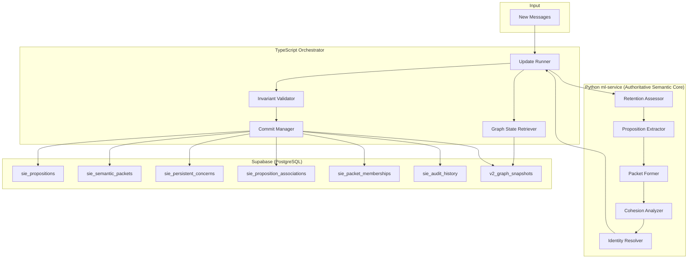

# Design Document: SIE Data Model (Final Corrected)

## Overview

This design defines the foundational data model for the Semantic Intelligence Engine (SIE). It covers retention-level assessment, proposition representation, concern-cohesive Semantic Packet formation, Persistent Concern lifecycle, and cross-cutting invariants.

### Key Concepts

1. **Retention-Level Assessment** — A 6-level classification (non-exclusive roles) replacing binary include/discard.
2. **Propositions** — Smallest semantic units with full provenance, extending the existing V2 `Proposition` type.
3. **Semantic Packets** — Concern-cohesive processing units with provisional cohesion analysis before identity resolution.
4. **Persistent Concerns** — Durable semantic identities with stable IDs, lifecycle status, and normalized associations.
5. **Cross-Cutting Invariants** — Provenance immutability, explicit association models, uncertainty-as-state.

### Execution Boundary

| Responsibility                                                                                                     | Runtime                          | Rationale                                                                  |
| ------------------------------------------------------------------------------------------------------------------ | -------------------------------- | -------------------------------------------------------------------------- |
| Retention assessment, proposition extraction, packet formation, cohesion analysis, **identity resolution**         | Python ml-service                | Python is the authoritative semantic core for all semantic decisions       |
| Graph state retrieval, version/invariant validation, orchestration, atomic commit, snapshot management, UI serving | TypeScript Next.js               | Preserves existing `v2_commit_update` RPC pattern and Supabase integration |
| Storage                                                                                                            | Supabase (PostgreSQL + pgvector) | Existing persistence infrastructure                                        |

**Critical boundary**: Python makes all primary semantic decisions (retention, identity, cohesion, relationships). TypeScript orchestrates calls, retrieves graph state for Python to reason over, validates structural invariants (cycle detection, single-parent), and commits results atomically. TypeScript does NOT make the primary semantic identity decision.

## Architecture



### Data Flow

1. **Ingestion**: TypeScript update runner receives new messages via `enqueueV2Update` (existing pattern preserved).
2. **Graph State Retrieval**: TypeScript loads current graph state from Supabase and sends it to Python as context for semantic decisions.
3. **Semantic Processing (Python)**: Retention assessment → proposition extraction → packet formation → cohesion analysis → identity resolution. Python receives graph state as input and returns semantic decisions.
4. **Invariant Validation (TypeScript)**: TypeScript validates structural invariants (no cycles, single-parent, version conflicts) against the current graph state.
5. **Atomic Commit (TypeScript)**: Results committed via existing `v2_commit_update` RPC pattern. SIE tables updated alongside V2 snapshot for backward compatibility.

### Relationship to Existing V2 Infrastructure

The transition has an explicit single-authority rule. The legacy V2 semantic pipeline and SIE must never both author semantic identity for the same conversation at the same time.

* **Shadow phase**: V2 remains authoritative. SIE may analyze the same messages and write isolated evaluation results, but it must not alter the user-visible V2 snapshot, cursor, or production mutation history.
* **Cutover transaction**: A conversation is assigned an authoritative engine version. The cutover establishes the initial SIE state and records the engine version atomically.
* **SIE-authoritative phase**: Persistent Concerns and their associations are the authoritative semantic state. `v2_graph_snapshots` becomes a backward-compatible materialized projection consumed by the existing React Flow UI. The legacy Thread → Object identity-formation path no longer writes semantic objects for that conversation.
* **Rollback**: Rollback changes the authoritative engine version through an explicit migration/restore operation. It must not permit concurrent dual writers.

The following infrastructure remains in use:

* `v2_graph_snapshots` stores the UI-compatible projection, not an independent competing semantic truth after SIE cutover.
* `v2_update_state` continues to manage cursor and recovery state.
* An extended `v2_commit_update` RPC remains the single atomic commit boundary.
* SIE tables store richer authoritative semantic detail that the V2 snapshot format cannot express.

**Thread → SemanticPacket is NOT a direct replacement.** Semantic Packets are concern-cohesive processing units for identity resolution. V2 Threads may remain as derived compatibility/display artifacts for ordering, grouping, and provenance, but after SIE cutover they must not continue independently forming authoritative objects.

**ObjectMaturity is retired.** It measured proposition count (`nascent < 3 < developing < 8 < stable`), which is not semantically meaningful. `semanticVersion` on PersistentConcern tracks commit count against that concern — a different concept entirely. Neither replaces the other.

## Components and Interfaces

### Stable, Idempotent ID Strategy

Permanent IDs are opaque, namespaced identifiers resolved once from stable creation keys and then reused. They are **not derived from mutable or model-generated text** such as `canonicalMeaning`, `identitySummary`, titles, summaries, or aliases. Equivalent model runs may phrase those fields differently, and later semantic evolution may legitimately update them.

Idempotency is provided through stable creation keys and an authoritative registry:

* Every processing attempt has a stable `request_id` and `idempotency_key` derived from the conversation, source message sequence range, and pipeline invocation identity.
* A proposed proposition carries a `proposition_creation_key` derived from immutable source provenance and its stable extraction-unit position within that request, not its canonical wording.
* A packet carries a `packet_creation_key` derived from the request and its stable partition lineage. Deliberate splits receive stable child partition keys.
* A new concern proposal carries a `concern_creation_key` derived from the packet and identity-resolution creation event. A namespaced UUIDv5 (or equivalent deterministic opaque-ID function) resolves the permanent `concern_id` from that immutable creation key; the atomic commit records and verifies the mapping. Retries reuse it.
* Existing concerns are always addressed by their persisted `concern_id`. Changes to identity summaries, titles, state, aliases, parents, or vocabulary never regenerate the ID.
* Association, membership, split, decision, and audit IDs use the same creation-key registry or a database uniqueness constraint appropriate to the event.

```python
class EntityCreationRef(BaseModel):
    entity_kind: str
    creation_key: str       # stable idempotency key; excludes mutable model text
    entity_id: str          # namespaced opaque ID resolved from creation_key
```

The database maintains a unique `(conversation_id, entity_kind, creation_key)` mapping and verifies that a creation key never resolves to a different ID. Replaying the same request returns the existing entity ID and cannot create a duplicate. A materially different extraction produced by a later extraction version is handled as explicit re-extraction/repair, not disguised as the same retry.

Batch and incremental convergence does not require identical internal IDs or packet boundaries. Comparison normalizes implementation-specific IDs and evaluates the approved current-state semantic equivalence contract.

### Python ml-service Models

```python
# ml-service/app/sie/enums.py

from enum import Enum

class RetentionLevel(str, Enum):
    DISCARD = "DISCARD"
    CONTEXT_ONLY = "CONTEXT_ONLY"
    SUPPORTING_EVIDENCE = "SUPPORTING_EVIDENCE"
    DURABLE_PROPOSITION = "DURABLE_PROPOSITION"
    EMERGENCE_EVIDENCE = "EMERGENCE_EVIDENCE"
    INDEPENDENT_CONCERN_CANDIDATE = "INDEPENDENT_CONCERN_CANDIDATE"

class BehavioralConfidenceBand(str, Enum):
    HIGH = "HIGH"
    MEDIUM = "MEDIUM"
    LOW = "LOW"

class PipelineOutcome(str, Enum):
    YES = "YES"
    NO = "NO"
    UNRESOLVED = "UNRESOLVED"
    DEFER = "DEFER"
    RETRIEVAL_INCONCLUSIVE = "RETRIEVAL_INCONCLUSIVE"
    REQUIRES_VALIDATION = "REQUIRES_VALIDATION"

class PropositionType(str, Enum):
    QUESTION = "QUESTION"
    CLAIM = "CLAIM"
    PREFERENCE = "PREFERENCE"
    GOAL = "GOAL"
    INTENT = "INTENT"
    DECISION = "DECISION"
    CONSTRAINT = "CONSTRAINT"
    PLAN = "PLAN"
    CORRECTION = "CORRECTION"
    REJECTION = "REJECTION"
    UPDATE = "UPDATE"
    REQUEST = "REQUEST"
    EMOTIONAL_STATE = "EMOTIONAL_STATE"
    EXAMPLE = "EXAMPLE"

class PropositionProvenance(str, Enum):
    DIRECT = "DIRECT"
    PARAPHRASE = "PARAPHRASE"
    INTERPRETATION = "INTERPRETATION"
    INFERENCE = "INFERENCE"

class SemanticState(str, Enum):
    ACTIVE = "ACTIVE"
    SUPERSEDED = "SUPERSEDED"
    RETRACTED = "RETRACTED"
    INVALIDATED = "INVALIDATED"

class CohesionStatus(str, Enum):
    COHESIVE = "COHESIVE"
    MIXED = "MIXED"
    UNRESOLVED_COHESION = "UNRESOLVED_COHESION"

class ConcernStatus(str, Enum):
    ACTIVE = "ACTIVE"
    DORMANT = "DORMANT"
    RETIRED = "RETIRED"
    MERGED = "MERGED"

class ParentResolutionState(str, Enum):
    ROOT_CONFIRMED = "ROOT_CONFIRMED"
    PARENT_DEFERRED = "PARENT_DEFERRED"
    PARENT_ASSIGNED = "PARENT_ASSIGNED"

class AssociationRole(str, Enum):
    PRIMARY_OWNER = "PRIMARY_OWNER"
    SUPPORTING_EVIDENCE = "SUPPORTING_EVIDENCE"
    EMERGENCE_EVIDENCE = "EMERGENCE_EVIDENCE"
    CONTEXT = "CONTEXT"
    CROSS_OBJECT_IMPACT = "CROSS_OBJECT_IMPACT"
```

```python
# ml-service/app/sie/models.py

from pydantic import BaseModel, Field
from typing import Optional
from .enums import *
class RetentionDecision(BaseModel):
    """Result of retention assessment. All retention roles are preserved downstream."""
    decision_id: str
    decision_creation_key: str
    conversation_id: str
    primary_level: RetentionLevel
    secondary_roles: list[RetentionLevel] = Field(default_factory=list)
    confidence: BehavioralConfidenceBand
    outcome: PipelineOutcome
    source_message_ids: list[str]
    speaker_role: str  # "USER" or "ASSISTANT"
    sequence_position: int
    extraction_version: str
    assessment_version: str
    rationale: Optional[str] = None


class SIEMessage(BaseModel):
    message_id: str
    conversation_id: str
    role: str  # USER or ASSISTANT
    content: str
    sequence_position: int
    created_at: str
    attachment_refs: list[str] = Field(default_factory=list)
    structured_content: Optional[dict] = None


class Proposition(BaseModel):
    """Smallest semantic unit. Permanent ID is resolved through the creation-key registry."""
    proposition_id: str
    proposition_creation_key: str
    conversation_id: str
    source_message_ids: list[str]
    speaker_role: str
    canonical_meaning: str
    proposition_type: PropositionType
    message_seq_range: tuple[int, int]
    provenance: PropositionProvenance
    semantic_state: SemanticState = SemanticState.ACTIVE
    retention_levels: list[RetentionLevel]  # ALL applicable levels preserved
    created_at: str
    extraction_version: str
    supersedes_proposition_id: Optional[str] = None


class ProvisionalConcernBoundary(BaseModel):
    """Provisional concern-boundary analysis before identity resolution.
    Determines whether propositions likely belong to the same or different
    primary concerns. Does NOT assign final Persistent Concern ownership."""
    boundary_id: str
    proposition_ids: list[str]
    provisional_concern_label: str  # descriptive, not a concern ID
    confidence: BehavioralConfidenceBand
    rationale: Optional[str] = None


class SemanticPacket(BaseModel):
    """Concern-cohesive processing unit with retry-stable creation lineage."""
    packet_id: str
    packet_creation_key: str
    conversation_id: str
    source_message_ids: list[str]  # inherited from constituent propositions
    message_seq_range: tuple[int, int]
    user_grounded_meaning: str
    assistant_context: Optional[str] = None
    continuation_origin: Optional[str] = None
    provenance: str
    packet_formation_version: str
    cohesion_status: CohesionStatus
    provisional_boundaries: list[ProvisionalConcernBoundary] = Field(default_factory=list)


class IdentityResolutionResult(BaseModel):
    """Result of identity resolution (performed in Python)."""
    packet_id: str
    outcome: PipelineOutcome
    confidence: BehavioralConfidenceBand
    matched_concern_id: Optional[str] = None
    new_concern_proposal: Optional["ConcernProposal"] = None
    candidates_considered: list[str] = Field(default_factory=list)
    rationale: str

    # Invariant: exactly one of matched_concern_id or new_concern_proposal may be
    # present for an affirmative result. Both are absent for unresolved/deferred results.


class ConcernProposal(BaseModel):
    """Proposal for a new Persistent Concern from identity resolution."""
    concern_creation_key: str
    proposed_concern_id: str  # opaque ID resolved from concern_creation_key
    identity_summary: str
    display_title: str
    initial_summary: str
    proposed_parent_id: Optional[str] = None
    parent_resolution_state: ParentResolutionState = ParentResolutionState.PARENT_DEFERRED


class PersistentConcern(BaseModel):
    """Durable concern state returned to Python as identity-resolution context."""
    concern_id: str
    conversation_id: str
    identity_summary: str
    display_title: str
    current_summary: str
    status: ConcernStatus
    created_at: str
    last_active_at: str
    canonical_parent_id: Optional[str] = None
    parent_resolution_state: ParentResolutionState
    semantic_version: int
    merged_into_concern_id: Optional[str] = None
    aliases: list[str] = Field(default_factory=list)  # derived from normalized aliases
    metadata: dict = Field(default_factory=dict)
```

Concern lifecycle semantics:

* `ACTIVE` and `DORMANT` retain the same semantic identity; dormancy never removes a concern from eligible identity retrieval.
* `RETIRED` means previously concluded or abandoned, not erased. Retired concerns remain historically retrievable. A later packet that genuinely resumes the same independently returnable concern may reactivate the existing ID; a mere historical mention does not reactivate it.
* `MERGED` concerns retain their source IDs as auditable redirects to `merged_into_concern_id`; the source ID is not recycled.
* `identity_summary` is an internal identity aid, `display_title` is user-facing metadata, and `current_summary` expresses current state. None independently defines identity.
* `canonical_parent_id = null` is interpreted through `parent_resolution_state`: `ROOT_CONFIRMED` and `PARENT_DEFERRED` are distinct valid states.
* Aliases are retrieval evidence rather than identity. Their addition, repair, removal, and privacy deletion are explicit and audited.

### Normalized Association Models

Instead of ID arrays on the concern (which cannot express role, versioning, or auditing), associations are modeled as explicit records:

```python
# ml-service/app/sie/associations.py

class PropositionAssociation(BaseModel):
    """Normalized association between a proposition and a concern.
    A proposition may have multiple associations with different roles.
    A proposition MAY be both PRIMARY_OWNER of one concern and
    SUPPORTING_EVIDENCE for another — roles are per-association, not per-proposition."""
    association_id: str
    association_creation_key: str  # retry-stable event key resolved through registry
    proposition_id: str
    concern_id: str
    role: AssociationRole
    confidence: BehavioralConfidenceBand
    provenance: str  # how this association was established
    semantic_state: SemanticState = SemanticState.ACTIVE
    created_at: str
    version: int = 1


class PacketMembership(BaseModel):
    """Normalized membership of a proposition in a packet.
    Source provenance is INHERITED from the proposition — packet membership
    never introduces new source provenance."""
    membership_id: str
    membership_creation_key: str
    packet_id: str
    proposition_id: str
    ordinal: int  # position within packet
    created_at: str


class PacketSplitRecord(BaseModel):
    """Records a packet split. Child packets inherit source provenance
    from their constituent propositions — no new provenance introduced."""
    split_id: str
    split_creation_key: str
    original_packet_id: str
    resulting_packet_ids: list[str]
    split_reason: str
    created_at: str
```

`PacketSplitRecord` is the API-level split event. Persistence expands its `resulting_packet_ids` into normalized `sie_packet_splits` edge rows sharing one `split_event_id`; each edge receives its own `split_edge_id`.

### Supporting Evidence Model

Supporting evidence is a role-constrained `PropositionAssociation`, not a second independently persisted association type. An evidence association uses one of `SUPPORTING_EVIDENCE`, `EMERGENCE_EVIDENCE`, `CONTEXT`, or `CROSS_OBJECT_IMPACT`; it records the source proposition, target concern, provenance, confidence, semantic state, establishing packet, and version in the normalized proposition-association record.

The Python API may expose a typed evidence view for convenience, but it normalizes to exactly one `PropositionAssociation` before persistence. The same semantic link must never be written once as a proposition association and again as a separate evidence record.

Key semantics:

* A proposition with role=PRIMARY_OWNER for concern A **may also** have role=SUPPORTING_EVIDENCE for concern B. These are different associations — ownership and evidence are NOT required to be disjoint at the proposition level.
* An association can be reassigned (role changed, concern changed) via semantic repair — the old association is marked INVALIDATED and a new one created, with audit trail.
* Evidence associations support the same lifecycle as propositions: ACTIVE → SUPERSEDED/INVALIDATED.
* Re-establishing a previously invalidated association creates a new association event/creation key rather than colliding with the historical association ID.

### Cohesion Analysis vs Identity Resolution

The pipeline separates **provisional cohesion analysis** from **final identity resolution**:

1. **Cohesion Analysis** (packet formation stage): Determines whether propositions in a packet likely advance the same or different primary concerns. Produces `ProvisionalConcernBoundary` records with descriptive labels. Does NOT assign Persistent Concern IDs. May result in packet splitting if MIXED.

2. **Identity Resolution** (downstream stage): Takes a COHESIVE packet and resolves it against the existing Persistent Concern graph. Produces a `matched_concern_id` or `new_concern_proposal`. This is the authoritative semantic ownership decision.

The separation ensures that cohesion validation can identify "these propositions seem to be about different things" without needing to know which specific Persistent Concerns they belong to. This prevents circular dependency between packet formation and identity resolution.

### API Contract (ml-service ↔ TypeScript)

```python
# ml-service/app/routes/sie.py

@router.post("/sie/process-messages")
async def process_messages(request: ProcessRequest) -> ProcessResult:
    """Full semantic processing pipeline.
    
    Input: messages + current graph state (concerns, associations)
    Output: retention decisions, propositions, packets, identity resolution results
    
    Python performs ALL semantic decisions. TypeScript only needs to validate
    structural invariants and commit."""
    ...

class ProcessRequest(BaseModel):
    api_contract_version: str
    pipeline_version: str
    model_version: str
    extraction_version: str
    request_id: str
    idempotency_key: str
    conversation_id: str
    base_graph_version: int
    message_seq_start: int
    message_seq_end: int
    messages: list[SIEMessage]
    context_window: list[SIEMessage] = Field(default_factory=list)
    current_graph_state: "GraphStateContext"  # existing concerns, for identity resolution

class GraphStateContext(BaseModel):
    """Graph state provided by TypeScript for Python to reason over."""
    graph_version: int
    concerns: list["ConcernSummary"]
    propositions: list["PropositionSummary"]
    active_associations: list["AssociationSummary"]
    pending_decisions: list["PendingDecisionSummary"] = Field(default_factory=list)

class ConcernSummary(BaseModel):
    concern_id: str
    identity_summary: str
    display_title: str
    current_summary: str
    status: ConcernStatus
    aliases: list[str] = Field(default_factory=list)
    canonical_parent_id: Optional[str] = None
    parent_resolution_state: ParentResolutionState
    last_active_at: str
    semantic_version: int

class PropositionSummary(BaseModel):
    proposition_id: str
    canonical_meaning: str
    proposition_type: PropositionType
    speaker_role: str
    semantic_state: SemanticState
    message_seq_range: tuple[int, int]

class AssociationSummary(BaseModel):
    association_id: str
    proposition_id: str
    concern_id: str
    role: AssociationRole
    semantic_state: SemanticState

class PendingDecisionSummary(BaseModel):
    entity_id: str
    stage: str
    outcome: PipelineOutcome
    rationale: Optional[str] = None

class PipelineDiagnostics(BaseModel):
    stage_versions: dict[str, str]
    warnings: list[str] = Field(default_factory=list)
    deferred_entity_ids: list[str] = Field(default_factory=list)

class SemanticDependencyGroupRef(BaseModel):
    """Transport-level grouping; full mutation semantics are defined by the
    evolution/integration specification."""
    group_id: str
    mutation_refs: list[str]
    failure_policy: str  # ALL_OR_NONE, INDEPENDENT, or DERIVED

class ProcessResult(BaseModel):
    api_contract_version: str
    pipeline_version: str
    model_version: str
    extraction_version: str
    request_id: str
    idempotency_key: str
    conversation_id: str
    base_graph_version: int
    lowest_seq: int
    highest_seq: int
    retention_decisions: list[RetentionDecision]
    propositions: list[Proposition]
    packets: list[SemanticPacket]
    packet_memberships: list[PacketMembership]
    splits: list[PacketSplitRecord]
    identity_resolutions: list[IdentityResolutionResult]
    new_concern_proposals: list[ConcernProposal]
    proposed_associations: list[PropositionAssociation]
    dependency_groups: list[SemanticDependencyGroupRef] = Field(default_factory=list)
    diagnostics: PipelineDiagnostics
```

Contract invariants:

* `current_graph_state.graph_version` must equal `base_graph_version`.
* TypeScript must reject a result whose request, conversation, sequence range, contract version, or base graph version does not match the invocation.
* A version conflict requires fresh graph retrieval and re-invocation of Python. Stale semantic results are never blindly replayed.
* OpenAPI generated from these Pydantic models is the source of truth for transport types. TypeScript runtime validators and types are generated from that contract rather than maintained as a second handwritten semantic schema.

### TypeScript Orchestrator Interfaces

```typescript
// src/lib/intelligence-v2/sie/types.ts

/** Transport types, including ProcessRequest and ProcessResult, are generated
 * from the versioned Python OpenAPI contract. The enums below are illustrative. */
export type RetentionLevel =
  | "DISCARD" | "CONTEXT_ONLY" | "SUPPORTING_EVIDENCE"
  | "DURABLE_PROPOSITION" | "EMERGENCE_EVIDENCE" | "INDEPENDENT_CONCERN_CANDIDATE";

export type BehavioralConfidenceBand = "HIGH" | "MEDIUM" | "LOW";
export type PipelineOutcome =
  | "YES" | "NO" | "UNRESOLVED" | "DEFER" | "RETRIEVAL_INCONCLUSIVE" | "REQUIRES_VALIDATION";
export type CohesionStatus = "COHESIVE" | "MIXED" | "UNRESOLVED_COHESION";
export type ConcernStatus = "ACTIVE" | "DORMANT" | "RETIRED" | "MERGED";
export type ParentResolutionState = "ROOT_CONFIRMED" | "PARENT_DEFERRED" | "PARENT_ASSIGNED";
export type AssociationRole =
  | "PRIMARY_OWNER" | "SUPPORTING_EVIDENCE" | "EMERGENCE_EVIDENCE" | "CONTEXT" | "CROSS_OBJECT_IMPACT";

/** TypeScript does NOT contain identity resolution logic.
 *  It orchestrates calls and validates structural invariants. */
export interface SIEOrchestratorResult {
  /** From Python — semantic decisions */
  processResult: ProcessResult;
  /** TypeScript — structural validation */
  invariantValidation: InvariantValidationResult;
  /** TypeScript — commit outcome */
  commitResult: CommitResult;
}

export interface InvariantValidationResult {
  valid: boolean;
  violations: InvariantViolation[];
}

export interface InvariantViolation {
  type: "cycle_detected" | "multi_parent" | "version_conflict" | "dangling_reference";
  entityId: string;
  description: string;
}

export interface CommitResult {
  success: boolean;
  committedGraphVersion: number | null;
  requestId: string;
  retryRequired: boolean;
  violations: InvariantViolation[];
}

export interface SIEGraphState {
  graphVersion: number;
  concerns: PersistentConcern[];
  propositions: Proposition[];
  associations: PropositionAssociation[];
  packets: SemanticPacket[];
}
```

## Data Models

### Supabase Schema

Tables are created in dependency order (no forward references):

```sql
-- 0. Authoritative-engine state and idempotent entity registry
ALTER TABLE v2_update_state
    ADD COLUMN IF NOT EXISTS authoritative_engine TEXT NOT NULL DEFAULT 'V2'
        CHECK (authoritative_engine IN ('V2', 'SIE_SHADOW', 'SIE')),
    ADD COLUMN IF NOT EXISTS sie_cutover_graph_version INTEGER;

CREATE TABLE sie_entity_registry (
    conversation_id UUID NOT NULL REFERENCES conversations(id),
    entity_kind TEXT NOT NULL,
    creation_key TEXT NOT NULL,
    entity_id TEXT NOT NULL,
    request_id TEXT NOT NULL,
    created_at TIMESTAMPTZ NOT NULL DEFAULT NOW(),
    PRIMARY KEY (conversation_id, entity_kind, creation_key),
    UNIQUE(entity_kind, entity_id)
);

CREATE TABLE sie_commit_requests (
    conversation_id UUID NOT NULL REFERENCES conversations(id),
    request_id TEXT NOT NULL,
    idempotency_key TEXT NOT NULL,
    payload_fingerprint TEXT NOT NULL,
    base_graph_version INTEGER NOT NULL,
    committed_graph_version INTEGER,
    status TEXT NOT NULL CHECK (status IN ('PENDING', 'COMMITTED', 'REJECTED')),
    result JSONB,
    created_at TIMESTAMPTZ NOT NULL DEFAULT NOW(),
    completed_at TIMESTAMPTZ,
    PRIMARY KEY (conversation_id, idempotency_key),
    UNIQUE(request_id)
);

-- 1. Persistent Concerns (no FK dependencies on other SIE entity tables)
CREATE TABLE sie_persistent_concerns (
    concern_id TEXT PRIMARY KEY,
    conversation_id UUID NOT NULL REFERENCES conversations(id),
    identity_summary TEXT NOT NULL,
    display_title TEXT NOT NULL,
    current_summary TEXT NOT NULL,
    status TEXT NOT NULL DEFAULT 'ACTIVE'
        CHECK (status IN ('ACTIVE', 'DORMANT', 'RETIRED', 'MERGED')),
    created_at TIMESTAMPTZ NOT NULL DEFAULT NOW(),
    last_active_at TIMESTAMPTZ NOT NULL DEFAULT NOW(),
    canonical_parent_id TEXT REFERENCES sie_persistent_concerns(concern_id),
    parent_resolution_state TEXT NOT NULL DEFAULT 'PARENT_DEFERRED'
        CHECK (parent_resolution_state IN ('ROOT_CONFIRMED', 'PARENT_DEFERRED', 'PARENT_ASSIGNED')),
    metadata JSONB DEFAULT '{}',
    semantic_version INTEGER NOT NULL DEFAULT 1,
    merged_into_concern_id TEXT REFERENCES sie_persistent_concerns(concern_id),
    CHECK (canonical_parent_id IS NULL OR canonical_parent_id <> concern_id),
    CHECK (
        (parent_resolution_state = 'PARENT_ASSIGNED' AND canonical_parent_id IS NOT NULL)
        OR (parent_resolution_state IN ('ROOT_CONFIRMED', 'PARENT_DEFERRED') AND canonical_parent_id IS NULL)
    ),
    CHECK (
        (status = 'MERGED' AND merged_into_concern_id IS NOT NULL)
        OR (status <> 'MERGED' AND merged_into_concern_id IS NULL)
    )
);

CREATE INDEX idx_concerns_conversation ON sie_persistent_concerns(conversation_id);
CREATE INDEX idx_concerns_status ON sie_persistent_concerns(status);
CREATE INDEX idx_concerns_parent ON sie_persistent_concerns(canonical_parent_id);

-- 2. Concern Aliases (normalized, supports audited removal)
CREATE TABLE sie_concern_aliases (
    alias_id TEXT PRIMARY KEY,
    concern_id TEXT NOT NULL REFERENCES sie_persistent_concerns(concern_id),
    alias_text TEXT NOT NULL,
    added_at TIMESTAMPTZ NOT NULL DEFAULT NOW(),
    removed_at TIMESTAMPTZ,  -- NULL = active; set via audited repair/deletion
    removal_reason TEXT
);

CREATE INDEX idx_aliases_concern ON sie_concern_aliases(concern_id) WHERE removed_at IS NULL;
CREATE INDEX idx_aliases_text ON sie_concern_aliases(alias_text) WHERE removed_at IS NULL;
CREATE UNIQUE INDEX uq_active_concern_alias
    ON sie_concern_aliases(concern_id, alias_text)
    WHERE removed_at IS NULL;

-- 3. Propositions (references concerns via association table, not direct FK)
CREATE TABLE sie_propositions (
    proposition_id TEXT PRIMARY KEY,
    conversation_id UUID NOT NULL REFERENCES conversations(id),
    source_message_ids TEXT[] NOT NULL,
    speaker_role TEXT NOT NULL CHECK (speaker_role IN ('USER', 'ASSISTANT')),
    canonical_meaning TEXT NOT NULL,
    proposition_type TEXT NOT NULL CHECK (proposition_type IN (
        'QUESTION', 'CLAIM', 'PREFERENCE', 'GOAL', 'INTENT', 'DECISION',
        'CONSTRAINT', 'PLAN', 'CORRECTION', 'REJECTION', 'UPDATE',
        'REQUEST', 'EMOTIONAL_STATE', 'EXAMPLE'
    )),
    message_seq_start INTEGER NOT NULL,
    message_seq_end INTEGER NOT NULL,
    provenance TEXT NOT NULL CHECK (provenance IN ('DIRECT', 'PARAPHRASE', 'INTERPRETATION', 'INFERENCE')),
    semantic_state TEXT NOT NULL DEFAULT 'ACTIVE'
        CHECK (semantic_state IN ('ACTIVE', 'SUPERSEDED', 'RETRACTED', 'INVALIDATED')),
    retention_levels TEXT[] NOT NULL
        CHECK (
            cardinality(retention_levels) > 0
            AND retention_levels <@ ARRAY[
                'DISCARD', 'CONTEXT_ONLY', 'SUPPORTING_EVIDENCE',
                'DURABLE_PROPOSITION', 'EMERGENCE_EVIDENCE',
                'INDEPENDENT_CONCERN_CANDIDATE'
            ]::TEXT[]
        ),  -- ALL applicable levels preserved
    created_at TIMESTAMPTZ NOT NULL DEFAULT NOW(),
    extraction_version TEXT NOT NULL,
    supersedes_proposition_id TEXT REFERENCES sie_propositions(proposition_id),
    CHECK (message_seq_start <= message_seq_end),
    CHECK (cardinality(source_message_ids) > 0)
);

CREATE INDEX idx_propositions_conversation ON sie_propositions(conversation_id);
CREATE INDEX idx_propositions_state ON sie_propositions(semantic_state);
CREATE INDEX idx_propositions_seq ON sie_propositions(conversation_id, message_seq_start);

-- 4. Proposition-Concern Associations (normalized many-to-many with roles)
CREATE TABLE sie_proposition_associations (
    association_id TEXT PRIMARY KEY,
    proposition_id TEXT NOT NULL REFERENCES sie_propositions(proposition_id),
    concern_id TEXT NOT NULL REFERENCES sie_persistent_concerns(concern_id),
    role TEXT NOT NULL CHECK (role IN (
        'PRIMARY_OWNER', 'SUPPORTING_EVIDENCE', 'EMERGENCE_EVIDENCE', 'CONTEXT', 'CROSS_OBJECT_IMPACT'
    )),
    confidence TEXT NOT NULL CHECK (confidence IN ('HIGH', 'MEDIUM', 'LOW')),
    provenance TEXT NOT NULL,
    semantic_state TEXT NOT NULL DEFAULT 'ACTIVE'
        CHECK (semantic_state IN ('ACTIVE', 'SUPERSEDED', 'RETRACTED', 'INVALIDATED')),
    established_at TIMESTAMPTZ NOT NULL DEFAULT NOW(),
    established_by_packet_id TEXT,
    version INTEGER NOT NULL DEFAULT 1
);

CREATE INDEX idx_assoc_proposition ON sie_proposition_associations(proposition_id);
CREATE INDEX idx_assoc_concern ON sie_proposition_associations(concern_id);
CREATE INDEX idx_assoc_role ON sie_proposition_associations(role) WHERE semantic_state = 'ACTIVE';
CREATE UNIQUE INDEX uq_active_primary_owner_per_proposition
    ON sie_proposition_associations(proposition_id)
    WHERE role = 'PRIMARY_OWNER' AND semantic_state = 'ACTIVE';

-- 5. Semantic Packets
CREATE TABLE sie_semantic_packets (
    packet_id TEXT PRIMARY KEY,
    conversation_id UUID NOT NULL REFERENCES conversations(id),
    source_message_ids TEXT[] NOT NULL,
    message_seq_start INTEGER NOT NULL,
    message_seq_end INTEGER NOT NULL,
    user_grounded_meaning TEXT NOT NULL,
    assistant_context TEXT,
    continuation_origin TEXT,
    provenance TEXT NOT NULL,
    packet_formation_version TEXT NOT NULL,
    cohesion_status TEXT NOT NULL CHECK (cohesion_status IN ('COHESIVE', 'MIXED', 'UNRESOLVED_COHESION')),
    created_at TIMESTAMPTZ NOT NULL DEFAULT NOW(),
    CHECK (message_seq_start <= message_seq_end),
    CHECK (cardinality(source_message_ids) > 0)
);

CREATE INDEX idx_packets_conversation ON sie_semantic_packets(conversation_id);
CREATE INDEX idx_packets_cohesion ON sie_semantic_packets(cohesion_status);

ALTER TABLE sie_proposition_associations
    ADD CONSTRAINT fk_assoc_establishing_packet
    FOREIGN KEY (established_by_packet_id)
    REFERENCES sie_semantic_packets(packet_id);

-- 6. Packet Memberships (normalized; replaces proposition_ids array)
CREATE TABLE sie_packet_memberships (
    membership_id TEXT PRIMARY KEY,
    packet_id TEXT NOT NULL REFERENCES sie_semantic_packets(packet_id),
    proposition_id TEXT NOT NULL REFERENCES sie_propositions(proposition_id),
    ordinal INTEGER NOT NULL,
    created_at TIMESTAMPTZ NOT NULL DEFAULT NOW(),
    UNIQUE(packet_id, proposition_id),
    UNIQUE(packet_id, ordinal)
);

CREATE INDEX idx_membership_packet ON sie_packet_memberships(packet_id);
CREATE INDEX idx_membership_proposition ON sie_packet_memberships(proposition_id);

-- 7. Packet Splits (explicit records; child provenance inherited, not introduced)
CREATE TABLE sie_packet_splits (
    split_edge_id TEXT PRIMARY KEY,
    split_event_id TEXT NOT NULL,
    original_packet_id TEXT NOT NULL REFERENCES sie_semantic_packets(packet_id),
    resulting_packet_id TEXT NOT NULL REFERENCES sie_semantic_packets(packet_id),
    split_reason TEXT NOT NULL,
    created_at TIMESTAMPTZ NOT NULL DEFAULT NOW(),
    UNIQUE(original_packet_id, resulting_packet_id)
);

CREATE INDEX idx_splits_original ON sie_packet_splits(original_packet_id);
CREATE INDEX idx_splits_event ON sie_packet_splits(split_event_id);

-- 8. Retention Decisions (audit trail)
CREATE TABLE sie_retention_decisions (
    id TEXT PRIMARY KEY,
    creation_key TEXT NOT NULL,
    request_id TEXT NOT NULL,
    conversation_id UUID NOT NULL REFERENCES conversations(id),
    source_message_ids TEXT[] NOT NULL,
    primary_level TEXT NOT NULL CHECK (primary_level IN (
        'DISCARD', 'CONTEXT_ONLY', 'SUPPORTING_EVIDENCE',
        'DURABLE_PROPOSITION', 'EMERGENCE_EVIDENCE', 'INDEPENDENT_CONCERN_CANDIDATE'
    )),
    secondary_roles TEXT[] DEFAULT '{}',
    confidence TEXT NOT NULL CHECK (confidence IN ('HIGH', 'MEDIUM', 'LOW')),
    outcome TEXT NOT NULL CHECK (outcome IN (
        'YES', 'NO', 'UNRESOLVED', 'DEFER', 'RETRIEVAL_INCONCLUSIVE', 'REQUIRES_VALIDATION'
    )),
    speaker_role TEXT NOT NULL CHECK (speaker_role IN ('USER', 'ASSISTANT')),
    sequence_position INTEGER NOT NULL,
    extraction_version TEXT NOT NULL,
    assessment_version TEXT NOT NULL,
    rationale TEXT,
    created_at TIMESTAMPTZ NOT NULL DEFAULT NOW(),
    UNIQUE(conversation_id, creation_key)
);

CREATE INDEX idx_retention_conversation ON sie_retention_decisions(conversation_id);

-- 9. Audit History
CREATE TABLE sie_audit_history (
    id TEXT PRIMARY KEY,
    entity_type TEXT NOT NULL CHECK (entity_type IN ('proposition', 'packet', 'concern', 'association', 'alias')),
    entity_id TEXT NOT NULL,
    conversation_id UUID NOT NULL REFERENCES conversations(id),
    field_changed TEXT NOT NULL,
    previous_value JSONB,
    new_value JSONB NOT NULL,
    change_reason TEXT NOT NULL,
    change_type TEXT NOT NULL CHECK (change_type IN ('evolution', 'repair', 'system')),
    changed_at TIMESTAMPTZ NOT NULL DEFAULT NOW(),
    change_version INTEGER NOT NULL
);

CREATE INDEX idx_audit_entity ON sie_audit_history(entity_type, entity_id);
CREATE INDEX idx_audit_conversation ON sie_audit_history(conversation_id);
```

### V2 Compatibility Layer and Atomic Commit

The SIE commit manager produces both authoritative SIE table writes and a V2-compatible snapshot update through **one database RPC and one PostgreSQL transaction**. A client-side call performed immediately before or after the RPC is not part of that transaction and is not permitted for authoritative commit data.

```typescript
// src/lib/intelligence-v2/sie/commit-manager.ts (conceptual)

async function commitSIEResult(
  conversationId: string,
  processResult: ProcessResult,
  currentSIEState: SIEGraphState,
  currentVersion: number
): Promise<CommitResult> {
  // Build one validated commit bundle. No database mutation occurs yet.
  // The bundle contains SIE entity/association mutations, audit records,
  // idempotency creation keys, cursor movement, and the V2 projection.
  // Project authoritative SIE state → V2 snapshot format:
  //    - PersistentConcern → ConversationalObject (with objectType derived from propositions)
  //    - PropositionAssociation(PRIMARY_OWNER) → object.propositionIds
  //    - SemanticPacket (informational, threads remain separate)
  //    - Hierarchy (canonical_parent_id → child_of relationships)
  const commitBundle = buildSIECommitBundle(processResult, currentSIEState, currentVersion);
  const v2Projection = projectToV2Snapshot(commitBundle.resultingSIEState);
  
  // This extended RPC performs, in one PostgreSQL transaction:
  // 1. lock/check authoritative engine, graph version, cursor and idempotency key;
  // 2. verify/reuse creation-key-to-ID mappings through sie_entity_registry;
  // 3. apply all SIE entity, association, split and audit mutations;
  // 4. write the V2 projection and mutation log;
  // 5. advance graph version and message cursor exactly once.
  const { data, error } = await db.rpc("v2_commit_update", {
    p_conversation_id: conversationId,
    p_new_snapshot: v2Projection,
    p_from_version: currentVersion,
    p_to_version: currentVersion + 1,
    p_mutations: formatMutationsForV2(commitBundle),
    p_sie_commit_bundle: commitBundle,
    p_request_id: processResult.request_id,
    p_idempotency_key: processResult.idempotency_key,
    p_required_engine: "SIE",
    p_last_processed_seq: processResult.highest_seq,
    p_message_seq_from: processResult.lowest_seq,
    p_message_seq_to: processResult.highest_seq,
  });

  if (error) return classifyCommitFailure(error, processResult.request_id);
  return {
    success: true,
    committedGraphVersion: data.graph_version,
    requestId: processResult.request_id,
    retryRequired: false,
    violations: [],
  };
}
```

The RPC must be idempotent. Repeating an already committed `idempotency_key` returns the recorded commit result without duplicating entities, associations, audit events, snapshots, or cursor advancement. A graph-version conflict aborts the entire transaction and requires TypeScript to reload state and re-invoke Python.

An idempotency key is bound to a canonical request/bundle fingerprint. Reusing the same key with a materially different payload is an error and must not return the earlier success or commit the new payload.

Structural validation applies to the complete semantic dependency group. TypeScript may reject a structurally invalid group, but it must not drop one mutation and commit the remaining mutations when their meaning depends on one another. Rejected groups return violations to Python for semantic correction or re-analysis.

### V2 Type Migration (Corrected)

| V2 Type                | SIE Equivalent                        | Relationship                  | Notes                                                                                                                                                                                           |
| ---------------------- | ------------------------------------- | ----------------------------- | ----------------------------------------------------------------------------------------------------------------------------------------------------------------------------------------------- |
| `Utterance`            | (unchanged)                           | Kept as-is                    | Immutable ground truth                                                                                                                                                                          |
| `Proposition`          | `SIEProposition`                      | Extended                      | Adds retention_levels (array), richer provenance. V2 Proposition persists for backward compat.                                                                                                  |
| `Thread`               | Coexists with `SemanticPacket`        | NOT a replacement             | During shadow mode, legacy behavior remains isolated. After SIE cutover, Threads may remain as derived compatibility/display structures but no longer independently form authoritative objects. |
| `ConversationalObject` | `PersistentConcern`                   | Semantic evolution            | Objects are projection targets. Concerns are the authoritative semantic identity.                                                                                                               |
| `ObjectType`           | Derived from proposition types        | Retired as primary model      | Concern identity is not typed by category. V2 snapshot projection derives objectType from constituent proposition types for UI compat.                                                          |
| `ObjectMaturity`       | Retired                               | NOT mapped to semanticVersion | Maturity was proposition-count-based (meaningless). semanticVersion is commit-count. These are unrelated concepts.                                                                              |
| `Relationship`         | Persists during data-model transition | Compatibility projection      | Existing relationship infrastructure remains available until the relationship subsystem receives its own SIE cutover; it must not become a second source of concern identity.                   |

### Extraction Validation

Extraction validation verifies semantic grounding of extracted propositions against source material. It does NOT use an arbitrary embedding/lexical similarity threshold as a truth test.

Instead, validation checks:

1. **Source grounding**: Every proposition must reference at least one source message that semantically supports the extracted meaning. Validation asks "can this meaning be reasonably derived from the referenced source messages?" via LLM judgment, not a numeric similarity cutoff.

2. **Speaker attribution**: The speaker_role must match the actual author(s) of the referenced source messages.

3. **Provenance classification**: DIRECT propositions must be close to verbatim; INTERPRETATION and INFERENCE require explicit supporting context in the source window.

4. **No hallucination**: If a proposition's canonical_meaning cannot be grounded in any referenced source message through reasonable interpretation, it is rejected with `outcome=REQUIRES_VALIDATION`.

## Correctness Properties

### Property 1: Retention classification produces valid levels with all roles preserved

*For any* conversational material, the retention assessment SHALL produce a valid primary RetentionLevel with zero or more secondary_roles. *For any* proposition created from that material, all applicable retention levels (primary + secondary) SHALL be stored in the `retention_levels` array and SHALL survive all downstream processing unchanged.

**Validates: Requirements 1.1, 1.8**

### Property 2: Retention levels determine downstream participation

*For any* material classified as DISCARD (with no secondary roles above DISCARD), it SHALL NOT appear in any downstream proposition. *For any* material classified as CONTEXT_ONLY (primary), it SHALL NOT be assigned PRIMARY_OWNER role in any association.

**Validates: Requirements 1.2, 1.3, 1.4**

### Property 3: Low confidence prevents permanent classification

*For any* retention decision where confidence is LOW, the outcome SHALL be one of UNRESOLVED, DEFER, or REQUIRES_VALIDATION — never YES or NO.

**Validates: Requirements 1.9**

### Property 4: Assistant content never automatically becomes user state

*For any* proposition with speakerRole=ASSISTANT, it SHALL NOT receive an association with role=PRIMARY_OWNER to a user-state concern unless explicit user confirmation evidence exists in the provenance chain.

**Validates: Requirements 1.11, 2.10, 5.5**

### Property 5: Entity creation is idempotent and permanent IDs are semantically stable

*For any* repeated entity-creation request with the same `(conversation_id, entity_kind, creation_key)`, the registry SHALL return the same permanent entity ID and SHALL NOT create a duplicate. Mutable model output such as canonical meaning, identity summary, title, summary, alias, or parent SHALL NOT participate in permanent-ID derivation. Once committed, an entity ID remains stable through semantic evolution and repair unless an explicit merge redirect retires that identity.

**Validates: Requirements 2.1, 3.11, 5.6**

### Property 6: Provenance is immutable through all operations

*For any* proposition and any valid operation (state transition, association change, semantic repair, version increment), the source_message_ids and provenance fields SHALL remain unchanged.

**Validates: Requirements 2.5, 5.1, 5.7**

### Property 7: Associations support multiple roles per proposition

*For any* proposition P and concerns A and B, P MAY simultaneously hold role=PRIMARY_OWNER for A and role=SUPPORTING_EVIDENCE for B. The system SHALL NOT require ownership and evidence associations to be disjoint at the proposition level.

**Validates: Requirements 2.8 (corrected), 4.8, 5.2**

### Property 8: Only COHESIVE packets enter identity resolution

*For any* semantic packet submitted to identity resolution (Python), its cohesion_status SHALL be COHESIVE. MIXED or UNRESOLVED_COHESION packets SHALL NOT proceed to final identity resolution.

**Validates: Requirements 3.3, 3.9**

### Property 9: Packet splits never introduce new source provenance

*For any* packet split, each resulting child packet's source_message_ids SHALL be a subset of the union of source_message_ids from its constituent propositions. No new source provenance is introduced by the split operation itself.

**Validates: Requirements 3.6 (corrected)**

### Property 10: Provisional cohesion analysis does not assign concern IDs

*For any* ProvisionalConcernBoundary produced during cohesion analysis, the provisional_concern_label SHALL be descriptive text — it SHALL NOT be a Persistent Concern ID and SHALL NOT create or reference any Persistent Concern.

**Validates: Requirements 3.3 (cohesion vs identity separation)**

### Property 11: Aliases support audited removal

*For any* concern alias, it MAY be removed through explicit audited repair or deletion (removed_at set, removal_reason recorded). The alias list is NOT required to be monotonically additive.

**Validates: Requirements 4.7 (corrected)**

### Property 12: DORMANT concerns remain queryable and reactivatable

*For any* concern with status=DORMANT, it SHALL remain retrievable by identity resolution queries and eligible for reactivation. Temporal distance alone SHALL NOT exclude it.

Retired concerns SHALL remain historically retrievable. When new material resumes the same concern identity rather than merely referring to its history, the system MAY reactivate the existing concern ID through an audited lifecycle transition instead of creating a duplicate.

**Validates: Requirements 4.4**

### Property 13: Unresolved states are first-class valid

*For any* proposition with no PRIMARY_OWNER association, *for any* packet with UNRESOLVED_COHESION, *for any* concern with PARENT_DEFERRED — all SHALL pass validation. Uncertainty is not invalid.

**Validates: Requirements 2.9, 4.5, 4.12, 5.4**

### Property 14: State transitions produce audit records

*For any* state change (proposition semantic_state, concern status, association role/state, alias removal), an audit record SHALL be created with entity_id, field_changed, previous_value, new_value, change_reason, and change_type.

**Validates: Requirements 2.7**

### Property 15: Semantic convergence (batch vs incremental)

*For any* conversation processed incrementally and as a full batch, the resulting active concern identities, active proposition-to-concern associations (role=PRIMARY_OWNER), and active concern statuses SHALL be semantically equivalent. The specific packets, histories, intermediate entities, and entity structures MAY differ between modes.

**Validates: Requirements 5.8 (corrected)**

### Property 16: Identity resolution executes in Python

*For any* semantic packet requiring identity resolution, the primary ownership decision SHALL be made by the Python ml-service. TypeScript SHALL NOT independently assign primary concern ownership.

**Validates: Execution boundary requirement**

### Property 17: V2 snapshot compatibility

*For any* SIE commit, the resulting V2 snapshot projection SHALL be consumable by the React Flow UI and the existing `v2_graph_snapshots` query path without modification to UI code.

**Validates: V2 compatibility requirement**

### Property 18: SIE state, V2 projection, audit history, version, and cursor commit atomically

*For any* authoritative SIE commit, all SIE mutations, entity-registry mappings, association changes, audit records, V2 snapshot projection, mutation-log entries, graph-version increment, and cursor advancement SHALL become visible together or none SHALL become visible. Replaying a committed idempotency key SHALL return the original result without additional writes.

**Validates: Atomic commit and idempotency requirements**

### Property 19: Exactly one semantic identity authority exists per conversation

*For any* conversation and graph version, `authoritative_engine` SHALL select exactly one production semantic writer. Shadow SIE output SHALL NOT alter production state, and after SIE cutover the legacy Thread → Object path SHALL NOT independently author semantic objects.

**Validates: V2-to-SIE transition requirement**

## Error Handling

### Retention Assessment Errors

| Error Condition                           | Handling Strategy                                                                                                                |
| ----------------------------------------- | -------------------------------------------------------------------------------------------------------------------------------- |
| LLM fails to return valid retention level | Set outcome to REQUIRES_VALIDATION; do not discard                                                                               |
| Empty text content                        | Inspect attachments and structured content first; classify as DISCARD only when the complete message carries no semantic content |
| Timeout on model call                     | Return DEFER outcome; re-queue for later processing                                                                              |
| Invalid speaker role                      | Reject with validation error before processing                                                                                   |

### Proposition Extraction Errors

| Error Condition                                              | Handling Strategy                                                                         |
| ------------------------------------------------------------ | ----------------------------------------------------------------------------------------- |
| Creation key already mapped                                  | Reuse the recorded permanent entity ID and prior commit result; do not create a duplicate |
| Extraction produces zero propositions from retained material | Log diagnostic; allow empty extraction (material may be context-only)                     |
| Provenance references non-existent message IDs               | Reject proposition; log for investigation                                                 |
| Extracted meaning cannot be grounded in source messages      | Set outcome to REQUIRES_VALIDATION; do NOT apply arbitrary similarity threshold           |

### Packet Formation Errors

| Error Condition                                  | Handling Strategy                                            |
| ------------------------------------------------ | ------------------------------------------------------------ |
| Cohesion assessment fails (model error)          | Set cohesionStatus to UNRESOLVED_COHESION; do NOT auto-split |
| Split would produce child with zero propositions | Reject split; re-attempt with different boundary             |
| Packet references non-existent proposition IDs   | Validate all IDs exist before forming packet                 |

### Identity Resolution Errors (Python)

| Error Condition                      | Handling Strategy                                  |
| ------------------------------------ | -------------------------------------------------- |
| Multiple equal-confidence matches    | Return RETRIEVAL_INCONCLUSIVE with candidates list |
| Graph state context missing or stale | Return DEFER; TypeScript retries with fresh state  |
| Model timeout during resolution      | Return UNRESOLVED; persist packet in pending state |

### Commit Errors (TypeScript)

| Error Condition                                               | Handling Strategy                                                                                               |
| ------------------------------------------------------------- | --------------------------------------------------------------------------------------------------------------- |
| Version conflict (concurrent update)                          | Reject commit; reload state and re-invoke Python                                                                |
| Invariant violation (cycle, multi-parent, dangling reference) | Reject the affected semantic dependency group; return violation details to Python for correction or re-analysis |
| Supabase transaction failure                                  | Retry with exponential backoff; no partial commits visible                                                      |

### Cross-Cutting Error Principles

1. **Never silently discard**: Processing failures produce UNRESOLVED/DEFER, not DISCARD.
2. **Never rewrite provenance**: Repairs correct semantic state, never source_message_ids.
3. **Audit all state changes**: Every correction creates an audit record.
4. **Python is authoritative for semantic decisions**: TypeScript may reject on structural grounds but does not override semantic judgment.

## Testing Strategy

### Property-Based Testing

**Python**: Hypothesis framework. **TypeScript**: fast-check.

| Property                       | Layer          | Key Generators                                                                                     |
| ------------------------------ | -------------- | -------------------------------------------------------------------------------------------------- |
| 1 (retention roles preserved)  | Python         | Random messages → verify retention_levels array roundtrip                                          |
| 5 (idempotent entity creation) | Python + DB    | Same creation key twice → one persisted entity and the same permanent ID                           |
| 6 (provenance immutability)    | Both           | Entity + random operation sequence → provenance unchanged                                          |
| 7 (multi-role associations)    | Python + DB    | Proposition with multiple associations → all valid                                                 |
| 9 (split provenance)           | Python         | Random splits → no new source_message_ids introduced                                               |
| 15 (convergence)               | Integration    | Same messages batch vs incremental → equivalent active state                                       |
| 17 (V2 compat)                 | TypeScript     | SIE result → V2 projection → valid V2GraphPlan shape                                               |
| 18 (atomic commit)             | DB integration | Inject failure at each RPC phase → either every SIE/V2/version/cursor write is visible or none are |
| 19 (single authority)          | Integration    | Shadow and cutover states → exactly one production semantic writer                                 |

### Integration Tests

| Scenario                                                             | Validates                          |
| -------------------------------------------------------------------- | ---------------------------------- |
| Full pipeline: message → Python processing → TS commit → V2 snapshot | End-to-end data flow               |
| Retry after failure reuses creation-key registry mappings            | Idempotent entity creation         |
| Concurrent updates with version conflict → retry succeeds            | Optimistic locking                 |
| V2 snapshot readable by existing React Flow UI query                 | Backward compatibility             |
| SIE commit alongside existing v2_commit_update RPC                   | Coexistence with V2 infrastructure |
