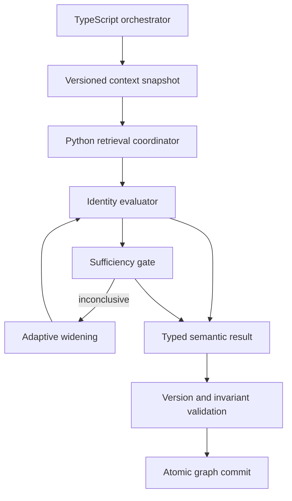

# Design Document: SIE Identity Resolution

## 1. Purpose and Status

This document is the authoritative implementation design for the Semantic Intelligence Engine (SIE) identity-resolution subsystem. It replaces the earlier identity-resolution design and its correction appendix.

The subsystem determines whether a concern-cohesive `Semantic_Packet` advances an existing `Persistent_Concern`, should contribute to a shared new-concern proposal, or must remain unresolved. It also establishes whether retrieval was adequate before novelty is declared, performs bounded adaptive widening, handles concern lifecycle redirects and reactivation, and produces version-bound mutation proposals for atomic commit.

The governing rules are:

- Persistent concern identity outranks lexical similarity (SME-1).
- Retrieval proposes candidates; it never determines ownership (SME-2).
- Retrieval absence is not semantic absence (SME-3).
- Exact continuity outranks broad topic compatibility (SME-5).
- Temporal distance does not break identity (SME-8).
- State change does not itself create a new identity (SME-9).
- Uncertainty is durable: the engine may return `UNRESOLVED`, `DEFER`, `RETRIEVAL_INCONCLUSIVE`, or `REQUIRES_VALIDATION`.
- Python is the authoritative semantic core. TypeScript orchestrates, validates versions and invariants, and commits; it does not reinterpret identity.

This design depends on the finalized `sie-data-model` contract. In particular, it uses `INDEPENDENT_CONCERN_CANDIDATE`, preserves primary and secondary retention roles, uses deterministic creation keys, and stores durable concern/proposition relationships in normalized association tables.

## 2. Scope and Ownership Boundaries

### 2.1 Python `ml-service`

Python owns:

- identity candidate evaluation;
- IRS signal assessment;
- retrieval-sufficiency judgment;
- adaptive-widening plans;
- novelty eligibility;
- dormant/retired substantive-resumption judgment;
- merge-redirect validation;
- proposition-association proposals;
- pending-decision proposals and resolutions;
- semantic reasoning and diagnostics.

### 2.2 TypeScript/Next.js orchestration

TypeScript owns:

- message ingestion and the currently implemented proposition-extraction boundary;
- loading one transactionally consistent, version-bound graph context;
- invoking the Python service;
- request reservation, leases, semantic-result caching, and retry orchestration;
- contract, graph-version, dependency-group, and invariant validation;
- atomic persistence through the extended `v2_commit_update` RPC;
- cursor, snapshot, recovery, and UI compatibility.

TypeScript shall not select a concern, reinterpret candidate scores, change confidence bands, or substitute its own semantic result.

### 2.3 Upstream extraction boundary

This identity-resolution specification does not own or redesign proposition extraction. During the current transition, the existing TypeScript extraction path may supply upstream propositions to the SIE pipeline. Final extraction ownership and migration remain governed by the `sie-data-model` and SIE execution-boundary design. Identity resolution itself begins only after concern-cohesive packets are available.

An extraction repair may cause upstream propositions or packets to be regenerated. Identity resolution then runs again against the corrected, versioned inputs. It does not repair corrupted extraction by guessing missing meaning.

### 2.4 Hierarchy boundary

Identity resolution may propose a new concern, but it does not infer or assign a canonical parent. New concern proposals leave `canonical_parent_id = null` and `parent_resolution_state = PARENT_DEFERRED`. Parent resolution belongs to `sie-hierarchy-structure`.

## 3. System Architecture



### 3.1 Processing sequence

1. TypeScript atomically reserves the request's idempotency key.
2. TypeScript loads one coherent graph-context snapshot and its graph version.
3. Python validates packet cohesion and required context.
4. Python runs initial retrieval over the supplied snapshot only.
5. Python semantically evaluates candidates.
6. A uniquely actionable `HIGH` match produces an existing-concern proposal.
7. Otherwise, Python assesses retrieval sufficiency.
8. Inconclusive retrieval triggers bounded, signal-directed widening.
9. After widening, Python either assigns an existing concern, proposes novelty, or persists uncertainty.
10. Python assembles normalized mutations and diagnostic records.
11. TypeScript stores the validated semantic result in the idempotency record.
12. TypeScript verifies that the graph version has not changed and commits atomically.
13. A version conflict supersedes the stale request and triggers fresh semantic analysis against the new version.

## 4. Canonical Outcomes and Confidence

### 4.1 Resolution action

```python
class ResolutionAction(str, Enum):
    ASSIGN_EXISTING = "ASSIGN_EXISTING"
    PROPOSE_NEW = "PROPOSE_NEW"
    RETAIN_PENDING = "RETAIN_PENDING"
    NONE = "NONE"
```

### 4.2 Valid result combinations

| Outcome | Action | Existing concern | Proposed concern | Meaning |
|---|---|---:|---:|---|
| `YES` | `ASSIGN_EXISTING` | Exactly one | None | One committed concern has uniquely supported continuity |
| `NO` | `PROPOSE_NEW` | None | Exactly one proposal reference | Adequate retrieval confirms no existing identity and retention permits a candidate |
| `UNRESOLVED` | `RETAIN_PENDING` | None | None | Semantic ambiguity may be resolved by later evidence |
| `DEFER` | `RETAIN_PENDING` or `NONE` | None | None | Required model, policy, context, or service could not complete |
| `RETRIEVAL_INCONCLUSIVE` | `RETAIN_PENDING` | None | None | Retrieval adequacy was not established |
| `REQUIRES_VALIDATION` | `RETAIN_PENDING` or `NONE` | None | None | A high-consequence inconsistency requires validation |

No result may contain both an existing match and a new-concern proposal.

### 4.3 Stage execution status

`HIGH`, `MEDIUM`, and `LOW` remain the only behavioral confidence bands. A stage that did not execute does not receive a fabricated confidence band.

```python
class StageExecutionStatus(str, Enum):
    COMPLETED = "COMPLETED"
    NOT_RUN = "NOT_RUN"
    FAILED = "FAILED"
```

Each confidence-bearing stage stores both `stage_status` and a nullable confidence:

- `COMPLETED` requires a confidence band.
- `NOT_RUN` or `FAILED` requires confidence `null`.
- `YES` requires completed identity evaluation with `HIGH` confidence.
- `NO/PROPOSE_NEW` requires completed retrieval-sufficiency evaluation with `HIGH` confidence.

### 4.4 Identity confidence behavior

- `HIGH`: sufficient grounded identity-defining evidence, with no materially competitive candidate; assignment is permitted.
- `MEDIUM`: plausible continuity but incomplete evidence or meaningful competition; assignment is prohibited.
- `LOW`: available evidence does not support assignment; it does not prove novelty.

Candidate identity confidence, IRS-signal confidence, retrieval-sufficiency confidence, retention confidence, and association confidence are separate judgments. They are never converted into universal numeric probabilities.

## 5. Version-Bound Graph Context

### 5.1 Atomic snapshot loading

TypeScript loads identity context through one read-only database operation, `v2_load_sie_identity_context(conversation_id)`. The RPC executes as one PostgreSQL statement over one MVCC snapshot and returns:

- `graph_version` and snapshot token;
- concerns of every eligible lifecycle status;
- identity summaries and current summaries;
- normalized aliases;
- propositions and sequence positions needed for retrieval;
- active proposition associations;
- packet memberships and split lineage;
- pending semantic decisions plus normalized pending memberships;
- version-matched concern embeddings;
- privacy/suppression eligibility flags.

The loader must either return a complete coherent snapshot or fail. It may not assemble context through unrelated client-side queries.

### 5.2 Python retrieval boundary

Python performs all candidate searches within the supplied immutable context. It does not query live Supabase tables during semantic reasoning.

Every embedding includes:

```python
class ConcernEmbedding(BaseModel):
    concern_id: str
    embedding: list[float]
    source_text_hash: str
    embedding_model_version: str
    graph_version: int
```

Embeddings whose graph version, concern identity-summary hash, or model version does not match the snapshot are unavailable, not empty successful results.

### 5.3 Commit-time validation

Before commit, TypeScript verifies that the current graph version still equals `graph_version_analyzed`. If it differs, the semantic result is stale and cannot be committed. TypeScript reloads context and invokes Python again under a new version-scoped idempotency key.

## 6. Retrieval Architecture

### 6.1 Canonical retrieval channels

The channel registry contains exactly these channel families for Candidate v1:

- `embedding_primary`
- `identity_summary`
- `alias_normalized`
- `lexical_entity`
- `dormant_scan`
- `historical_region`
- `alternate_formulation`

Broad, narrow, continuation-aware, and historical behavior are query modes on registered channels—not phantom channels.

```python
class ChannelInvocation(BaseModel):
    channel_id: str
    query_mode: str
    scope_overrides: dict[str, JsonValue]
```

At startup, every configured `channel_id` and `query_mode` is validated against the registry. Invalid policy causes fail-closed `DEFER` results.

### 6.2 No executable defaults

The following are required, versioned configuration with no behavioral defaults:

- initial channel plan;
- IRS-to-channel invocation mapping;
- channel result limits and query parameters;
- channel-family coverage needed for adequacy;
- widening rounds, attempts, latency, and cost budgets;
- pending re-evaluation attempts and cooldown;
- model routing, retries, and token budgets.

If an approved policy cannot be loaded, the subsystem returns `DEFER`. It never substitutes engineering guesses.

### 6.3 Retrieval attempt record

```python
class RetrievalAttemptRecord(BaseModel):
    attempt_id: str
    channel_id: str
    channel_family: str
    query_mode: str
    query_reference: str
    scope_description: str
    status: RetrievalAttemptStatus
    candidate_ids: list[str]
    candidate_count: int
    latency_ms: int | None
    failure_reason: str | None
    retrieval_policy_version: str
    triggered_by_signal: IRSSignalType | None
```

`candidate_count` must equal `len(candidate_ids)`. `ERROR`, `TIMEOUT`, `UNAVAILABLE`, and `SKIPPED_WITH_REASON` never count as successful empty retrieval.

`query_reference` identifies a stored or reproducible query formulation without requiring sensitive raw text in general logs. Authorized debugging storage may retain encrypted query details under the applicable privacy policy.

### 6.4 Candidate record

```python
class CandidateRecord(BaseModel):
    concern_id: str
    lifecycle_status: ConcernStatus
    resolved_merge_target: str | None
    contributing_attempt_ids: list[str]
    channel_local_diagnostics: list[ChannelDiagnostic]
    identity_evidence: list[EvidenceReference]
    contrary_evidence: list[EvidenceReference]
    confidence: BehavioralConfidenceBand
    explanation: str
```

Retrieval scores remain channel-local diagnostics. No score, rank, count, or score threshold can directly cause `YES`.

## 7. IRS Signals and Retrieval Sufficiency

### 7.1 IRS signal

```python
class IRSSignal(BaseModel):
    signal_type: IRSSignalType
    confidence: BehavioralConfidenceBand
    source_evidence: list[EvidenceReference]
    explanation: str
    resolved: bool
    resolved_by_attempt_ids: list[str]
```

IRS assessment uses a hybrid approach:

- deterministic checks may use explicit structured provenance, continuation origin, lifecycle state, and candidate/history mismatches;
- semantic or multilingual cues may be assessed through the structured semantic evaluator;
- keyword lists alone are insufficient and must not become domain- or language-specific truth rules.

Every signal must be grounded in source evidence.

### 7.2 Adequacy

Retrieval is `ADEQUATE` only when:

1. every policy-required channel family completed successfully;
2. every material `HIGH` or `MEDIUM` IRS signal was addressed;
3. no failed or unavailable attempt could plausibly conceal a match;
4. required lifecycle and historical scopes were covered.

A successful empty result may contribute to adequacy. Failure, timeout, unavailability, skipped coverage, or exhausted budget cannot.

Retrieval adequacy is independent from identity resolution. After retrieval is positively `ADEQUATE`:

- one uniquely actionable `HIGH` identity match produces `YES / ASSIGN_EXISTING`;
- one or more plausible candidates without a uniquely actionable owner produce `UNRESOLVED / RETAIN_PENDING`; and
- no plausible existing candidate proceeds to the novelty-eligibility check and may produce `NO / PROPOSE_NEW` when eligible.

Identity ambiguity does not make retrieval inconclusive and does not, by itself, trigger additional widening.

### 7.3 Adaptive widening

The widener receives unresolved IRS signals and coverage gaps, selects approved parameterized invocations, and executes them within the required policy budget. Each result returns to the normal evaluator.

If alternate-formulation generation fails, that attempt is recorded as failed. The overall result becomes `DEFER` or `RETRIEVAL_INCONCLUSIVE` only if the sufficiency gate determines that the missing coverage is material. A nonessential channel failure does not automatically abort an otherwise adequate resolution.

Budget exhaustion before adequacy produces `RETRIEVAL_INCONCLUSIVE` or `DEFER`, never `NO`.

## 8. Semantic Identity Evaluation

### 8.1 Priority order

Candidates are evaluated in this order:

1. exact concern continuity;
2. historical trajectory;
3. return-path continuity;
4. semantic scope compatibility;
5. retrieval similarity as diagnostic context only.

Return-path continuity asks whether the concern is the coherent semantic location for continuing the same unresolved concern. It is not a prediction of user behavior.

### 8.2 Execution method

The core candidate comparison uses a configured LLM with a strict structured-output contract. Deterministic Python validates inputs, grounds output references, applies the confidence rubric, checks lifecycle invariants, and assembles results.

```python
class IdentityEvaluationConfig(BaseModel):
    config_version: str
    primary_model: str
    fallback_model: str | None
    output_schema_version: str
    max_retries_primary: int
    max_retries_fallback: int
    retry_backoff_ms: int
    max_input_tokens: int
    max_output_tokens: int
    system_prompt_version: str
    evaluation_prompt_version: str
```

All fields are required from approved configuration; no model or retry default is embedded in code.

### 8.3 Structured output

```python
class CandidateAssessment(BaseModel):
    concern_id: str
    supporting_evidence: list[EvidenceReference]
    contrary_evidence: list[EvidenceReference]
    exact_continuity: bool
    historical_trajectory: bool
    return_path_continuity: bool
    scope_compatible: bool
    substantive_resumption: bool | None
    explanation: str

class LLMEvaluationOutput(BaseModel):
    candidate_assessments: list[CandidateAssessment]
    best_match_concern_id: str | None
    competing_candidate_ids: list[str]
    explanation: str
```

Evidence references use stable entity IDs and, when applicable, source-message spans. Free-form text similarity is not a grounding test.

### 8.4 Grounding validation

Deterministic validation rejects:

- concern or proposition IDs absent from the request;
- evidence spans absent from source material;
- unsupported assistant-to-user attribution;
- unlisted competing candidates;
- output that violates the schema or priority rubric.

Validation failure triggers bounded retry, then configured fallback. Exhaustion produces `DEFER` or `REQUIRES_VALIDATION`, never `LOW` or `NO_MATCH` by implication.

Every invocation records model, prompt/schema versions, token counts, latency, attempt number, and structured-output/grounding status.

## 9. Novelty and Shared New-Concern Proposals

### 9.1 Eligibility

A new concern may be proposed only when:

- outcome is `NO`;
- retrieval sufficiency completed with `HIGH` confidence;
- no plausible candidate remains; and
- at least one constituent proposition explicitly carries `INDEPENDENT_CONCERN_CANDIDATE` among its complete primary-plus-secondary retention roles.

Missing retention data fails closed. A non-independent unmatched packet is retained as pending evidence; it is neither discarded nor promoted.

### 9.2 Deterministic proposal identity

The proposal uses the data-model entity registry and a retry-stable creation key derived from conversation ID, source packet lineage, semantic request identity, and proposal ordinal. Random UUID generation is prohibited.

### 9.3 Multiple packets in one request

Packets are ordered by `(message_seq_start, message_seq_end, packet_id)`. After each resolution, an in-memory overlay makes prior proposals, assignments, reactivations, and pending records visible to later packets.

If a later packet has the same identity as an earlier uncommitted new-concern proposal, it does not return `YES/ASSIGN_EXISTING`. Instead:

- it returns `NO/PROPOSE_NEW` referencing the same deterministic proposal ID and creation key;
- the final `ProcessResult` contains the concern-creation mutation only once;
- associations from every contributing packet reference the shared proposal;
- all dependent mutations belong to one `ALL_OR_NONE` dependency group.

This preserves the rule that `YES` refers only to an already committed concern while preventing duplicate proposals.

Independent packet groups may remain separate semantic dependency groups, but the database transaction commits the request atomically. Any packet whose result depends on a shared proposal is grouped with that proposal.

## 10. Concern Lifecycle

### 10.1 Active and dormant concerns

`ACTIVE` and `DORMANT` concerns are eligible candidates. Age or recency cannot independently lower identity confidence.

A uniquely supported `HIGH` match to a dormant concern produces reactivation only when the packet substantively resumes it. The dependency group contains:

- normalized proposition associations;
- `DORMANT → ACTIVE` status mutation;
- last-active update; and
- audit entry.

A historical reference does not reactivate the concern.

### 10.2 Retired concerns

Retired concerns remain discoverable. A substantive return to the same concern proposes `RETIRED → ACTIVE`; a historical reference leaves it retired. The same atomicity rules apply.

### 10.3 Merged concerns

New ownership is never attached to a `MERGED` concern. The lifecycle handler follows the ordered redirect chain to its surviving concern. It rejects missing targets, cycles, cross-conversation redirects, privacy-suppressed targets, and invalid terminal states with `REQUIRES_VALIDATION`.

The redirect path is stored as an ordered list—not a set—so its audit order is preserved.

## 11. Proposition Association Assembly

Identity is decided at packet level, but persistence is proposition-level. Association assembly uses normalized `sie_proposition_associations` records.

### 11.1 Completeness

Every packet membership must have proposition detail and complete retention roles. If any required detail is missing, the entire packet dependency group returns `DEFER` or `REQUIRES_VALIDATION`; the assembler never silently skips a proposition.

### 11.2 Multi-role behavior

The assembler returns a set of applicable roles, not one winning role:

```python
def roles_for_user_proposition(detail: PropositionDetail) -> set[AssociationRole]:
    roles = set()
    levels = set(detail.retention_levels)

    if "DURABLE_PROPOSITION" in levels or "INDEPENDENT_CONCERN_CANDIDATE" in levels:
        roles.add(AssociationRole.PRIMARY_OWNER)
    if "SUPPORTING_EVIDENCE" in levels:
        roles.add(AssociationRole.SUPPORTING_EVIDENCE)
    if "EMERGENCE_EVIDENCE" in levels:
        roles.add(AssociationRole.EMERGENCE_EVIDENCE)
    return roles
```

Rules:

- user-grounded propositions may receive every applicable role;
- one proposition may be `PRIMARY_OWNER` of one concern and evidence for another;
- role combinations are not forced to be disjoint;
- existing valid secondary associations remain active;
- `CONTEXT_ONLY` and `DISCARD` create no durable concern association;
- assistant-authored propositions never receive `PRIMARY_OWNER`, `SUPPORTING_EVIDENCE`, or `EMERGENCE_EVIDENCE` merely because the assistant stated them;
- explicit user confirmation is represented by the confirming user proposition, not by converting the assistant proposition into user evidence.

Association confidence is stage- and role-specific. A packet's `HIGH` identity confidence does not automatically overwrite retention/evidence confidence. Each association records the grounded decision source and relevant confidence band.

All associations derived from one packet are committed in the packet's semantic dependency group.

## 12. Pending Identity Decisions

### 12.1 Existing generic record

The existing `sie_pending_semantic_decisions` table remains the authoritative generic pending-decision record. Identity resolution does not create `sie_pending_decisions`.

### 12.2 Normalized identity detail

Identity-specific durable references use auxiliary normalized tables rather than unverifiable JSON arrays:

- `sie_pending_identity_details`: one-to-one detail for an identity pending decision, including packet, graph version, source resolution record, stage statuses, and confidence bands;
- `sie_pending_identity_propositions`: ordered many-to-many membership between the pending decision and propositions.

Diagnostic snapshots—candidate explanations, IRS details, and retrieval summaries—may remain JSONB because they are immutable audit material rather than mutable relationships.

### 12.3 Lifecycle

Supported generic lifecycle states remain exactly those implemented by the data model: `pending`, `unresolved`, `deferred`, and `resolved`. Identity resolution does not invent `expired`.

Re-evaluation is triggered only by configured events such as new evidence, alias changes, graph repair, merge, retrieval-policy improvement, or manual review. Attempt and cooldown limits come from required versioned policy.

Resolution preserves the original decision, records `resolved_at`, and links the successor associations, concern proposal, or repair mutation. It never deletes the earlier reasoning.

## 13. API Contract

Identity resolution uses one endpoint:

`POST /sie/process-messages`

`ProcessRequest` gains a versioned processing-mode discriminator:

```python
class ProcessingMode(str, Enum):
    FULL_PIPELINE = "FULL_PIPELINE"
    IDENTITY_RESOLUTION_ONLY = "IDENTITY_RESOLUTION_ONLY"
    PENDING_RE_EVALUATION = "PENDING_RE_EVALUATION"
```

- `FULL_PIPELINE` retains the upstream architecture: TypeScript supplies extracted propositions/source context; Python runs the applicable SIE data-model and semantic stages.
- `IDENTITY_RESOLUTION_ONLY` requires preformed cohesive packets, full proposition detail, and versioned graph context.
- `PENDING_RE_EVALUATION` requires a trigger and optionally targeted pending-decision IDs.

The endpoint returns the normal versioned `ProcessResult` with a first-class `identity_resolution_records` field. The complete record is not hidden only inside generic diagnostics and is not reduced to the legacy minimal result.

```python
class IdentityResolutionRecord(BaseModel):
    record_id: str
    request_id: str
    idempotency_key: str
    conversation_id: str
    packet_id: str
    proposition_ids: list[str]
    graph_version_analyzed: int
    graph_snapshot_token: str
    outcome: PipelineOutcome
    action: ResolutionAction
    identity_stage_status: StageExecutionStatus
    identity_confidence: BehavioralConfidenceBand | None
    sufficiency_stage_status: StageExecutionStatus
    sufficiency_confidence: BehavioralConfidenceBand | None
    matched_concern_id: str | None
    proposed_concern_id: str | None
    candidates_considered: list[CandidateRecord]
    irs_signals: list[IRSSignal]
    retrieval_attempts: list[RetrievalAttemptRecord]
    evidence_references: list[EvidenceReference]
    reasoning: str
    semantic_policy_version: str
    retrieval_policy_version: str
    model_config_version: str
    prompt_version: str
    proposed_dependency_group_id: str | None
```

OpenAPI-generated TypeScript types are authoritative at the boundary. Hand-maintained duplicate semantic unions are prohibited.

## 14. Idempotency, Leases, and Version Conflicts

### 14.1 Canonical fingerprint

The payload fingerprint is computed over canonical semantic inputs, excluding request and idempotency identifiers themselves. It includes:

- conversation ID and processing mode;
- base graph version and snapshot digest;
- ordered packet/proposition content and stable IDs;
- complete retention roles and provenance;
- requested sequence range;
- API, pipeline, semantic-policy, retrieval-policy, model-config, and prompt versions.

### 14.2 Request state machine

The existing `sie_commit_requests` infrastructure is extended through migrations and RPCs to support:

```text
RESERVED → ANALYZED → COMMITTED
    │          │
    ├──────→ FAILED_RETRYABLE
    └──────→ SUPERSEDED
```

Each reservation stores lease owner and lease expiry. A database reservation RPC atomically returns one of:

- `NEW_LEASE`;
- `ANALYZED_RESULT`;
- `COMMITTED_RESULT`;
- `IN_PROGRESS`;
- `FINGERPRINT_CONFLICT`;
- `RETRYABLE_LEASE`.

Only the lease holder may record the analyzed result. The validated Python result is persisted in the request record before graph commit, so a retry after response loss returns the same semantic result without rerunning the model.

If a worker dies before recording a result, an expired lease may be reacquired. No semantic result was externally committed or cached, so re-execution is allowed.

### 14.3 Version conflict

A version conflict marks the old request `SUPERSEDED`, records its successor version/key, and creates a new reservation whose fingerprint includes the new graph snapshot. The old request never remains permanently `PENDING` and its stale analyzed result is never committed.

## 15. Persistence Design

### 15.1 Existing tables reused

- `sie_commit_requests`
- `sie_entity_registry`
- `sie_persistent_concerns`
- `sie_propositions`
- `sie_proposition_associations`
- `sie_semantic_packets`
- `sie_packet_memberships`
- `sie_pending_semantic_decisions`
- `sie_audit_history`
- `v2_graph_snapshots`
- `v2_update_state`

### 15.2 New tables

1. `sie_identity_resolution_records` — complete append-only decision record.
2. `sie_retrieval_attempts` — append-only attempt diagnostics linked to a resolution record.
3. `sie_pending_identity_details` — normalized one-to-one identity detail for generic pending decisions.
4. `sie_pending_identity_propositions` — normalized pending-decision/proposition membership.

### 15.3 Conversation-consistent keys

The migration ensures unique composite keys exist for:

- `(conversation_id, packet_id)`;
- `(conversation_id, concern_id)`;
- `(conversation_id, proposition_id)`;
- `(conversation_id, decision_id)` where applicable.

New tables use composite foreign keys so a record cannot claim conversation A while referencing an entity from conversation B.

### 15.4 Resolution-record invariants

The schema stores explicit columns for `matched_concern_id` and `proposed_concern_id`. Cross-field constraints are expressed as mutually exclusive branches and use explicit `IS NOT NULL` checks:

```sql
CHECK (
  (
    outcome = 'YES'
    AND action = 'ASSIGN_EXISTING'
    AND identity_stage_status = 'COMPLETED'
    AND identity_confidence IS NOT NULL
    AND identity_confidence = 'HIGH'
    AND matched_concern_id IS NOT NULL
    AND proposed_concern_id IS NULL
  )
  OR
  (
    outcome = 'NO'
    AND action = 'PROPOSE_NEW'
    AND sufficiency_stage_status = 'COMPLETED'
    AND sufficiency_confidence IS NOT NULL
    AND sufficiency_confidence = 'HIGH'
    AND matched_concern_id IS NULL
    AND proposed_concern_id IS NOT NULL
  )
  OR
  (
    outcome IN ('UNRESOLVED','DEFER','RETRIEVAL_INCONCLUSIVE','REQUIRES_VALIDATION')
    AND action IN ('RETAIN_PENDING','NONE')
    AND matched_concern_id IS NULL
    AND proposed_concern_id IS NULL
  )
)
```

Additional checks enforce:

- `COMPLETED` stage status iff that stage's confidence is non-null;
- non-completed stage status iff confidence is null;
- candidate count equals diagnostic candidate-array cardinality;
- query mode and query reference are required rather than defaulted;
- one resolution record per `(request_id, packet_id)`;
- deterministic IDs exist in the entity registry before dependent inserts.

### 15.5 Diagnostic arrays

Candidate IDs, IRS snapshots, LLM invocation metadata, and proposed-mutation snapshots may use JSONB/arrays only when immutable and non-authoritative. They do not claim foreign-key integrity and are not used as the durable ownership or pending-membership model.

### 15.6 Commit integration

The SIE commit bundle is extended with optional arrays for:

- identity-resolution records;
- retrieval attempts;
- pending-identity details;
- pending-identity proposition memberships;
- request-state transitions.

The `v2_commit_update` RPC validates the request lease, payload fingerprint, graph version, entity registry, composite conversation ownership, dependency groups, and cross-field invariants before inserting. All graph mutations, audit records, retrieval records, pending records, snapshot updates, cursor updates, and request-state changes commit in one transaction.

Existing callers that omit the new keys remain valid.

### 15.7 Migration order

New migrations must follow the completed data-model migrations:

1. composite reference keys and identity tables;
2. request reservation/state-machine extension;
3. atomic context-loader RPC;
4. extended commit RPC;
5. indexes and RLS/grants;
6. controlled privacy-purge functions;
7. rollback migration in reverse dependency order.

Exact migration numbers are assigned from the repository's current migration sequence at implementation time; this design does not assume an unused number.

## 16. Security, Immutability, and Privacy

### 16.1 Access model

New tables enable RLS. Conversation owners may read permitted records. Application roles receive no direct insert, update, or delete privileges; writes occur only through narrowly scoped `SECURITY DEFINER` RPCs that validate conversation ownership and request state.

Service-role RLS bypass is not treated as append-only enforcement. Direct table mutation privileges are revoked from the runtime role. Identity/audit records are insert-only through the commit RPC.

### 16.2 Controlled privacy deletion

Privacy deletion overrides ordinary audit immutability. A separate authorized purge/redaction RPC:

- excludes suppressed concerns before graph-context loading;
- deletes or redacts identity reasoning, evidence snapshots, candidate diagnostics, and LLM metadata containing deleted content;
- removes normalized associations and pending memberships as required;
- records a minimal non-content-bearing `DELETE_FOR_PRIVACY` event where legally permitted;
- never exposes suppressed concerns to Python retrieval.

The retention duration and jurisdiction-specific purge policy remain governed by the system privacy requirements. Production release is blocked until those policies are approved and tested.

## 17. Correctness Properties

The implementation must satisfy at least these property-based invariants:

1. `YES` always means one committed existing concern; `NO` always means one new proposal; pending outcomes contain neither.
2. Non-cohesive packets cannot produce ownership or novelty.
3. Input provenance, stable IDs, retention roles, memberships, and split lineage remain unchanged.
4. One uniquely actionable `HIGH` candidate with no material competitor may assign.
5. Multiple `HIGH` or materially competitive candidates cannot assign.
6. `NO` is impossible without completed, `HIGH`-confidence adequacy.
7. An unresolved `HIGH`/`MEDIUM` IRS signal blocks adequacy.
8. Failed retrieval does not count as successful coverage.
9. Budget exhaustion cannot produce novelty.
10. `PROPOSE_NEW` requires `INDEPENDENT_CONCERN_CANDIDATE` and no plausible existing candidate.
11. Non-independent unmatched evidence is retained.
12. `MERGED` concerns never receive new ownership; redirects are finite, ordered, and conversation-consistent.
13. Dormant/retired reactivation requires substantive resumption and an `ALL_OR_NONE` group.
14. Historical mention alone never reactivates.
15. Pending resolution preserves the original record and normalized membership history.
16. Same idempotency key and fingerprint returns the recorded analyzed/committed result; a different fingerprint fails.
17. Temporal distance alone cannot reduce an otherwise valid match.
18. Assistant-authored material alone cannot create user ownership or evidence.
19. Exact continuity beats greater retrieval similarity.
20. Static dependency tests and adversarial differential tests prove there is no score-only path to assignment.
21. Missing proposition detail blocks the whole packet group rather than silently skipping content.
22. Every applicable retention role survives association assembly.
23. Cross-conversation packet, proposition, concern, and pending references are rejected by the database.
24. A provisional shared proposal produces one concern mutation and never masquerades as an existing concern.
25. Python reasons entirely over one snapshot token and graph version.

## 18. Testing and Release Gates

### 18.1 Python tests

- unit tests for every retrieval channel, evaluator, sufficiency gate, widener, lifecycle handler, association assembler, and pending manager;
- Hypothesis tests for all correctness properties;
- structured-output and grounding-failure tests;
- policy-missing and malformed-policy fail-closed tests;
- multilingual and paraphrased IRS cases without keyword dependence;
- multi-packet shared-proposal and deterministic-order tests.

### 18.2 TypeScript tests

- generated contract validation;
- snapshot-loader version binding;
- reservation leases and concurrent duplicate requests;
- cached analyzed-result replay;
- supersession and re-analysis after version conflict;
- prevention of TypeScript semantic override;
- V2 regression and UI projection compatibility.

### 18.3 Real PostgreSQL tests

Tests must run against real PostgreSQL/Supabase, not only mocks, and verify:

- transactional context snapshot consistency under concurrent writes;
- composite conversation foreign keys;
- cross-field result constraints, including null cases;
- deterministic/idempotent insert behavior;
- lease acquisition, expiry, takeover, and concurrent waiters;
- `ANALYZED → COMMITTED` and version-conflict supersession;
- atomic rollback across concerns, associations, pending tables, resolution records, retrieval attempts, snapshots, cursors, and request state;
- runtime-role inability to update/delete append-only records directly;
- controlled privacy purge;
- backward compatibility for callers without identity-specific bundle keys;
- rollback migration in a disposable database.

### 18.4 SMT evaluation

The SMT harness must include representative, adversarial, and domain-diverse conversations, including domains absent from development examples. It must test vocabulary drift, same vocabulary/different identity, dormant returns, retired reopening, merge redirects, parent-versus-child ambiguity, duplicate concerns, multiple competitive candidates, assistant attribution, extraction repair, channel failure, pending reactivation, and state evolution without identity change.

Metrics include false assignment, false novelty, missed reactivation, unresolved/defer calibration, retrieval-sufficiency error, and retry/version determinism.

Production release requires zero known graph/semantic invariant violations and approved numeric thresholds for semantic quality, latency, availability, and cost. Those numeric thresholds and policy budgets are consequential release decisions and are intentionally not invented in this design.

## 19. Implementation Readiness Conditions

Task generation may proceed from this design. Production implementation may not be declared complete until:

- the required policy files and quality thresholds are approved;
- migrations and RPC changes pass real PostgreSQL tests;
- the existing data-model contract remains green;
- snapshot, idempotency, privacy, and rollback behavior are demonstrated end to end;
- batch and incremental runs satisfy Current_State_Equivalence without requiring identical packet boundaries or historical traces.
