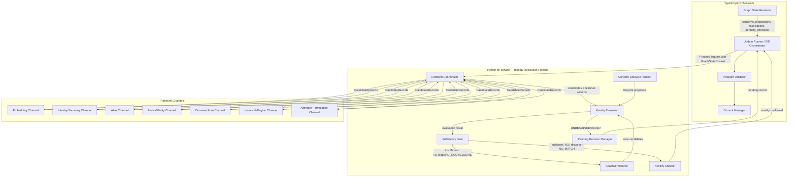
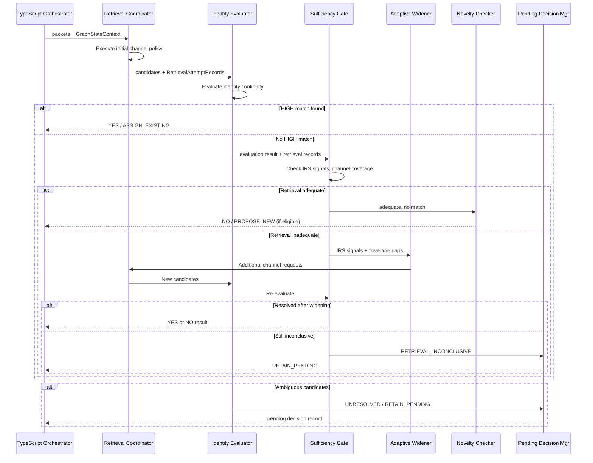

# Design Document: SIE Identity Resolution

## Overview

This design specifies the internal architecture of the identity-resolution subsystem within the Semantic Intelligence Engine (SIE). Identity resolution receives concern-cohesive `SemanticPacket` records that have passed cohesion validation, and determines whether each packet most directly advances an existing `PersistentConcern` or represents a genuinely novel concern.

The subsystem is implemented as a multi-stage pipeline within the Python `ml-service`, invoked by the TypeScript orchestrator through the existing `/sie/process-messages` contract. It extends the existing `IdentityResolver` protocol and `IdentityResolutionResult` model without breaking backward compatibility.

### Design Principles

1. **Retrieval proposes, evaluation decides.** Retrieval channels produce candidates; semantic evaluation makes the ownership decision. No retrieval score, rank, or channel count constitutes proof of ownership.
2. **Adequacy before novelty.** A `NO_MATCH` requires positively adequate retrieval. Retrieval absence is not semantic absence.
3. **Uncertainty is a valid state.** The system defers rather than forces a decision when evidence is insufficient.
4. **Operational failure ≠ semantic novelty.** Errors, timeouts, and budget exhaustion produce explicit failure outcomes, never silent novelty declarations.
5. **Behavioral confidence.** Confidence bands directly control pipeline behavior — they are not passive metadata.

### Key Design Decisions

| Decision | Rationale |
|----------|-----------|
| Multi-channel retrieval with sufficiency gate | Prevents single-channel blind spots from causing false novelty |
| Signal-directed adaptive widening | Targets specific retrieval gaps rather than uniform expansion |
| Pending decisions as first-class durable records | Allows safe deferral with eventual resolution |
| Typed IRS signals rather than numeric scores | Grounds retrieval-incompleteness evidence in specific linguistic/contextual indicators |
| Separation of retrieval, evaluation, sufficiency, widening | Each stage has clear inputs/outputs and can be independently versioned and tested |
| Budget parameters deferred to product decision | Retrieval budgets, attempt limits, and latency caps are consequential operational decisions, not engineering defaults |

## Architecture



### Pipeline Stage Sequence



### Execution Boundary (Unchanged from Data Model)

| Responsibility | Runtime | Rationale |
|---|---|---|
| All semantic identity decisions, retrieval evaluation, sufficiency judgment, novelty determination | Python ml-service | Authoritative semantic core |
| Graph state retrieval, version/invariant validation, orchestration, atomic commit | TypeScript | Preserves `v2_commit_update` RPC pattern |
| Candidate embedding retrieval (vector search) | Supabase pgvector via Python | Python controls query formulation and interpretation |

## Components and Interfaces

### 1. Retrieval Coordinator

Orchestrates retrieval across multiple channels according to a versioned retrieval policy. Does not make ownership decisions.

```python
class RetrievalChannel(Protocol):
    """A single retrieval channel producing identity candidates."""

    channel_id: str

    async def retrieve(
        self,
        packet: SemanticPacket,
        context: GraphStateContext,
        policy: RetrievalPolicy,
    ) -> RetrievalAttemptRecord: ...


class RetrievalCoordinator:
    """Orchestrates multi-channel retrieval for identity resolution."""

    def __init__(
        self,
        channels: dict[str, RetrievalChannel],
        policy: RetrievalPolicy,
    ) -> None: ...

    async def retrieve_candidates(
        self,
        packet: SemanticPacket,
        context: GraphStateContext,
        prior_attempts: list[RetrievalAttemptRecord] | None = None,
        widening_signals: list[IRSSignal] | None = None,
    ) -> RetrievalResult:
        """Execute retrieval channels per policy.

        Args:
            packet: The cohesive packet to find candidates for.
            context: Current graph state with concerns, aliases, pending decisions.
            prior_attempts: Previous retrieval attempts (for widening).
            widening_signals: IRS signals directing which channels to activate.

        Returns:
            RetrievalResult containing all candidates and attempt records.
        """
        ...
```

### 2. Identity Evaluator

Performs semantic evaluation of candidates against the packet using identity-continuity rules. This is the core decision-making component.

```python
class IdentityEvaluator:
    """Evaluates identity continuity between a packet and candidate concerns."""

    version: str

    async def evaluate(
        self,
        packet: SemanticPacket,
        candidates: list[CandidateRecord],
        context: GraphStateContext,
        retrieval_result: RetrievalResult,
    ) -> EvaluationResult:
        """Evaluate identity match between packet and candidates.

        Priority order:
        1. Exact concern continuity
        2. Historical trajectory
        3. Return-path continuity
        4. Semantic scope compatibility
        5. Retrieval similarity (diagnostic only)

        Returns:
            EvaluationResult with confidence bands and reasoning.
        """
        ...
```

### 3. Sufficiency Gate

Determines whether retrieval was adequate enough to support a `NO_MATCH` conclusion. Detects IRS signals indicating retrieval may be incomplete.

```python
class SufficiencyGate:
    """Evaluates retrieval adequacy before permitting NO_MATCH."""

    async def evaluate(
        self,
        packet: SemanticPacket,
        evaluation_result: EvaluationResult,
        retrieval_result: RetrievalResult,
        context: GraphStateContext,
    ) -> SufficiencyResult:
        """Determine whether retrieval was adequate.

        Checks:
        - Channel-family coverage per policy
        - IRS signal detection and resolution
        - Result diversity and history coverage
        - Query-result semantic alignment

        Returns:
            SufficiencyResult with outcome (ADEQUATE or INCONCLUSIVE),
            detected IRS signals, and coverage analysis.
        """
        ...
```

### 4. Adaptive Widener

Selects additional retrieval channels based on detected IRS signals and unresolved coverage gaps. Operates within a versioned budget.

```python
class AdaptiveWidener:
    """Signal-directed retrieval expansion when initial retrieval is inconclusive."""

    async def widen(
        self,
        packet: SemanticPacket,
        sufficiency_result: SufficiencyResult,
        prior_retrieval: RetrievalResult,
        context: GraphStateContext,
        budget: WideningBudget,
    ) -> WideningResult:
        """Execute additional retrieval channels directed by IRS signals.

        Signal-to-channel mapping:
        - IRS-5 (ALIAS_OR_VOCABULARY_DRIFT) → alias-normalized, alternate-formulation
        - IRS-2 (HISTORICAL_REFERENT) → historical-region, identity-summary
        - IRS-3 (IMPLIED_PRIOR_STATE) → historical-region, dormant-scan
        - IRS-1 (REVISIT_LANGUAGE) → alternate-formulation, embedding (wider)
        - IRS-4 (BROAD_CANDIDATE_MISMATCH) → identity-summary, lexical
        - IRS-6 (CONTINUATION_HISTORY_MISMATCH) → historical-region

        Returns:
            WideningResult with new candidates and updated attempt records.
        """
        ...
```

### 5. Concern Lifecycle Handler

Handles concern status transitions (dormant reactivation, merge redirect following, retired reopening) as atomic dependency groups.

```python
class ConcernLifecycleHandler:
    """Manages concern lifecycle transitions during identity resolution."""

    def build_reactivation_group(
        self,
        packet: SemanticPacket,
        concern: ConcernSummary,
        association_proposal: PropositionAssociation,
    ) -> SemanticDependencyGroupRef:
        """Build atomic dependency group for dormant/retired reactivation.

        Group contains:
        - Ownership association creation
        - Status transition (DORMANT/RETIRED → ACTIVE)
        - last_active_at update
        - Audit entry

        All mutations succeed or all roll back.
        """
        ...

    def follow_merge_redirect(
        self,
        merged_concern: ConcernSummary,
        context: GraphStateContext,
    ) -> ConcernSummary | None:
        """Follow merge redirect to surviving concern.

        Returns:
            The surviving concern, or None if redirect is missing/cyclic/invalid.
        """
        ...
```

### 6. Pending Decision Manager

Creates, persists, and manages re-evaluation of pending identity decisions.

```python
class PendingDecisionManager:
    """Manages pending identity decision lifecycle."""

    def create_pending_decision(
        self,
        packet: SemanticPacket,
        evaluation_result: EvaluationResult,
        retrieval_result: RetrievalResult,
        sufficiency_result: SufficiencyResult | None,
        request_id: str,
    ) -> PendingSemanticDecision:
        """Create a durable pending decision record.

        Uses deterministic creation key from packet + request identity.
        """
        ...

    def identify_resolvable(
        self,
        pending_decisions: list[PendingDecisionSummary],
        context: GraphStateContext,
        trigger: ResolutionTrigger,
    ) -> list[PendingDecisionSummary]:
        """Identify which pending decisions may now be resolvable.

        Triggers: new packets, new aliases, graph repairs, concern merges,
        retrieval improvements, policy version changes.
        """
        ...
```

### 7. Integrated Identity Resolver (Top-Level Orchestrator)

Composes the above components into the full pipeline, implementing the existing `IdentityResolver` protocol.

```python
class IdentityResolutionPipeline:
    """Full identity resolution pipeline implementing the IdentityResolver protocol.

    Composes: RetrievalCoordinator → IdentityEvaluator → SufficiencyGate →
              AdaptiveWidener → NoveltyChecker → PendingDecisionManager
    """

    version: str

    def __init__(
        self,
        retrieval_coordinator: RetrievalCoordinator,
        evaluator: IdentityEvaluator,
        sufficiency_gate: SufficiencyGate,
        widener: AdaptiveWidener,
        lifecycle_handler: ConcernLifecycleHandler,
        pending_manager: PendingDecisionManager,
        policy: IdentityResolutionPolicy,
    ) -> None: ...

    async def resolve(
        self,
        packets: list[SemanticPacket],
        context: GraphStateContext,
    ) -> list[IdentityResolutionResult]:
        """Resolve identity for each cohesive packet.

        For each packet:
        1. Retrieve candidates via RetrievalCoordinator
        2. Evaluate identity continuity via IdentityEvaluator
        3. If HIGH match: return YES/ASSIGN_EXISTING
        4. If no HIGH match: run SufficiencyGate
        5. If retrieval adequate + no match + eligible: PROPOSE_NEW
        6. If retrieval inadequate: run AdaptiveWidener, re-evaluate
        7. If still unresolved: create PendingSemanticDecision

        Also processes pending decisions from context that may now be resolvable.
        """
        ...
```

## Data Models

### Extended Identity Resolution Result

The existing `IdentityResolutionResult` is preserved unchanged for backward compatibility. The pipeline internally produces a richer `IdentityResolutionRecord` that is serialized into the `ProcessResult` diagnostics and stored for audit purposes.

```python
class IdentityResolutionRecord(BaseModel):
    """Complete auditable record of an identity resolution decision.

    This extends the transport-level IdentityResolutionResult with full
    evidence, retrieval history, and diagnostic detail.
    """

    # Request identity
    request_id: str
    idempotency_key: str
    conversation_id: str
    graph_version_analyzed: int

    # Packet reference
    packet_id: str
    proposition_ids: list[str]

    # Decision
    outcome: PipelineOutcome
    action: ResolutionAction
    identity_confidence: BehavioralConfidenceBand
    sufficiency_confidence: BehavioralConfidenceBand | None

    # Match or proposal (mutually exclusive per discriminated-result invariant)
    matched_concern_id: str | None = None
    new_concern_proposal: ConcernProposal | None = None

    # Evidence
    candidates_considered: list[CandidateRecord]
    competing_candidates: list[str] = Field(default_factory=list)
    evidence_references: list[EvidenceReference] = Field(default_factory=list)

    # Retrieval
    irs_signals: list[IRSSignal] = Field(default_factory=list)
    retrieval_attempts: list[RetrievalAttemptRecord] = Field(default_factory=list)
    sufficiency_record: SufficiencyRecord | None = None

    # Diagnostics
    reasoning: str
    policy_version: str
    model_version: str
    retrieval_policy_version: str

    # Proposed mutations
    proposed_dependency_group: SemanticDependencyGroupRef | None = None
```

### Resolution Action Enum

```python
class ResolutionAction(str, Enum):
    """Action resulting from identity resolution."""

    ASSIGN_EXISTING = "ASSIGN_EXISTING"
    PROPOSE_NEW = "PROPOSE_NEW"
    RETAIN_PENDING = "RETAIN_PENDING"
    NONE = "NONE"
```

### IRS Signal Model

```python
class IRSSignalType(str, Enum):
    """Typed indicators that retrieval may be incomplete."""

    REVISIT_LANGUAGE = "IRS-1"            # Packet uses revisit/return language
    HISTORICAL_REFERENT = "IRS-2"         # References something discussed before
    IMPLIED_PRIOR_STATE = "IRS-3"         # Implies evolution from prior state
    BROAD_CANDIDATE_MISMATCH = "IRS-4"    # Retrieved candidates are too broad/narrow
    ALIAS_OR_VOCABULARY_DRIFT = "IRS-5"   # Different words for same concept
    CONTINUATION_HISTORY_MISMATCH = "IRS-6"  # Continuation origin doesn't match candidates


class IRSSignal(BaseModel):
    """A grounded indicator that retrieval may be incomplete."""

    signal_type: IRSSignalType
    confidence: BehavioralConfidenceBand
    source_evidence: list[str]  # References to packet content, propositions, history
    explanation: str
    resolved: bool = False
    resolved_by_channel: str | None = None
```

### Retrieval Attempt Record

```python
class RetrievalAttemptStatus(str, Enum):
    """Outcome status of a retrieval attempt."""

    SUCCESS_WITH_CANDIDATES = "SUCCESS_WITH_CANDIDATES"
    SUCCESS_EMPTY = "SUCCESS_EMPTY"
    ERROR = "ERROR"
    TIMEOUT = "TIMEOUT"
    UNAVAILABLE = "UNAVAILABLE"
    SKIPPED_WITH_REASON = "SKIPPED_WITH_REASON"


class RetrievalAttemptRecord(BaseModel):
    """Auditable record of a single retrieval channel execution."""

    attempt_id: str
    channel_id: str
    channel_family: str  # e.g., "embedding", "identity-summary", "alias"
    query_reference: str  # Opaque reference to query formulation (not raw content)
    scope: str  # Description of temporal/status/index scope used
    status: RetrievalAttemptStatus
    candidates_returned: list[str] = Field(default_factory=list)  # concern_ids
    candidate_count: int = 0
    latency_ms: int | None = None
    failure_reason: str | None = None
    retrieval_policy_version: str
    triggered_by: str | None = None  # "initial" or IRS signal type
```

### Candidate Record

```python
class CandidateRecord(BaseModel):
    """Full evaluation record for a single identity candidate."""

    concern_id: str
    resolved_merge_target: str | None = None  # If concern is MERGED, the target
    lifecycle_status: ConcernStatus
    contributing_channels: list[str]  # Channel IDs that surfaced this candidate
    identity_evidence: list[EvidenceReference] = Field(default_factory=list)
    contrary_evidence: list[EvidenceReference] = Field(default_factory=list)
    confidence: BehavioralConfidenceBand
    explanation: str


class EvidenceReference(BaseModel):
    """A grounded reference to evidence supporting or opposing identity."""

    evidence_type: str  # "proposition", "association", "alias", "history", "packet_content"
    entity_id: str
    relevance: str  # Brief description of why this is evidence
```

### Sufficiency Record

```python
class SufficiencyRecord(BaseModel):
    """Auditable record of retrieval-sufficiency evaluation."""

    policy_version: str
    channels_required: list[str]
    channels_attempted: list[str]
    attempt_statuses: dict[str, RetrievalAttemptStatus]
    irs_signals_detected: list[IRSSignal]
    irs_signals_resolved: list[IRSSignal]
    coverage_gaps: list[str]
    sufficiency_confidence: BehavioralConfidenceBand
    outcome: str  # "ADEQUATE" or "INCONCLUSIVE"
    reasoning: str
```

### Retrieval Policy and Widening Budget

```python
class RetrievalPolicy(BaseModel):
    """Versioned policy governing retrieval channel requirements.

    NOTE: Specific numeric values for attempt limits, latency caps,
    and cost budgets are product decisions requiring approval.
    They are referenced here as typed fields, not hardcoded defaults.
    """

    policy_version: str
    initial_channels: list[str]  # Channel families to run on first pass
    channel_family_requirements: dict[str, ChannelFamilyRequirement]
    irs_signal_channel_mapping: dict[str, list[str]]  # IRS type → channels to activate


class ChannelFamilyRequirement(BaseModel):
    """Requirements for a retrieval channel family."""

    required_for_adequacy: bool
    min_successful_attempts: int  # Product decision
    failure_blocks_no_match: bool


class WideningBudget(BaseModel):
    """Versioned budget for adaptive widening.

    NOTE: All numeric limits are product decisions requiring approval.
    """

    budget_version: str
    max_widening_rounds: int         # Product decision
    max_total_attempts: int          # Product decision
    max_latency_ms: int              # Product decision
    max_cost_units: float            # Product decision (abstract cost model)


class IdentityResolutionPolicy(BaseModel):
    """Top-level policy composing retrieval and evaluation configuration."""

    policy_version: str
    retrieval_policy: RetrievalPolicy
    widening_budget: WideningBudget
    pending_re_evaluation_policy: ReEvaluationPolicy


class ReEvaluationPolicy(BaseModel):
    """Policy governing when pending decisions are re-evaluated."""

    policy_version: str
    triggers: list[str]  # e.g., "new_packet", "new_alias", "graph_repair", "concern_merge"
    max_re_evaluation_attempts: int  # Product decision
    cooldown_between_attempts_ms: int  # Product decision
```

### Resolution Trigger

```python
class ResolutionTrigger(str, Enum):
    """Events that may trigger re-evaluation of pending decisions."""

    NEW_PACKET = "NEW_PACKET"
    NEW_ALIAS = "NEW_ALIAS"
    GRAPH_REPAIR = "GRAPH_REPAIR"
    CONCERN_MERGE = "CONCERN_MERGE"
    RETRIEVAL_IMPROVEMENT = "RETRIEVAL_IMPROVEMENT"
    POLICY_VERSION_CHANGE = "POLICY_VERSION_CHANGE"
    MANUAL_TRIGGER = "MANUAL_TRIGGER"
```

### Retrieval Channel Architecture

The retrieval coordinator manages seven channel families, each addressing distinct retrieval blind spots:

| Channel Family | Indexed Field / Mechanism | Addresses IRS Signals | Recovery Capability |
|---|---|---|---|
| **Embedding** | pgvector cosine similarity on packet meaning | IRS-1 (wider radius) | Semantically similar concerns |
| **Identity-Summary** | Text search on `identity_summary` field | IRS-4, IRS-2 | Concerns with matching internal identity description |
| **Alias** | Exact/fuzzy match on `sie_concern_aliases` | IRS-5 | Vocabulary drift, renamed concerns |
| **Lexical/Entity** | Full-text search on propositions, entities | IRS-4, IRS-5 | Named entities, specific terminology |
| **Dormant-Scan** | Status-filtered retrieval (`DORMANT` concerns) | IRS-3 | Inactive concerns eligible for reactivation |
| **Historical-Region** | Sequence-range scoped retrieval | IRS-2, IRS-3, IRS-6 | Temporally distant concerns |
| **Alternate-Formulation** | Rephrased query embeddings | IRS-1, IRS-5 | Vocabulary drift, paraphrase gaps |

### Integration with TypeScript Orchestrator

The identity resolution pipeline integrates with the existing TypeScript orchestrator via the established `ProcessRequest`/`ProcessResult` contract. No new HTTP endpoints are required.

```typescript
// Conceptual integration in SIE orchestrator (TypeScript)

async function orchestrateIdentityResolution(
  conversationId: string,
  processResult: ProcessResult
): Promise<CommitResult> {
  // 1. Validate response schema and version match
  validateProcessResultContract(processResult);

  // 2. Validate graph invariants on proposed mutations
  const invariantResult = validateInvariants(processResult);
  if (!invariantResult.valid) {
    return { success: false, violations: invariantResult.violations, ... };
  }

  // 3. For each dependency group, validate atomicity requirements
  for (const group of processResult.dependency_groups) {
    validateDependencyGroup(group, processResult);
  }

  // 4. Commit via existing atomic RPC
  return commitSIEResult(conversationId, processResult, currentState, currentVersion);
}
```

### Pending Decision Persistence

Pending decisions use the existing `PendingSemanticDecision` model from the data-model layer and are persisted in the `sie_pending_decisions` table. They are reloaded into `GraphStateContext.pending_decisions` on every subsequent pipeline invocation.

```sql
-- Extends existing schema from sie-data-model
CREATE TABLE sie_pending_decisions (
    decision_id TEXT PRIMARY KEY,
    decision_creation_key TEXT NOT NULL,
    conversation_id UUID NOT NULL REFERENCES conversations(id),
    stage TEXT NOT NULL DEFAULT 'identity_resolution',
    entity_creation_key TEXT NOT NULL,
    packet_id TEXT NOT NULL REFERENCES sie_semantic_packets(packet_id),
    proposition_ids TEXT[] NOT NULL,
    graph_version_analyzed INTEGER NOT NULL,
    outcome TEXT NOT NULL CHECK (outcome IN (
        'UNRESOLVED', 'DEFER', 'RETRIEVAL_INCONCLUSIVE', 'REQUIRES_VALIDATION'
    )),
    lifecycle_state TEXT NOT NULL DEFAULT 'pending'
        CHECK (lifecycle_state IN ('pending', 'unresolved', 'deferred', 'resolved')),
    candidates_considered JSONB DEFAULT '[]',
    irs_signals JSONB DEFAULT '[]',
    retrieval_attempts JSONB DEFAULT '[]',
    confidence JSONB NOT NULL,  -- {identity: band, sufficiency: band}
    rationale TEXT,
    originating_request_id TEXT NOT NULL,
    dependency_refs TEXT[] DEFAULT '{}',
    resolution_metadata JSONB,
    re_evaluation_count INTEGER NOT NULL DEFAULT 0,
    created_at TIMESTAMPTZ NOT NULL DEFAULT NOW(),
    resolved_at TIMESTAMPTZ,
    UNIQUE(conversation_id, decision_creation_key)
);

CREATE INDEX idx_pending_conversation_state
    ON sie_pending_decisions(conversation_id, lifecycle_state)
    WHERE lifecycle_state != 'resolved';

CREATE INDEX idx_pending_packet
    ON sie_pending_decisions(packet_id);
```

### Identity Resolution Audit Records

```sql
CREATE TABLE sie_identity_resolution_records (
    record_id TEXT PRIMARY KEY,
    request_id TEXT NOT NULL,
    conversation_id UUID NOT NULL REFERENCES conversations(id),
    packet_id TEXT NOT NULL REFERENCES sie_semantic_packets(packet_id),
    graph_version_analyzed INTEGER NOT NULL,
    outcome TEXT NOT NULL,
    action TEXT NOT NULL CHECK (action IN ('ASSIGN_EXISTING', 'PROPOSE_NEW', 'RETAIN_PENDING', 'NONE')),
    identity_confidence TEXT NOT NULL CHECK (identity_confidence IN ('HIGH', 'MEDIUM', 'LOW')),
    sufficiency_confidence TEXT CHECK (sufficiency_confidence IN ('HIGH', 'MEDIUM', 'LOW')),
    matched_concern_id TEXT REFERENCES sie_persistent_concerns(concern_id),
    candidates_considered JSONB NOT NULL DEFAULT '[]',
    irs_signals JSONB NOT NULL DEFAULT '[]',
    retrieval_attempts JSONB NOT NULL DEFAULT '[]',
    sufficiency_record JSONB,
    reasoning TEXT NOT NULL,
    policy_version TEXT NOT NULL,
    model_version TEXT NOT NULL,
    retrieval_policy_version TEXT NOT NULL,
    proposed_mutations JSONB,
    created_at TIMESTAMPTZ NOT NULL DEFAULT NOW(),
    UNIQUE(request_id, packet_id)
);

CREATE INDEX idx_ir_records_conversation
    ON sie_identity_resolution_records(conversation_id);
CREATE INDEX idx_ir_records_concern
    ON sie_identity_resolution_records(matched_concern_id)
    WHERE matched_concern_id IS NOT NULL;
```

## Correctness Properties

*A property is a characteristic or behavior that should hold true across all valid executions of a system — essentially, a formal statement about what the system should do. Properties serve as the bridge between human-readable specifications and machine-verifiable correctness guarantees.*

### Property 1: Discriminated-Result Invariant

*For any* `IdentityResolutionResult`, exactly one of the following must hold: (a) outcome=YES with exactly one of matched_concern_id or new_concern_proposal set, (b) outcome=NO with action=PROPOSE_NEW and new_concern_proposal set and matched_concern_id=None, or (c) outcome in {UNRESOLVED, DEFER, RETRIEVAL_INCONCLUSIVE, REQUIRES_VALIDATION} with both matched_concern_id=None and new_concern_proposal=None and action in {RETAIN_PENDING, NONE}.

**Validates: Requirements 2.12, 6.6, 10.2, 10.4**

### Property 2: Cohesion Precondition Enforcement

*For any* `SemanticPacket` with `cohesion_status` not equal to `COHESIVE`, the identity resolution pipeline SHALL NOT produce an outcome of YES/ASSIGN_EXISTING or NO/PROPOSE_NEW; it must reject the packet or return an error.

**Validates: Requirements 1.4**

### Property 3: Input Provenance Preservation

*For any* packet and its constituent propositions entering identity resolution, all stable IDs (proposition_id, packet_id, packet_creation_key), retention roles (primary and secondary), membership records, split lineage, source_message_ids, speaker_role, and continuation_origin in the output must exactly match the corresponding input values — identity resolution does not fabricate, drop, or mutate upstream provenance.

**Validates: Requirements 1.6, 1.7**

### Property 4: Unique HIGH-Match Assignment

*For any* identity evaluation producing exactly one candidate with confidence=HIGH and zero other candidates with confidence=HIGH, the result outcome must be YES with action=ASSIGN_EXISTING and matched_concern_id set to that candidate's concern_id.

**Validates: Requirements 2.10, 3.5**

### Property 5: Ambiguity Safety

*For any* identity evaluation producing two or more candidates with confidence=HIGH, the result outcome must be UNRESOLVED or REQUIRES_VALIDATION with action=RETAIN_PENDING — never YES.

**Validates: Requirements 2.11**

### Property 6: Sufficiency-Before-Novelty

*For any* `IdentityResolutionResult` with outcome=NO (indicating no existing match), the associated `SufficiencyRecord` must be present with outcome=ADEQUATE. Conversely, if sufficiency outcome is INCONCLUSIVE, the pipeline outcome must not be NO or PROPOSE_NEW.

**Validates: Requirements 3.6, 4.1, 4.2, 4.3, 4.4**

### Property 7: IRS Signal Blocks Adequacy

*For any* `SufficiencyRecord` containing one or more `IRSSignal` entries with confidence in {HIGH, MEDIUM} and resolved=false, the sufficiency outcome must be INCONCLUSIVE — never ADEQUATE.

**Validates: Requirements 4.7**

### Property 8: Failed Retrieval Not Counted as Success

*For any* `RetrievalAttemptRecord` with status in {ERROR, TIMEOUT, UNAVAILABLE, SKIPPED_WITH_REASON}, the sufficiency gate must not count that attempt toward successful channel-family coverage. Such attempts must not satisfy the `min_successful_attempts` requirement for any channel family.

**Validates: Requirements 4.10**

### Property 9: Budget Exhaustion Safety

*For any* pipeline execution where the adaptive widening budget is exhausted (max attempts, latency, or cost exceeded) before retrieval adequacy is established, the final outcome must be RETRIEVAL_INCONCLUSIVE or DEFER — never NO/PROPOSE_NEW.

**Validates: Requirements 5.5, 5.6, 5.12**

### Property 10: Novelty Preconditions

*For any* `IdentityResolutionResult` with action=PROPOSE_NEW, all of the following must hold: (a) outcome=NO, (b) sufficiency outcome=ADEQUATE, (c) no plausible candidate remains (all candidates have confidence=LOW or no candidates), and (d) the packet carries INDEPENDENT_CONCERN_CANDIDATE in its retention roles. Conversely, for any packet lacking INDEPENDENT_CONCERN_CANDIDATE, action must never be PROPOSE_NEW.

**Validates: Requirements 6.2, 6.3**

### Property 11: Non-Independent Unmatched Evidence Retention

*For any* packet that carries a durable retention role (SUPPORTING_EVIDENCE, DURABLE_PROPOSITION, EMERGENCE_EVIDENCE) but NOT INDEPENDENT_CONCERN_CANDIDATE, and for which no existing concern match is found, the outcome must be UNRESOLVED or DEFER with action=RETAIN_PENDING — the packet must not be discarded and must not generate a new concern.

**Validates: Requirements 6.4, 1.8**

### Property 12: Merge Redirect Enforcement

*For any* `IdentityResolutionResult` with outcome=YES, the matched_concern_id must not reference a concern with status=MERGED. Additionally, for any candidate with status=MERGED whose merge redirect is missing, cyclic, or invalid, the result must be REQUIRES_VALIDATION.

**Validates: Requirements 7.6, 7.7**

### Property 13: Reactivation Atomicity

*For any* `IdentityResolutionResult` matching a DORMANT or RETIRED concern, the proposed_dependency_group must be non-null and must contain: (a) an ownership association mutation, (b) a status transition mutation (DORMANT/RETIRED → ACTIVE), (c) a last_active_at update, and (d) an audit entry. The group's failure_policy must be ALL_OR_NONE. No existing propositions, associations, or aliases may be deleted by the group.

**Validates: Requirements 7.3, 7.5**

### Property 14: Pending Decision Integrity

*For any* result with outcome in {UNRESOLVED, DEFER, RETRIEVAL_INCONCLUSIVE, REQUIRES_VALIDATION} and action=RETAIN_PENDING, a valid `PendingSemanticDecision` must be producible containing: decision_id, decision_creation_key, packet_id, proposition_ids, graph_version_analyzed, outcome, lifecycle_state, originating_request_id, and created_at. When a pending decision transitions to lifecycle_state=resolved, all original creation fields must remain unchanged, resolved_at must be set, and the original rationale/evidence must be preserved.

**Validates: Requirements 8.1, 8.2, 8.6**

### Property 15: Idempotent Replay

*For any* two identity resolution requests with the same idempotency_key and payload_fingerprint, the returned result must be identical (same outcome, same matched_concern_id or proposal, same entity IDs). For any request reusing an idempotency_key with a different payload_fingerprint, validation must fail. For any creation_key, resolving it through the entity registry must always produce the same entity_id.

**Validates: Requirements 9.3, 9.4, 9.5, 6.5, 8.8**

### Property 16: Record Structural Completeness

*For any* `IdentityResolutionRecord`, all of the following fields must be non-null and non-empty: request_id, packet_id, graph_version_analyzed, outcome, action, identity_confidence, reasoning, policy_version, model_version, retrieval_policy_version. For any `CandidateRecord` within candidates_considered: concern_id, lifecycle_status, contributing_channels (non-empty), confidence, and explanation must be populated. For any `RetrievalAttemptRecord`: channel_id, channel_family, status, and retrieval_policy_version must be populated. For any `SufficiencyRecord`: policy_version, channels_required, outcome, and reasoning must be populated.

**Validates: Requirements 10.1, 3.11, 4.11, 5.7, 10.5**

### Property 17: Temporal Distance Does Not Weaken Valid Identity

*For any* identity match that would be confidence=HIGH with recent temporal proximity, increasing temporal distance between the packet and the concern's last_active_at SHALL NOT by itself reduce the confidence band below HIGH. Temporal distance is not independent counter-evidence against identity continuity.

**Validates: Requirements 2.6, 7.2**

### Property 18: Assistant Content Cannot Establish User Concern

*For any* proposition with speaker_role=ASSISTANT, it SHALL NOT receive an association with role=PRIMARY_OWNER to a user-state concern unless explicit user-grounded confirmation evidence exists in the provenance chain. Assistant-authored material informs interpretation and retrieval but does not independently create durable user concerns or user beliefs.

**Validates: Requirements 1.8**

### Property 19: Priority Ordering (Exact Continuity Outranks Similarity)

*For any* candidate set where one candidate has exact concern continuity (the packet directly continues the same independently returnable concern) and another candidate has higher embedding similarity or broader topical overlap, the exact-continuity candidate SHALL be selected over the higher-similarity candidate. A narrower exact concern SHALL NOT be replaced by a broader related concern merely because the broader concern has greater retrieval similarity.

**Validates: Requirements 2.3, 2.5**

### Property 20: Retrieval Scores Are Candidate-Generation Only

*For any* identity resolution, retrieval scores, ranks, and channel counts SHALL appear in candidate records as diagnostics only. The outcome and action fields SHALL be determined by identity evidence (continuity, trajectory, return-path) rather than retrieval rank or similarity score. No path exists from retrieval score alone to outcome=YES.

**Validates: Requirements 2.9**

### Identity Resolution Algorithm

```python
# ml-service/app/sie/identity/resolver.py (continued)

class IdentityResolverImpl:
    """Authoritative identity resolution implementation.
    
    Priority order for identity evaluation:
    1. Exact concern continuity (same independently returnable concern)
    2. Historical trajectory (packet continues the concern's documented arc)
    3. Return-path continuity (user would return here to continue this concern)
    4. Semantic scope compatibility (concern scope contains packet scope)
    5. Retrieval similarity (embedding/lexical closeness — candidate generation only)
    """

    def __init__(
        self,
        retrieval_policy: RetrievalPolicy,
        confidence_rubric: ConfidenceRubric,
        widening_budget: WideningBudget,
    ):
        self.retrieval_policy = retrieval_policy
        self.confidence_rubric = confidence_rubric
        self.widening_budget = widening_budget
        self.version = "0.1.0"

    async def resolve(
        self,
        packets: list[SemanticPacket],
        context: GraphStateContext,
    ) -> list[IdentityResolutionResult]:
        """Resolve identity for each cohesive packet."""
        results: list[IdentityResolutionResult] = []
        
        for packet in packets:
            assert packet.cohesion_status == "COHESIVE"
            record = await self._resolve_single(packet, context)
            results.append(self._to_result(record))
        
        return results

    async def _resolve_single(
        self,
        packet: SemanticPacket,
        context: GraphStateContext,
    ) -> IdentityResolutionRecord:
        """Core resolution for one packet."""
        
        # Stage 1: Initial multi-channel retrieval
        initial_attempts = await self._initial_retrieval(packet, context)
        candidates = self._extract_candidates(initial_attempts, context)
        
        # Stage 2: Confidence band evaluation
        evaluated = self._evaluate_candidates(packet, candidates, context)
        
        # Check for unique HIGH match
        high_matches = [c for c in evaluated if c.confidence_band == "HIGH"]
        
        if len(high_matches) == 1 and not self._has_competing(high_matches[0], evaluated):
            return self._build_assign_record(packet, high_matches[0], initial_attempts, context)
        
        if len(high_matches) > 1:
            return self._build_unresolved_record(
                packet, evaluated, initial_attempts, context,
                reason="Multiple competing HIGH candidates"
            )
        
        # Stage 3: Retrieval Sufficiency Gate
        irs_signals = self._detect_irs_signals(packet, evaluated, initial_attempts, context)
        sufficiency = self._evaluate_sufficiency(initial_attempts, irs_signals)
        
        if sufficiency.is_adequate and not self._has_plausible_candidate(evaluated):
            # Adequate retrieval, no match — check novelty eligibility
            return self._attempt_novelty(packet, evaluated, initial_attempts, sufficiency, context)
        
        if not sufficiency.is_adequate:
            # Stage 4: Adaptive Widening
            widened = await self._adaptive_widen(packet, irs_signals, initial_attempts, context)
            # Re-evaluate with expanded candidate set
            all_attempts = initial_attempts + widened.attempts
            all_candidates = self._extract_candidates(all_attempts, context)
            re_evaluated = self._evaluate_candidates(packet, all_candidates, context)
            
            high_after_widen = [c for c in re_evaluated if c.confidence_band == "HIGH"]
            if len(high_after_widen) == 1 and not self._has_competing(high_after_widen[0], re_evaluated):
                return self._build_assign_record(packet, high_after_widen[0], all_attempts, context)
            
            # Re-check sufficiency after widening
            post_sufficiency = self._evaluate_sufficiency(all_attempts, irs_signals)
            if post_sufficiency.is_adequate and not self._has_plausible_candidate(re_evaluated):
                return self._attempt_novelty(packet, re_evaluated, all_attempts, post_sufficiency, context)
            
            # Still inconclusive
            return self._build_pending_record(
                packet, re_evaluated, all_attempts, context,
                outcome=PipelineOutcome.RETRIEVAL_INCONCLUSIVE
            )
        
        # Sufficiency adequate but plausible candidate exists
        return self._build_pending_record(
            packet, evaluated, initial_attempts, context,
            outcome=PipelineOutcome.UNRESOLVED
        )
```

### Retrieval Sufficiency Gate

```python
# ml-service/app/sie/identity/sufficiency.py

from enum import Enum
from pydantic import BaseModel, Field
from typing import Optional
from ..enums import BehavioralConfidenceBand


class IRSSignalType(str, Enum):
    """Incomplete Retrieval Signal types."""
    REVISIT_LANGUAGE = "IRS-1"        # Packet uses "again", "back to", "as I mentioned"
    HISTORICAL_REFERENT = "IRS-2"     # References a prior discussion not in candidates
    IMPLIED_PRIOR_STATE = "IRS-3"     # Assumes state that only makes sense with history
    BROAD_CANDIDATE_MISMATCH = "IRS-4"  # All candidates are too broad/narrow
    ALIAS_OR_VOCAB_DRIFT = "IRS-5"    # Different vocabulary for possibly same concern
    CONTINUATION_HISTORY_MISMATCH = "IRS-6"  # continuation_origin doesn't match candidates


class RetrievalAttemptStatus(str, Enum):
    SUCCESS_WITH_CANDIDATES = "SUCCESS_WITH_CANDIDATES"
    SUCCESS_EMPTY = "SUCCESS_EMPTY"
    ERROR = "ERROR"
    TIMEOUT = "TIMEOUT"
    UNAVAILABLE = "UNAVAILABLE"
    SKIPPED_WITH_REASON = "SKIPPED_WITH_REASON"


class IRSSignal(BaseModel):
    """A detected Incomplete Retrieval Signal."""
    signal_type: IRSSignalType
    confidence: BehavioralConfidenceBand
    source_evidence: list[str]  # proposition IDs or content references
    explanation: str


class RetrievalAttemptRecord(BaseModel):
    """Record of a single retrieval attempt."""
    channel: str  # e.g. "embedding_primary", "alias_normalized", "dormant_scan"
    query_reference: str  # hash or summary of query used
    scope: str  # e.g. "active_concerns", "all_statuses", "historical_region"
    status: RetrievalAttemptStatus
    candidates_returned: int
    candidate_ids: list[str] = Field(default_factory=list)
    latency_ms: int
    failure_reason: Optional[str] = None
    policy_version: str


class SufficiencyResult(BaseModel):
    """Result of retrieval sufficiency evaluation."""
    is_adequate: bool
    policy_version: str
    channels_required: list[str]
    channels_attempted: list[str]
    channels_successful: list[str]
    coverage_gaps: list[str]
    irs_signals: list[IRSSignal]
    unresolved_signals: list[IRSSignal]
    confidence: BehavioralConfidenceBand
    outcome: str  # "ADEQUATE" or "INCONCLUSIVE"
    reasoning: str


class RetrievalSufficiencyGate:
    """Evaluates whether retrieval coverage is adequate to support NO_MATCH.
    
    Adequacy requires:
    1. All policy-required channel families were attempted successfully
    2. All HIGH/MEDIUM IRS signals have been addressed by appropriate channels
    3. No material retrieval failure that could plausibly conceal a match
    4. Result diversity indicates the query space was covered
    """

    def __init__(self, policy: RetrievalPolicy):
        self.policy = policy

    def evaluate(
        self,
        attempts: list[RetrievalAttemptRecord],
        irs_signals: list[IRSSignal],
    ) -> SufficiencyResult:
        """Determine if retrieval was adequate for a NO_MATCH conclusion."""
        
        channels_required = self.policy.required_channels_for_signals(irs_signals)
        channels_attempted = [a.channel for a in attempts]
        channels_successful = [
            a.channel for a in attempts
            if a.status in (
                RetrievalAttemptStatus.SUCCESS_WITH_CANDIDATES,
                RetrievalAttemptStatus.SUCCESS_EMPTY,
            )
        ]
        
        # Coverage gaps: required but not successfully covered
        coverage_gaps = [c for c in channels_required if c not in channels_successful]
        
        # Unresolved signals: HIGH/MEDIUM signals not addressed
        unresolved = [
            s for s in irs_signals
            if s.confidence in (BehavioralConfidenceBand.HIGH, BehavioralConfidenceBand.MEDIUM)
            and not self._signal_addressed(s, attempts)
        ]
        
        # Failed attempts that could conceal a match
        material_failures = [
            a for a in attempts
            if a.status in (
                RetrievalAttemptStatus.ERROR,
                RetrievalAttemptStatus.TIMEOUT,
                RetrievalAttemptStatus.UNAVAILABLE,
            )
        ]
        
        is_adequate = (
            len(coverage_gaps) == 0
            and len(unresolved) == 0
            and not self._has_material_failure(material_failures, irs_signals)
        )
        
        return SufficiencyResult(
            is_adequate=is_adequate,
            policy_version=self.policy.version,
            channels_required=channels_required,
            channels_attempted=channels_attempted,
            channels_successful=channels_successful,
            coverage_gaps=coverage_gaps,
            irs_signals=irs_signals,
            unresolved_signals=unresolved,
            confidence=BehavioralConfidenceBand.HIGH if is_adequate else BehavioralConfidenceBand.LOW,
            outcome="ADEQUATE" if is_adequate else "INCONCLUSIVE",
            reasoning=self._build_reasoning(coverage_gaps, unresolved, material_failures),
        )
```

### Adaptive Widening

```python
# ml-service/app/sie/identity/widening.py

from pydantic import BaseModel, Field
from typing import Optional
from ..enums import BehavioralConfidenceBand


class WideningBudget(BaseModel):
    """Versioned budget for adaptive widening attempts."""
    max_additional_attempts: int = 4
    max_total_latency_ms: int = 5000
    max_cost_units: float = 10.0
    version: str = "0.1.0"


class WideningResult(BaseModel):
    """Result of adaptive widening."""
    attempts: list[RetrievalAttemptRecord]
    budget_exhausted: bool
    total_latency_ms: int
    total_cost_units: float
    new_candidates_found: int
    signals_addressed: list[IRSSignalType]


class AdaptiveWidener:
    """Signal-directed expansion of retrieval when initial retrieval is inconclusive.
    
    Channel selection is driven by detected IRS signals:
    - IRS-1 (REVISIT_LANGUAGE) → broader embedding, continuation history
    - IRS-2 (HISTORICAL_REFERENT) → historical region search, older conversations
    - IRS-3 (IMPLIED_PRIOR_STATE) → identity-summary search, historical segments
    - IRS-4 (BROAD_CANDIDATE_MISMATCH) → narrower/broader scope queries
    - IRS-5 (ALIAS_OR_VOCAB_DRIFT) → alias-normalized, alternate formulations
    - IRS-6 (CONTINUATION_HISTORY_MISMATCH) → continuation_origin trace, packet lineage
    """

    def __init__(self, budget: WideningBudget, channels: list[RetrievalChannel]):
        self.budget = budget
        self.channels = {c.name: c for c in channels}

    async def widen(
        self,
        packet: SemanticPacket,
        signals: list[IRSSignal],
        prior_attempts: list[RetrievalAttemptRecord],
        context: GraphStateContext,
    ) -> WideningResult:
        """Execute signal-directed widening within budget."""
        
        additional_attempts: list[RetrievalAttemptRecord] = []
        total_latency = 0
        total_cost = 0.0
        signals_addressed: list[IRSSignalType] = []
        
        # Select channels based on signals
        plan = self._plan_widening(signals, prior_attempts)
        
        for channel_name, query_config in plan:
            if len(additional_attempts) >= self.budget.max_additional_attempts:
                break
            if total_latency >= self.budget.max_total_latency_ms:
                break
            if total_cost >= self.budget.max_cost_units:
                break
            
            channel = self.channels.get(channel_name)
            if not channel:
                continue
            
            attempt = await channel.retrieve(packet, query_config, context)
            additional_attempts.append(attempt)
            total_latency += attempt.latency_ms
            total_cost += channel.cost_per_query
            
            # Track which signals this addresses
            for signal in signals:
                if channel_name in self._channels_for_signal(signal.signal_type):
                    signals_addressed.append(signal.signal_type)
        
        return WideningResult(
            attempts=additional_attempts,
            budget_exhausted=(
                len(additional_attempts) >= self.budget.max_additional_attempts
                or total_latency >= self.budget.max_total_latency_ms
                or total_cost >= self.budget.max_cost_units
            ),
            total_latency_ms=total_latency,
            total_cost_units=total_cost,
            new_candidates_found=sum(a.candidates_returned for a in additional_attempts),
            signals_addressed=list(set(signals_addressed)),
        )

    def _channels_for_signal(self, signal_type: IRSSignalType) -> list[str]:
        """Map IRS signals to appropriate retrieval channels."""
        mapping = {
            IRSSignalType.REVISIT_LANGUAGE: ["embedding_broad", "continuation_history"],
            IRSSignalType.HISTORICAL_REFERENT: ["historical_region", "identity_summary"],
            IRSSignalType.IMPLIED_PRIOR_STATE: ["identity_summary", "historical_region"],
            IRSSignalType.BROAD_CANDIDATE_MISMATCH: ["embedding_narrow", "embedding_broad"],
            IRSSignalType.ALIAS_OR_VOCAB_DRIFT: ["alias_normalized", "alternate_formulation"],
            IRSSignalType.CONTINUATION_HISTORY_MISMATCH: ["continuation_trace", "packet_lineage"],
        }
        return mapping.get(signal_type, [])
```

### Confidence Band Evaluation

```python
# ml-service/app/sie/identity/confidence.py

from pydantic import BaseModel, Field
from ..enums import BehavioralConfidenceBand


class ConfidenceRubric(BaseModel):
    """Versioned rubric defining behavioral consequences of each confidence band.
    
    HIGH: Evidence sufficient to act.
      - Candidate has identity-defining continuity with the packet.
      - No materially competitive alternative remains.
      - Evidence types: exact continuation, unambiguous return-path, 
        user-explicit reference to the same concern.
    
    MEDIUM: Plausible but incomplete.
      - Match is plausible based on semantic overlap or partial trajectory.
      - Either evidence is incomplete, candidate separation is narrow,
        or retrieval coverage hasn't been fully established.
      - Does NOT authorize ownership assignment.
    
    LOW: Insufficient evidence.
      - Available evidence does not support ownership assignment.
      - Does NOT by itself prove novelty (absence of match ≠ novelty).
      - May indicate the concern is genuinely different or retrieval is incomplete.
    """
    version: str
    high_criteria: list[str]
    medium_criteria: list[str]
    low_criteria: list[str]


class ConfidenceBandEvaluator:
    """Evaluates identity-match confidence per candidate.
    
    Confidence is evaluated independently from:
    - Retrieval-sufficiency confidence (gate adequacy)
    - IRS-signal confidence (signal reliability)
    
    These are NOT numerically interchangeable.
    """

    def __init__(self, rubric: ConfidenceRubric):
        self.rubric = rubric

    def evaluate_candidate(
        self,
        packet: SemanticPacket,
        candidate: ConcernSummary,
        evidence: list[IdentityEvidence],
        context: GraphStateContext,
    ) -> BehavioralConfidenceBand:
        """Evaluate identity-match confidence for a single candidate.
        
        Evaluation priority:
        1. Exact concern continuity (same independently returnable concern)
        2. Historical trajectory alignment
        3. Return-path continuity
        4. Semantic scope compatibility
        
        Retrieval scores are NOT used as evidence — only as candidate generation.
        """
        
        supporting = [e for e in evidence if e.supports_match]
        contrary = [e for e in evidence if not e.supports_match]
        
        # HIGH requires identity-defining evidence with no material counter-evidence
        if self._has_identity_defining_evidence(supporting) and not self._has_material_contrary(contrary):
            return BehavioralConfidenceBand.HIGH
        
        # MEDIUM: plausible match but incomplete evidence or narrow separation
        if self._has_plausible_evidence(supporting):
            return BehavioralConfidenceBand.MEDIUM
        
        return BehavioralConfidenceBand.LOW
```

### Novelty Proposer

```python
# ml-service/app/sie/identity/novelty.py

from typing import Optional
from ..enums import BehavioralConfidenceBand, PipelineOutcome, RetentionLevel
from ..models import ConcernProposal, SemanticPacket
from ..contracts import GraphStateContext


class NoveltyProposer:
    """Proposes new Persistent Concerns after adequate retrieval confirms novelty.
    
    A new-concern proposal requires ALL of:
    1. outcome=NO (no existing match)
    2. Positively adequate retrieval (sufficiency gate passed)
    3. No plausible existing identity candidate remains
    4. Packet carries INDEPENDENT_CONCERN_CANDIDATE retention role
    
    Non-independent unmatched packets (SUPPORTING_EVIDENCE, DURABLE_PROPOSITION,
    EMERGENCE_EVIDENCE) are retained in pending/evidence state — NOT discarded.
    """

    def attempt_proposal(
        self,
        packet: SemanticPacket,
        sufficiency: SufficiencyResult,
        candidates: list[CandidateRecord],
        context: GraphStateContext,
    ) -> Optional[ConcernProposal]:
        """Attempt to propose a new concern from this packet.
        
        Returns None if packet doesn't qualify (non-independent retention).
        """
        
        # Check retention role eligibility
        if not self._has_independent_retention(packet, context):
            return None  # Will be retained as pending evidence
        
        # Verify adequacy
        if not sufficiency.is_adequate:
            return None
        
        # Verify no plausible candidates
        if any(c.confidence_band != BehavioralConfidenceBand.LOW for c in candidates):
            return None
        
        # Generate deterministic creation key
        creation_key = self._derive_creation_key(packet)
        proposed_id = self._resolve_id(creation_key, packet.conversation_id)
        
        return ConcernProposal(
            concern_creation_key=creation_key,
            proposed_concern_id=proposed_id,
            identity_summary=self._derive_identity_summary(packet),
            display_title=self._derive_display_title(packet),
            initial_summary=packet.user_grounded_meaning,
            proposed_parent_id=self._infer_parent(packet, context),
            parent_resolution_state="PARENT_DEFERRED",
        )

    def _has_independent_retention(
        self, packet: SemanticPacket, context: GraphStateContext
    ) -> bool:
        """Check if packet's propositions carry INDEPENDENT_CONCERN_CANDIDATE."""
        # At least one constituent proposition must have this retention role
        packet_prop_ids = self._get_packet_propositions(packet, context)
        for prop in context.propositions:
            if prop.proposition_id in packet_prop_ids:
                # Check retention levels (stored on proposition in DB)
                # This requires the full proposition, not just summary
                pass
        return True  # Actual implementation checks retention_levels array
```

### Pending Decision Manager

```python
# ml-service/app/sie/identity/pending.py

from pydantic import BaseModel, Field
from typing import Optional
from datetime import datetime
from ..enums import BehavioralConfidenceBand, PipelineOutcome


class PendingIdentityDecision(BaseModel):
    """Durable record of an unresolved identity decision.
    
    Survives process restarts, unrelated conversational episodes,
    and incremental cursor advancement. Reloaded into later context
    for re-evaluation.
    """
    decision_id: str
    decision_creation_key: str  # retry-stable
    packet_id: str
    proposition_ids: list[str]
    conversation_id: str
    graph_version_analyzed: int
    outcome: PipelineOutcome
    candidates_considered: list[str]  # concern IDs
    evidence_references: list[str]
    irs_signals: list[str]  # signal type references
    retrieval_attempt_summary: dict = Field(default_factory=dict)
    identity_confidence: BehavioralConfidenceBand
    sufficiency_confidence: BehavioralConfidenceBand
    reason: str
    created_at: str
    lifecycle_state: str = "pending"  # pending | resolved | expired
    resolved_at: Optional[str] = None
    resolution_successor_refs: list[str] = Field(default_factory=list)


class PendingDecisionManager:
    """Manages lifecycle of unresolved identity decisions.
    
    Re-evaluation triggers (versioned, auditable):
    - New packets arrive that may disambiguate
    - New aliases added to existing concerns
    - Graph repairs (merge, split, corrections)
    - Retrieval improvements (new indexes, better embeddings)
    - Explicit manual review
    
    Bounded re-evaluation: max attempts per decision tracked to prevent
    unbounded repeated work.
    """

    MAX_REATTEMPTS = 5  # Configurable via policy

    async def should_reattempt(
        self, decision: PendingIdentityDecision, context: GraphStateContext
    ) -> bool:
        """Determine if a pending decision should be re-evaluated."""
        if decision.lifecycle_state != "pending":
            return False
        
        # Check attempt count
        attempt_count = decision.retrieval_attempt_summary.get("reattempt_count", 0)
        if attempt_count >= self.MAX_REATTEMPTS:
            return False
        
        # Check if material context has changed
        return self._context_materially_changed(decision, context)

    async def resolve(
        self,
        decision: PendingIdentityDecision,
        resolution: IdentityResolutionResult,
    ) -> PendingIdentityDecision:
        """Mark a pending decision as resolved, preserving history."""
        decision.lifecycle_state = "resolved"
        decision.resolved_at = datetime.utcnow().isoformat()
        decision.resolution_successor_refs.append(resolution.matched_concern_id or "new_concern")
        return decision
```

### Concern Lifecycle Handler

```python
# ml-service/app/sie/identity/lifecycle.py

from ..enums import ConcernStatus, BehavioralConfidenceBand
from ..contracts import ConcernSummary, GraphStateContext
from ..models import SemanticPacket


class ConcernLifecycleHandler:
    """Handles identity resolution across concern lifecycle states.
    
    Rules:
    - ACTIVE and DORMANT concerns are eligible identity candidates.
    - DORMANT status does NOT reduce identity based on age/inactivity.
    - MERGED concerns redirect to their surviving canonical concern.
    - RETIRED concerns remain discoverable for identity continuity.
    - Reactivation preserves all history (propositions, evidence, aliases).
    """

    def handle_dormant_match(
        self,
        packet: SemanticPacket,
        concern: ConcernSummary,
        confidence: BehavioralConfidenceBand,
    ) -> "ReactivationProposal":
        """Propose reactivation of a dormant concern.
        
        Requires:
        - Uniquely supported HIGH match
        - Packet substantively resumes the concern (not mere historical mention)
        
        Returns atomic dependency group containing:
        - Ownership association
        - DORMANT → ACTIVE status transition
        - last_active_at update
        - Audit entry
        """
        return ReactivationProposal(
            concern_id=concern.concern_id,
            new_status=ConcernStatus.ACTIVE,
            dependency_group_id=self._generate_group_id(packet, concern),
            mutations=[
                MutationRef(type="status_transition", target=concern.concern_id,
                           before="DORMANT", after="ACTIVE"),
                MutationRef(type="ownership_association", target=packet.packet_id,
                           concern=concern.concern_id),
                MutationRef(type="last_active_update", target=concern.concern_id),
                MutationRef(type="audit_entry", target=concern.concern_id,
                           reason="Substantive resumption via identity resolution"),
            ],
        )

    def follow_merge_redirect(
        self,
        concern: ConcernSummary,
        context: GraphStateContext,
    ) -> "MergeRedirectResult":
        """Follow merge redirect to surviving concern.
        
        Validates:
        - Target exists and is not itself MERGED (no cycles)
        - Redirect chain is finite and auditable
        
        Returns REQUIRES_VALIDATION on missing/cyclic/invalid redirect.
        """
        visited = set()
        current = concern
        
        while current.status == ConcernStatus.MERGED:
            if current.concern_id in visited:
                return MergeRedirectResult(
                    valid=False, reason="Cyclic merge redirect detected"
                )
            visited.add(current.concern_id)
            
            # Look up target in context
            target = self._find_concern(current.merged_into_concern_id, context)
            if not target:
                return MergeRedirectResult(
                    valid=False, reason=f"Merge target {current.merged_into_concern_id} not found"
                )
            current = target
        
        return MergeRedirectResult(
            valid=True,
            surviving_concern=current,
            redirect_path=[c for c in visited],
        )
```

### TypeScript Orchestrator Interface

```typescript
// src/lib/intelligence-v2/sie/identity-orchestrator.ts

import type { ProcessResult } from "./generated/sie-types";  // Generated from OpenAPI

/**
 * Identity Resolution orchestration interface.
 * TypeScript responsibilities:
 * 1. Load graph state (concerns, associations, pending decisions)
 * 2. Invoke Python /sie/resolve-identity endpoint
 * 3. Validate response schema and contract versions
 * 4. Validate graph version hasn't advanced
 * 5. Validate structural invariants (no cycles, no multi-parent)
 * 6. Commit via atomic RPC
 * 
 * TypeScript does NOT:
 * - Choose a concern based on retrieval scores
 * - Reinterpret candidate rankings as ownership
 * - Override Python's semantic identity outcome
 */
export interface IdentityOrchestrationConfig {
  readonly pythonServiceUrl: string;
  readonly maxRetries: number;
  readonly contractVersion: string;
  readonly retrievalPolicyVersion: string;
}

export interface IdentityOrchestrationRequest {
  conversationId: string;
  packets: CohesivePacket[];  // Only COHESIVE packets
  graphVersion: number;
  requestId: string;
  idempotencyKey: string;
  payloadFingerprint: string;
}

export interface CohesivePacket {
  packetId: string;
  propositionIds: string[];
  userGroundedMeaning: string;
  assistantContext: string | null;
  continuationOrigin: string | null;
  messageSeqRange: [number, number];
  sourceMessageIds: string[];
}

export interface IdentityOrchestrationResult {
  success: boolean;
  requestId: string;
  resolutions: IdentityResolutionOutcome[];
  committedGraphVersion: number | null;
  retryRequired: boolean;
  violations: InvariantViolation[];
}

export interface IdentityResolutionOutcome {
  packetId: string;
  outcome: PipelineOutcome;
  action: ResolutionAction;
  matchedConcernId: string | null;
  newConcernProposalId: string | null;
  pendingDecisionId: string | null;
}

/**
 * Orchestrates identity resolution:
 * 1. Load current graph state from Supabase
 * 2. Build ProcessRequest with identity-resolution focus
 * 3. POST to Python ml-service
 * 4. Validate response
 * 5. Check graph version hasn't changed
 * 6. Validate structural invariants
 * 7. Atomic commit
 * 8. On version conflict: reload + re-invoke Python (NOT replay stale result)
 */
export async function orchestrateIdentityResolution(
  request: IdentityOrchestrationRequest,
  config: IdentityOrchestrationConfig,
): Promise<IdentityOrchestrationResult> {
  // Implementation follows the sequence diagram above
  // Key invariant: stale results are never committed against a newer graph
}
```

### Retrieval Channel Abstractions

```python
# ml-service/app/sie/identity/channels.py

from abc import ABC, abstractmethod
from typing import Optional
from pydantic import BaseModel, Field
from ..models import SemanticPacket
from ..contracts import GraphStateContext, ConcernSummary


class RetrievalQuery(BaseModel):
    """A structured retrieval query for a channel."""
    query_text: Optional[str] = None
    query_embedding: Optional[list[float]] = None
    scope_filter: dict = Field(default_factory=dict)  # status, time range, etc.
    max_results: int = 20
    min_similarity: float = 0.0


class RetrievalCandidate(BaseModel):
    """A candidate concern returned by a retrieval channel."""
    concern_id: str
    channel: str
    score: float  # Channel-specific, NOT semantic confidence
    concern_summary: ConcernSummary


class RetrievalChannel(ABC):
    """Abstract base for retrieval channels.
    
    Each channel is materially distinct: uses different indexed fields,
    query formulations, temporal/status scopes, or retrieval mechanisms
    capable of recovering different candidates.
    """

    name: str
    cost_per_query: float = 1.0

    @abstractmethod
    async def retrieve(
        self,
        packet: SemanticPacket,
        query_config: RetrievalQuery,
        context: GraphStateContext,
    ) -> RetrievalAttemptRecord:
        """Execute retrieval and return attempt record."""
        ...


class EmbeddingRetrievalChannel(RetrievalChannel):
    """Primary embedding-based retrieval using pgvector similarity."""
    name = "embedding_primary"
    cost_per_query = 1.0


class IdentitySummarySearchChannel(RetrievalChannel):
    """Search against concern identity_summary fields."""
    name = "identity_summary"
    cost_per_query = 1.0


class AliasNormalizedChannel(RetrievalChannel):
    """Lookup via normalized concern aliases."""
    name = "alias_normalized"
    cost_per_query = 0.5


class LexicalEntityChannel(RetrievalChannel):
    """Full-text search on entity names and key terms."""
    name = "lexical_entity"
    cost_per_query = 0.5


class DormantConcernScanChannel(RetrievalChannel):
    """Scan dormant concerns not in recent active retrieval."""
    name = "dormant_scan"
    cost_per_query = 2.0


class HistoricalRegionChannel(RetrievalChannel):
    """Search older conversation regions for historical referents."""
    name = "historical_region"
    cost_per_query = 2.0


class AlternateFormulationChannel(RetrievalChannel):
    """Re-query with LLM-generated alternate phrasings."""
    name = "alternate_formulation"
    cost_per_query = 3.0  # Higher cost due to LLM call
```

### Retrieval Policy Configuration

```python
# ml-service/app/sie/identity/policy.py

from pydantic import BaseModel, Field


class RetrievalPolicy(BaseModel):
    """Versioned policy governing retrieval requirements.
    
    Defines which channel families are required for each IRS signal,
    minimum coverage for NO_MATCH conclusions, and channel-family
    definitions for materially distinct retrieval.
    """
    version: str = "0.1.0"
    
    # Minimum channels for initial retrieval (before sufficiency gate)
    initial_channels: list[str] = Field(
        default=["embedding_primary", "identity_summary"]
    )
    
    # Channel families required per IRS signal
    signal_channel_requirements: dict[str, list[str]] = Field(
        default={
            "IRS-1": ["embedding_broad", "continuation_history"],
            "IRS-2": ["historical_region", "identity_summary"],
            "IRS-3": ["identity_summary", "historical_region"],
            "IRS-4": ["embedding_narrow", "embedding_broad"],
            "IRS-5": ["alias_normalized", "alternate_formulation"],
            "IRS-6": ["continuation_trace", "packet_lineage"],
        }
    )
    
    # Minimum successful channels for NO_MATCH conclusion
    min_channels_for_no_match: int = 2
    
    # Channels that individually never support NO_MATCH
    insufficient_alone: list[str] = Field(
        default=["embedding_primary"]  # One embedding channel is never enough
    )

    def required_channels_for_signals(self, signals: list["IRSSignal"]) -> list[str]:
        """Compute total required channels based on detected signals."""
        required = set(self.initial_channels)
        for signal in signals:
            if signal.confidence.value in ("HIGH", "MEDIUM"):
                channels = self.signal_channel_requirements.get(signal.signal_type.value, [])
                required.update(channels)
        return sorted(required)
```

### Persistence Schema (Identity Resolution)

```sql
-- Stores complete identity resolution records for every decision
CREATE TABLE sie_identity_resolution_audit (
    record_id TEXT PRIMARY KEY,
    request_id TEXT NOT NULL,
    packet_id TEXT NOT NULL REFERENCES sie_semantic_packets(packet_id),
    conversation_id UUID NOT NULL REFERENCES conversations(id),
    graph_version_analyzed INTEGER NOT NULL,
    outcome TEXT NOT NULL CHECK (outcome IN (
        'YES', 'NO', 'UNRESOLVED', 'DEFER', 'RETRIEVAL_INCONCLUSIVE', 'REQUIRES_VALIDATION'
    )),
    action TEXT NOT NULL CHECK (action IN (
        'ASSIGN_EXISTING', 'PROPOSE_NEW', 'RETAIN_PENDING', 'NONE'
    )),
    identity_confidence TEXT NOT NULL CHECK (identity_confidence IN ('HIGH', 'MEDIUM', 'LOW')),
    sufficiency_confidence TEXT NOT NULL CHECK (sufficiency_confidence IN ('HIGH', 'MEDIUM', 'LOW')),
    matched_concern_id TEXT REFERENCES sie_persistent_concerns(concern_id),
    new_concern_proposal JSONB,  -- ConcernProposal serialized
    candidates_considered JSONB NOT NULL DEFAULT '[]',
    competing_candidates TEXT[] DEFAULT '{}',
    evidence_references JSONB NOT NULL DEFAULT '[]',
    irs_signals JSONB NOT NULL DEFAULT '[]',
    retrieval_attempts JSONB NOT NULL DEFAULT '[]',
    reasoning TEXT NOT NULL,
    policy_versions JSONB NOT NULL DEFAULT '{}',
    proposed_mutations JSONB NOT NULL DEFAULT '[]',
    created_at TIMESTAMPTZ NOT NULL DEFAULT NOW(),
    
    -- Invariant checks
    CHECK (
        (outcome = 'YES' AND action = 'ASSIGN_EXISTING' AND matched_concern_id IS NOT NULL AND new_concern_proposal IS NULL)
        OR (outcome = 'NO' AND action = 'PROPOSE_NEW' AND matched_concern_id IS NULL AND new_concern_proposal IS NOT NULL)
        OR (outcome IN ('UNRESOLVED', 'DEFER', 'RETRIEVAL_INCONCLUSIVE', 'REQUIRES_VALIDATION')
            AND action IN ('RETAIN_PENDING', 'NONE')
            AND matched_concern_id IS NULL AND new_concern_proposal IS NULL)
    )
);

CREATE INDEX idx_resolution_audit_conversation ON sie_identity_resolution_audit(conversation_id);
CREATE INDEX idx_resolution_audit_packet ON sie_identity_resolution_audit(packet_id);
CREATE INDEX idx_resolution_audit_request ON sie_identity_resolution_audit(request_id);
CREATE INDEX idx_resolution_audit_outcome ON sie_identity_resolution_audit(outcome);
```

### Pending Identity Decisions Table

```sql
-- Durable pending decisions that survive restarts and cursor advancement
CREATE TABLE sie_pending_decisions (
    decision_id TEXT PRIMARY KEY,
    decision_creation_key TEXT NOT NULL,
    packet_id TEXT NOT NULL REFERENCES sie_semantic_packets(packet_id),
    conversation_id UUID NOT NULL REFERENCES conversations(id),
    proposition_ids TEXT[] NOT NULL,
    graph_version_analyzed INTEGER NOT NULL,
    outcome TEXT NOT NULL CHECK (outcome IN (
        'UNRESOLVED', 'DEFER', 'RETRIEVAL_INCONCLUSIVE', 'REQUIRES_VALIDATION'
    )),
    candidates_considered TEXT[] DEFAULT '{}',
    evidence_references JSONB NOT NULL DEFAULT '[]',
    irs_signals JSONB NOT NULL DEFAULT '[]',
    retrieval_attempts JSONB NOT NULL DEFAULT '[]',
    identity_confidence TEXT NOT NULL CHECK (identity_confidence IN ('HIGH', 'MEDIUM', 'LOW')),
    sufficiency_confidence TEXT NOT NULL CHECK (sufficiency_confidence IN ('HIGH', 'MEDIUM', 'LOW')),
    reason TEXT NOT NULL,
    lifecycle_state TEXT NOT NULL DEFAULT 'pending'
        CHECK (lifecycle_state IN ('pending', 'resolved', 'expired')),
    reattempt_count INTEGER NOT NULL DEFAULT 0,
    last_reattempt_at TIMESTAMPTZ,
    resolved_at TIMESTAMPTZ,
    resolution_successor_refs TEXT[] DEFAULT '{}',
    created_at TIMESTAMPTZ NOT NULL DEFAULT NOW(),
    
    UNIQUE(conversation_id, decision_creation_key)
);

CREATE INDEX idx_pending_conversation ON sie_pending_decisions(conversation_id)
    WHERE lifecycle_state = 'pending';
CREATE INDEX idx_pending_lifecycle ON sie_pending_decisions(lifecycle_state);
CREATE INDEX idx_pending_packet ON sie_pending_decisions(packet_id);
```

### Retrieval Attempt Log Table

```sql
-- Queryable log of all retrieval attempts for observability
CREATE TABLE sie_retrieval_attempts (
    attempt_id TEXT PRIMARY KEY,
    request_id TEXT NOT NULL,
    packet_id TEXT NOT NULL,
    conversation_id UUID NOT NULL REFERENCES conversations(id),
    channel TEXT NOT NULL,
    query_reference TEXT NOT NULL,
    scope TEXT NOT NULL,
    status TEXT NOT NULL CHECK (status IN (
        'SUCCESS_WITH_CANDIDATES', 'SUCCESS_EMPTY', 'ERROR', 'TIMEOUT', 'UNAVAILABLE', 'SKIPPED_WITH_REASON'
    )),
    candidates_returned INTEGER NOT NULL DEFAULT 0,
    candidate_ids TEXT[] DEFAULT '{}',
    latency_ms INTEGER NOT NULL,
    failure_reason TEXT,
    policy_version TEXT NOT NULL,
    is_widening_attempt BOOLEAN NOT NULL DEFAULT FALSE,
    created_at TIMESTAMPTZ NOT NULL DEFAULT NOW()
);

CREATE INDEX idx_retrieval_request ON sie_retrieval_attempts(request_id);
CREATE INDEX idx_retrieval_conversation ON sie_retrieval_attempts(conversation_id);
CREATE INDEX idx_retrieval_channel ON sie_retrieval_attempts(channel);
CREATE INDEX idx_retrieval_status ON sie_retrieval_attempts(status)
    WHERE status NOT IN ('SUCCESS_WITH_CANDIDATES', 'SUCCESS_EMPTY');
```

### API Contract Extension

The identity resolution subsystem extends the existing `ProcessResult` with dedicated identity resolution fields. The endpoint may be invoked separately from full pipeline processing:

```python
# ml-service/app/sie/identity/contracts.py

from pydantic import BaseModel, Field
from typing import Optional
from ..contracts import GraphStateContext, ProcessRequest
from ..models import SemanticPacket
from ..enums import PipelineOutcome, BehavioralConfidenceBand


class IdentityResolutionRequest(BaseModel):
    """Request specifically for identity resolution stage.
    
    May be invoked independently (for pending decision re-evaluation)
    or as part of the full pipeline ProcessRequest.
    """
    api_contract_version: str
    pipeline_version: str
    model_version: str
    retrieval_policy_version: str
    request_id: str
    idempotency_key: str
    payload_fingerprint: str
    conversation_id: str
    base_graph_version: int
    packets: list[SemanticPacket]  # Only COHESIVE
    current_graph_state: GraphStateContext
    # Proposition details needed for retention-level checks
    proposition_retention_levels: dict[str, list[str]]  # prop_id → retention levels


class IdentityResolutionResponse(BaseModel):
    """Response from identity resolution."""
    api_contract_version: str
    pipeline_version: str
    model_version: str
    retrieval_policy_version: str
    request_id: str
    idempotency_key: str
    conversation_id: str
    graph_version_analyzed: int
    resolutions: list["FullIdentityResolutionRecord"]
    new_concern_proposals: list["ConcernProposal"]
    proposed_associations: list["PropositionAssociation"]
    pending_decisions: list["PendingIdentityDecision"]
    dependency_groups: list["SemanticDependencyGroupRef"]
    diagnostics: "IdentityDiagnostics"


class IdentityDiagnostics(BaseModel):
    """Diagnostics specific to identity resolution."""
    total_packets_processed: int
    assignments: int
    new_proposals: int
    pending_created: int
    pending_resolved: int
    reactivations: int
    merge_redirects_followed: int
    widening_triggered: int
    total_retrieval_attempts: int
    total_retrieval_latency_ms: int
    budget_exhaustions: int
    irs_signals_detected: dict[str, int] = Field(default_factory=dict)
    confidence_distribution: dict[str, int] = Field(default_factory=dict)
    warnings: list[str] = Field(default_factory=list)
```

### Idempotency and Version Binding

```typescript
// src/lib/intelligence-v2/sie/identity-commit.ts

/**
 * Handles idempotent commit of identity resolution results.
 * 
 * Invariants enforced:
 * 1. Same idempotency_key + same payload_fingerprint → return cached result
 * 2. Same idempotency_key + different payload_fingerprint → validation error
 * 3. graph_version_analyzed must equal current graph version at commit time
 * 4. Version conflict → reject, reload state, re-invoke Python
 * 5. All entity IDs from creation keys are deterministic and retry-stable
 */
export interface IdentityCommitBundle {
  requestId: string;
  idempotencyKey: string;
  payloadFingerprint: string;
  conversationId: string;
  graphVersionAnalyzed: number;
  
  // Mutations to apply atomically
  newAssociations: PropositionAssociation[];
  newConcernProposals: ConcernProposal[];
  statusTransitions: ConcernStatusTransition[];
  pendingDecisions: PendingIdentityDecision[];
  pendingResolutions: PendingDecisionResolution[];
  auditEntries: AuditEntry[];
  
  // Entity registry entries (creation key → entity ID mappings)
  entityRegistryEntries: EntityRegistryEntry[];
  
  // Dependency group for atomic commit
  dependencyGroup: SemanticDependencyGroupRef;
}

export interface ConcernStatusTransition {
  concernId: string;
  fromStatus: ConcernStatus;
  toStatus: ConcernStatus;
  reason: string;
  triggeringPacketId: string;
}

export interface PendingDecisionResolution {
  decisionId: string;
  resolvedAt: string;
  successorRefs: string[];
}

export interface EntityRegistryEntry {
  entityKind: string;
  creationKey: string;
  entityId: string;
}
```

## Error Handling

### Retrieval Failures

| Failure Type | Handling | Outcome |
|---|---|---|
| Embedding service timeout | Record `TIMEOUT` attempt, trigger widening if budget allows | `RETRIEVAL_INCONCLUSIVE` if not resolved |
| Index unavailable | Record `UNAVAILABLE`, skip channel, note coverage gap | `RETRIEVAL_INCONCLUSIVE` if required channel |
| Malformed retrieval response | Record `ERROR`, bounded retry, then skip | `RETRIEVAL_INCONCLUSIVE` |
| All channels fail | No candidates available, cannot establish adequacy | `DEFER` |

### Model/Evaluation Failures

| Failure Type | Handling | Outcome |
|---|---|---|
| Structured output validation failure | Bounded retry with escalation policy | `DEFER` or `REQUIRES_VALIDATION` after exhaustion |
| Model timeout | Record in diagnostics, use fallback if available | `DEFER` |
| Contract version mismatch | Immediate rejection, no retry | Validation error to orchestrator |
| Missing graph context | Reject request, require TypeScript to reload | Validation error |

### Concurrency and Version Conflicts

| Failure Type | Handling | Outcome |
|---|---|---|
| Graph version advanced since analysis | TypeScript rejects stale proposal | Re-invoke Python with fresh state |
| Idempotency key collision (same payload) | Return cached result | Previously recorded result |
| Idempotency key collision (different payload) | Reject with validation error | Error to caller |
| Concurrent writes to same conversation | Handled by database-level optimistic locking | Retry with fresh version |

### Budget Exhaustion

When the adaptive widening budget is exhausted:
1. Record all attempted channels and their outcomes
2. Record remaining unresolved IRS signals
3. Return `RETRIEVAL_INCONCLUSIVE` or `DEFER` — never `NO_MATCH`
4. Create a `PendingSemanticDecision` for later re-evaluation

### Concern Lifecycle Errors

| Scenario | Handling | Outcome |
|---|---|---|
| Merge redirect target missing | Cannot follow redirect | `REQUIRES_VALIDATION` |
| Cyclic merge redirect chain | Detect cycle, halt traversal | `REQUIRES_VALIDATION` |
| Deleted/suppressed concern in candidates | Exclude from retrieval results | Treated as if not present |
| Reactivation invariant violation | Dependency group validation fails | Reject mutation, `REQUIRES_VALIDATION` |

## Testing Strategy

### Dual Testing Approach

The identity resolution subsystem requires both property-based tests (for universal invariants) and integration tests (for semantic correctness against labeled corpora). Property tests validate structural invariants; they don't test semantic quality (which requires labeled evaluation data). The two approaches are complementary.

### Property-Based Tests

Property-based tests validate the 20 correctness properties defined above. Each property is implemented as a single property-based test with minimum 100 iterations.

**Python**: Hypothesis framework (already in use — `ml-service/.hypothesis/` exists).
**TypeScript**: fast-check (for orchestrator contract validation).

**Configuration:**
- Library: `hypothesis` with `hypothesis[numpy]` for structured data generation
- Minimum iterations: 100 per property (configurable via hypothesis settings)
- Tag format: `Feature: sie-identity-resolution, Property {N}: {title}`

**Generator Strategy:**
- Custom strategies for `SemanticPacket`, `CandidateRecord`, `IRSSignal`, `RetrievalAttemptRecord`, `SufficiencyRecord`
- Constrained generation respecting enum domains and field relationships
- Edge case coverage: empty candidate lists, all-failed retrievals, maximum IRS signals, budget-boundary conditions

| Property | Layer | Key Generators |
|---|---|---|
| 1 (Result-Union Validity) | Python | Random outcomes × actions × concern presence → only valid combos pass |
| 2 (COHESIVE only) | Python | Random packets with all cohesion statuses → non-COHESIVE rejected |
| 3 (Provenance immutability) | Python | Random propositions + random resolution operations → provenance unchanged |
| 4 (Unique HIGH → assign) | Python | Random candidate sets with exactly one HIGH → outcome=YES |
| 5 (Multiple HIGH → unresolved) | Python | Random candidate sets with 2+ HIGH → outcome=UNRESOLVED |
| 6 (MEDIUM never assigns) | Python | Random candidate sets with max=MEDIUM → action≠ASSIGN_EXISTING |
| 7 (NO_MATCH requires adequacy) | Python | Random results with outcome=NO → sufficiency=ADEQUATE + 2+ channels |
| 8 (Failure ≠ novelty) | Python | Random attempt sets with failures → NO_MATCH blocked unless independent adequacy |
| 9 (Idempotent retry) | Python + DB | Same request twice → same result, no new entities |
| 10 (Independent retention) | Python | Random packets with/without INDEPENDENT_CONCERN_CANDIDATE → proposal only when present |
| 11 (Merge redirect) | Python | Random MERGED concerns with valid/invalid/cyclic targets → correct handling |
| 12 (Reactivation atomicity) | Python | Random dormant matches → dependency group contains all required mutations |
| 13 (Temporal invariance) | Python | Random matches × random temporal distances → confidence preserved |
| 14 (Single primary owner) | Python | Random resolution results → at most one PRIMARY_OWNER per packet |
| 15 (Bounded widening) | Python | Random widening scenarios → budget never exceeded |
| 16 (Pending lifecycle) | Python + DB | Random pending decisions + resolutions → original preserved |
| 17 (Re-eval bounded) | Python | Random pending decisions with high attempt counts → re-eval stops |
| 18 (Assistant not PRIMARY_OWNER) | Python | Random assistant propositions → no PRIMARY_OWNER without user evidence |
| 19 (Priority ordering) | Python | Random candidate sets with continuity + similarity → continuity wins |
| 20 (Scores are diagnostics) | Python | Random results → reasoning doesn't cite retrieval rank as justification |

**Property Test Organization:**
```
ml-service/tests/sie/identity_resolution/
├── test_properties_result_invariants.py    # Properties 1, 4, 5, 6, 14
├── test_properties_preconditions.py        # Properties 2, 3, 10, 18
├── test_properties_sufficiency.py          # Properties 7, 8, 15
├── test_properties_lifecycle.py            # Properties 11, 12, 13, 16, 17
├── test_properties_idempotency.py          # Property 9
├── test_properties_semantics.py            # Properties 19, 20
└── conftest.py                             # Shared hypothesis strategies
```

### Unit Tests (Example-Based)

| Scenario | Layer | Validates |
|---|---|---|
| Exact vocabulary match to wrong concern rejected | Python | Priority ordering (2.3) |
| Different vocabulary matches correct concern | Python | Identity vs similarity (2.2) |
| Dormant concern reactivated on substantive return | Python | Lifecycle (7.3) |
| Historical mention of dormant does NOT reactivate | Python | Lifecycle (7.4) |
| Retired concern reopened on substantive return | Python | Lifecycle (7.8) |
| Engine mistake detected, repair signal emitted | Python | Error correction (2.8) |
| Return-path continuity correctly identified | Python | Definition (2.4) |
| State change preserves identity (opinion update) | Python | State evolution (2.7) |
| Multiple resolution paths for pending decisions | Python | Pending (8.7) |

### Integration Tests (SMT Harness)

Integration tests evaluate semantic correctness against labeled conversation corpora through the existing `contextgraph-eval-harness-v1` framework.

**Coverage domains (per Requirement 12):**
- Same vocabulary, different identities
- Different vocabulary, same identity
- Dormant returns and retired reopening
- Merge redirect following
- Parent-versus-child ambiguity
- Multiple competitive candidates
- Assistant-generated material handling
- Channel failures and budget exhaustion
- Pending decision reactivation
- State evolution without identity change

### PostgreSQL Integration Tests

Real-database tests verify:
- Pending decision persistence and reload across invocations
- Atomic reactivation/ownership commits via dependency groups
- Idempotency key enforcement (same payload → same result; different payload → error)
- Graph version conflict rejection and rollback
- Entity registry creation-key-to-ID determinism
- Merge redirect integrity constraints

### Invariant Tests

Structural invariant tests verify architectural boundaries:
- Retrieval rank never directly assigns ownership (no path from retrieval score to YES without evaluation)
- Stale proposals (mismatched graph version) cannot commit
- Mixed-cohesion packets never reach final identity resolution
- Non-independent unmatched evidence is never discarded
- TypeScript commit path cannot alter Python's semantic decision fields

### Evaluation Metrics (per Requirement 12.3)

Separately measured and reported:
- False existing-concern assignment rate
- False new-concern creation rate
- Missed reactivation rate
- Unresolved/defer calibration (should a decision have been made?)
- Retrieval-sufficiency error rate (false adequacy)
- Retry/version determinism (idempotent replay consistency)

**Note:** Specific numeric quality thresholds for these metrics are a product decision requiring approval before production release (per Requirement 12.9). This design does not invent them.
