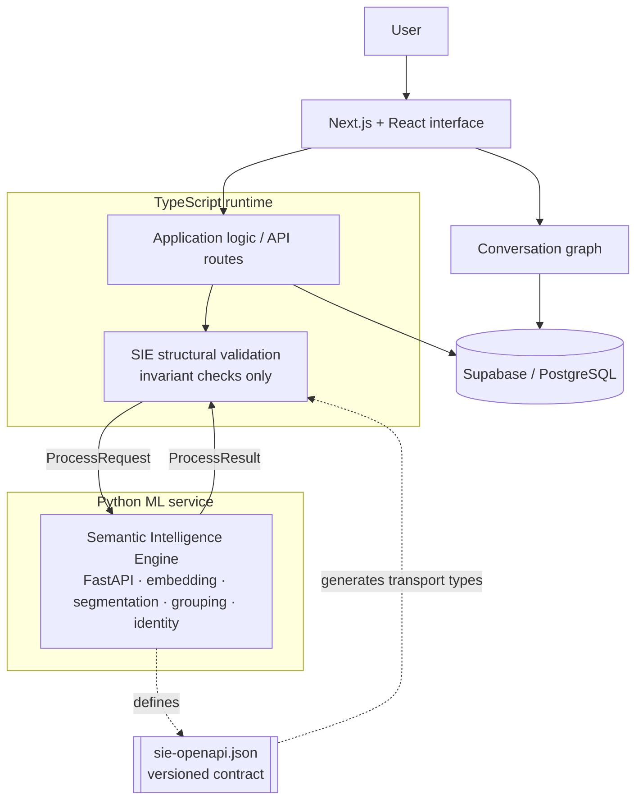

# ContextGraph

[](https://github.com/anshikachourey/contextgraph/actions/workflows/ci.yml)


**Visual AI conversations as navigable knowledge graphs.**

ContextGraph transforms linear AI conversations into an interactive graph, letting
users branch into alternative lines of thought, explore them independently, and
return to earlier context without losing their place.

## Why ContextGraph?

Most AI chat interfaces organize a conversation as a single linear history. That
works until a conversation grows long, a user wants to explore several approaches,
or an earlier idea becomes relevant again. Branching usually means starting another
chat and manually reconstructing the missing context.

ContextGraph treats a conversation as a **navigable graph instead of a transcript**.
Users can explore alternate paths while preserving the relationships between
messages, branches, and the context that produced them.

## Features

### Branching conversations

Create an alternate path from an existing point in a conversation without
overwriting or abandoning the original thread.

### Visual graph navigation

Navigate conversation history spatially through an interactive graph rather than
scrolling a long transcript. Each node represents part of the conversation, making
the relationships between branches easier to understand and revisit.

### Persistent conversation state

Conversation structure and graph relationships are persisted in PostgreSQL via
Supabase, so users can return to earlier conversations and continue from their
existing context.

### Semantic Intelligence Engine (SIE)

A semantic layer analyzes conversation content and proposes how new material
relates to the existing graph — for example, whether new conversation content
matches an existing concern or should form a new one. Decisions use an explicit
outcome enum defined in the service contract (`PipelineOutcome`):

```text
YES · NO · UNRESOLVED · DEFER · RETRIEVAL_INCONCLUSIVE · REQUIRES_VALIDATION
```

## Architecture

ContextGraph is a Next.js/TypeScript application backed by Supabase/PostgreSQL, with
semantic analysis delegated to a separate Python (FastAPI) ML service.

The Python service owns semantic decisions such as embedding, segmentation,
grouping, and identity resolution. The TypeScript application validates structural
invariants and consumes the service through a versioned OpenAPI contract — the
TypeScript transport types are generated from `ml-service/contracts/sie-openapi.json`,
never handwritten.



## Engineering

- 797 Vitest tests across 46 TypeScript test files
- 47 pytest test files for the Python ML service
- Property-based testing with fast-check and Hypothesis
- GitHub Actions CI on pushes and pull requests
- TypeScript validation with `tsc --noEmit`
- Production build validation with `next build`
- Versioned PostgreSQL migrations
- Generated TypeScript transport types from a versioned OpenAPI contract

## Tech Stack

- **Frontend:** Next.js 16, React, TypeScript, Tailwind CSS, React Flow
- **Backend & data:** Next.js API routes, Supabase, PostgreSQL
- **ML service:** Python, FastAPI, NumPy, sentence-embedding models
- **Testing & CI:** Vitest, pytest, ESLint, GitHub Actions

## Repository Structure

```text
contextgraph/
├── app/                    # Next.js App Router: routes + API route handlers
├── src/                    # UI components, hooks, and application/intelligence logic
├── ml-service/             # Python FastAPI semantic ML service (+ OpenAPI contract)
├── supabase/migrations/    # PostgreSQL schema migrations
└── .github/workflows/      # GitHub Actions CI
```

## Getting Started

Clone and install. The Node version is pinned in `.node-version`.

```bash
git clone https://github.com/anshikachourey/contextgraph.git
cd contextgraph
npm ci
```

Start the development server:

```bash
npm run dev
```

Then open http://localhost:3000.

The Python ML service in `ml-service/` runs separately. See `ml-service/README.md`.

## Development scripts

```bash
npm test           # Vitest suite
npm run typecheck  # tsc --noEmit
npm run lint       # ESLint
npm run build      # production build
```

ContextGraph is under active development and continues to evolve.
